.NET 内存性能分析 - Maoni Stephens

# 一、本文目的

本文檔旨在協助 .NET 開發者理解如何進行 memory 效能分析，並在需要時找到合適的分析方法。此處的 .NET 包含 .NET Framework 與 .NET Core。若您尚未使用 .NET Core，強烈建議切換至此平臺，以獲得 GC (Garbage Collecto) 及框架其他部分的最新 memory 改進，因為 .NET Core 是當前主要的開發方向。

# 二、本文狀態

本文檔為持續更新的動態文件。目前內容主要聚焦於 Windows 平臺。未來計劃補充 Linux 相關內容以提升實用性，也非常歡迎貢獻者協助完善 (尤其是 Linux 部分)。

**Version revision history**

| Version Number | Commit                                                       | Comment                                                      |
| -------------- | ------------------------------------------------------------ | ------------------------------------------------------------ |
| 1.0            | [c006800](https://github.com/Maoni0/mem-doc/commit/c006800d5173d8b4da60faebe94bc5b724f32cfd) | 此前未維護版本歷史，但即將提交中文版本——為保持中英文文件同步，需建立版本記錄。 |
|                |                                                              |                                                              |

# 三、如何看待性能分析工作

有經驗的效能分析者都知道，這本質上是偵探工作——不存在「照這 10 個步驟就能解決所有效能問題」的萬靈公式。原因很簡單：你的程式碼不是唯一在運行的東西。OS、runtime、函式庫（BCL 只是其中之一，通常還有第三方依賴）都在同一個 process 裡執行，Thread 還要跟其他 process 共享機器或容器的資源。

但這不表示你得成為以上所有領域的專家，否則永遠寫不完一行程式碼。你需要的是夠用的基礎知識加上正確的分析方法，讓你能聚焦在自己程式碼的效能上——這就是本文要提供的。我會講清楚每個概念背後的原理，讓你理解邏輯而非死記規則。

本文也會說明何時該自己動手，何時該把問題交給 GC 團隊（有些改進只能在 runtime 層面實現）。GC 團隊一直在持續改進 GC（不然我也不會還在這裡）。關鍵認知是：**GC 的行為由你應用程式的行為驅動**，所以你可以透過調整應用程式來影響 GC。.NET GC 的設計哲學是盡可能自動化，當需要你介入時（例如設定某個 config），我會用應用層面的語言提需求，而不是要求你懂 GC 內部實作。

當然，GC 團隊的長期目標是自動化所有使用者需要手動分析的工作。我們已有進展，但還沒完全達標。本文會說明目前的分析方法，最後也會展望我們為此所做的改進。

# 四、選擇正確的性能分析方法

資源有限，關鍵在於投資報酬率最高的部分。這意味您需找出最值得優化的部分，並以最有效率的方式優化。當您決定優化某事物時，背後應有邏輯依據。

## 1. 明確你的性能目標

這是我常問新接觸者的問題——您的效能目標是什麼？不同產品有截然不同的需求。在設定量化目標 (例如提升 X) 前，需明確優化方向。最高層級的優化面向包括：

- 優化 memory 佔用：例如需在單一機器運行最多實例

- 優化吞吐量：例如需在固定時間處理最多請求

- 優化尾部延遲：例如需滿足特定 SLA 延遲要求

當然，您可能需兼顧多項。例如需同時滿足 SLA 與最低請求處理量。此時需釐清優先級，決定主要投入方向。

## 2. 理解 GC 只是框架的一部分

GC 行為變化可能源自：
- GC 本身的改動
- Framework 其他部分的調整（新版框架通常包含大量變更）

升級後觀察到 memory 行為變化，可能因 GC 改動，或框架其他部分開始 allocation 更多 memory 並以不同方式保留 memory 。此外，升級 OS 版本或在不同虛擬化環境運行產品，也可能因環境影響應用行為而產生變化。

## 3. 不要猜測，要measure

measure能力應在產品 *初期* 規劃，而非問題發生後補救——尤其當產品需在高壓環境運行時。若您閱讀本文，很可能正在處理效能關鍵的專案。

多數工程師都理解measure概念，但「如何measure」與「measure什麼」常是需協助之處：

- 真實環境模擬：複雜伺服器應用的常見問題是測試環境難以模擬生產環境狀況

- 深度分析能力：measure不僅是「能measure每秒請求數」，更需在效能不達標時，具備有意義的分析工具。發現問題是一回事，若無法找出根源則無濟於事。這需要您知道如何收集數據，下文將討論

- 驗證修正效果：給出修復措施 / 替代方案

## 4. 充分measure以確定應關注的領域

我反覆聽聞有人measure單一指標後，僅因同事提及就專注優化該指標。此時掌握 [fundamentals](#Memory-Fundamentals) 至關重要，避免持續聚焦於未必正確的方向。

## 5. measure可能影響性能指標的因素

確定可能顯著影響效能指標的因素後，應measure *實際影響*，以觀察其在產品開發過程中的貢獻度變化。經典案例是伺服器應用改善 P95 請求延遲 (即 95th percentile 延遲)——幾乎所有網頁伺服器都關注此指標。

下圖展示 5 個請求， R1 受 GC 影響， R4 受 Network IO 影響：

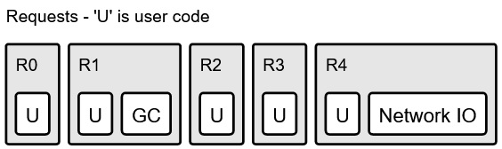

Network IO 僅是可能影響延遲的眾多因素之一。圖中框線寬度僅供示意。

日常 P95 延遲（無論記錄時間單位為何）可能波動，但您知道大致範圍。假設平均延遲 < 3ms， P95 約 70ms。您必須能measure每個請求的總耗時（否則無法計算百分位數）。您可記錄 GC 暫停或 Network IO 發生時間 (兩者皆可透過事件measure)。針對接近 P95 延遲的請求，計算「 GC 對 P95 的影響比例」：

`受影響請求的 GC 暫停總時長 / 受影響請求的總延遲`

若比例為 10%，表示存在其他未納入因素。

許多人猜測 GC 暫停是影響 P95 的主因。這確實可能，但絕非唯一或最主要因素。理解 *影響比例* 才能決定投入方向。

影響 P95 的因素可能與 P99 或 P99.99 截然不同，此原則同樣適用其他百分位數。

## 6. 優化框架代碼 vs 用戶代碼

本文適用所有關注 memory 分析者，但需根據工作層級採取不同策略：

終端產品開發者 : 您擁有高度優化自由，因可預測產品運行環境：
- 通常清楚可能飽和的資源（ CPU、 memory 等）
- 能控制產品運行的機器 /VMs 規格與函式庫使用方式
- 可做出估算（例如「機器有 128GB  memory ，計劃在最大 process 中 allocation  20GB 給 in-memory cache」）

平台 / 函式庫開發者 : 無法預測程式碼將在何種環境運行
- 若希望用戶在效能關鍵路徑使用您的程式碼，需極度節省 memory 
- 可能需提供效能與易用性權衡的 API，並教育用戶

# 五、Memory 基礎知識

正如前文所述，一個人要全面掌握整個技術 Stack 是不現實的。本節列出所有從事 memory 效能分析工作必須掌握的基礎知識。

## 1. OS 的虛擬 Memory 基礎知識

作業系統透過 VMM (Virtual Memory Manager) 來管理所有 process 的 memory。VMM 為每個 process 分配一塊獨立的虛擬地址空間，讓 process 以為自己獨佔整台機器的 memory，實際上所有 process 共享同一塊實體 memory（以及分頁檔）。如果你在 VM 中運行，還多一層虛擬化——VM 以為自己在實體機上，其實它也是一個被 VMM 管理的 process。

大多數應用程式不會直接跟 VMM 打交道，而是透過更高層的 allocator 來申請和釋放 memory：

| 程式類型 | 使用的 allocator |
|----------|-----------------|
| 原生 C/C++ 程式碼 | CRT heap、`new`/`delete`、`malloc`/`free` 等 |
| .NET 託管程式碼 | GC（垃圾回收器） |

所以當你寫 `new MyObject()` 時，背後是 GC 在跟 VMM 打交道——GC 先向 VMM 保留/提交記憶體，再從中分配給你的 object。

每個 VA (Virtual Address) 範圍（即連續的虛擬地址區塊）可處於不同狀態——空閒 (free)、保留 (reserved) 和提交 (committed)。空閒狀態容易理解。 reserve 與 commit 的區別常令人困惑。 reserve 意為「預留此 memory 區域供己使用」——保留某個虛擬地址範圍後，該範圍無法用於其他保留請求。此時尚無法在該地址範圍儲存資料，必須先 commit，系統才會為其 allocation 實體儲存空間。使用效能工具觀察 memory 時，務必確認觀察對象正確。可能因保留空間不足或提交空間不足而導致 memory 不足（本文聚焦 Windows VMM——在 Linux 中，實際存取 memory 時可能觸發 OOM）。

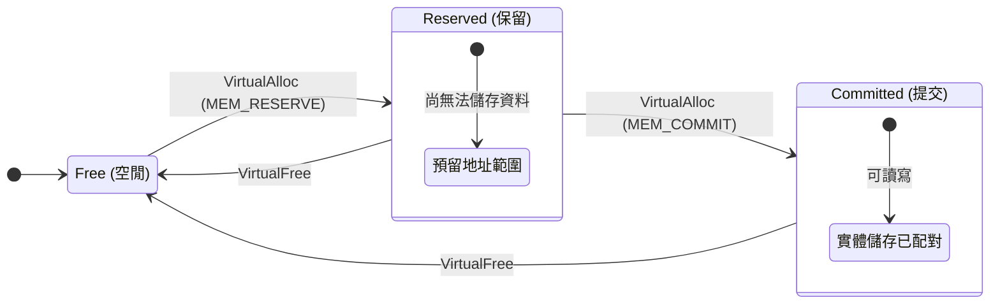
```mermaid
stateDiagram-v2
    direction LR

    Free: Free (空閒)
    Reserved: Reserved (保留)
    Committed: Committed (提交)

    [*] --> Free

    Free --> Reserved: VirtualAlloc (MEM_RESERVE)
    Reserved --> Committed: VirtualAlloc (MEM_COMMIT)
    Committed --> Free: VirtualFree
    Reserved --> Free: VirtualFree

    state Reserved {
        [*] --> 預留地址範圍: 尚無法儲存資料
    }

    state Committed {
        [*] --> 實體儲存已配對: 可讀寫
    }
```

虛擬 memory 可分為私有 (private) 或共享 (shared)。私有 memory 僅供當前 process 使用，共享 memory 可被其他 process 共享。所有 GC 相關的 memory 使用均為私有。

虛擬地址空間可能產生碎片化，即地址空間存在「空洞」（空閒區塊）。當請求保留一塊虛擬 memory 時， VMM 需在虛擬地址範圍中找到足夠大的空閒區塊——若僅有數個總和足夠的空閒區塊，請求仍會失敗。這意味著即使總量有 2GB，實際可用空間未必能完全利用。在 32 位元 process 為主流的時代，此問題相當嚴重。現今 64 位元系統提供充足的虛擬地址空間，因此實體 memory 成為主要關注點。提交 memory 時， VMM 確保有足夠實體儲存空間供實際存取使用。當實際寫入資料時， VMM 會將該資料存入實體 memory 的頁面 (4KB)。此頁面隨即成為 process 工作集 (working set) 的一部分——此為 process 啟動時的常規操作。

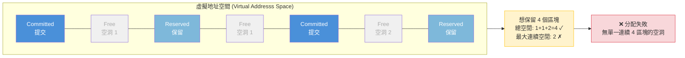
```mermaid
graph LR
    subgraph VA[" 虛擬地址空間 (Virtual Addresss Space) "]
        direction LR
        C1["Committed<br/>提交"] --- F1["Free<br/>空洞 1"]
        F1 --- R1["Reserved<br/>保留"]
        R1 --- F2["Free<br/>空洞 1"]
        F2 --- C2["Committed<br/>提交"]
        C2 --- F3["Free<br/>空洞 2"]
        F3 --- R2["Reserved<br/>保留"]
    end

    VA --> Req["想保留 4 個區塊<br/>總空閒: 1+1+2=4 ✓<br/>最大連續空閒: 2 ✗"]
    Req --> Fail["❌ 分配失敗<br/>無單一連續 4 區塊的空洞"]

    style C1 fill:#4a90d9,color:#fff
    style C2 fill:#4a90d9,color:#fff
    style F1 fill:#f0f0f0,color:#aaa
    style F2 fill:#f0f0f0,color:#aaa
    style F3 fill:#f0f0f0,color:#aaa
    style R1 fill:#7eb8da,color:#fff
    style R2 fill:#7eb8da,color:#fff
    style Req fill:#fff3cd,stroke:#ffc107
    style Fail fill:#f8d7da,stroke:#dc3545
```

> **為何總空閒 4 但分配失敗？** 上圖中三個 Free 區塊各自獨立，大小分別為 1、1、2，總和為 4。但 VMM 需要一個**連續**的 4 單位空間才能滿足保留請求，而最大連續空閒只有 2。碎片化使空間雖然充足卻無法使用——就像停車場總共還有 4 個空位，但分散四處，停不下一輛大巴。

當機器上所有 process 使用的 memory 總量超過實體 memory 容量時，部分頁面需寫入分頁檔（若有設定，通常會設定）。此操作速度極慢，因此實務中多避免觸發分頁。簡化說明——具體細節與本次討論無關。 process 處於穩定狀態時，通常希望常用頁面保留在工作集中，避免額外成本。下一節將探討 GC 如何避免分頁。

本節刻意簡化，因 GC 會代為處理虛擬 memory 互動，但了解基礎有助解讀效能工具結果。

- 分頁 (paging) 指的是 memory 分頁在實體 memory  (RAM) 和硬碟 (Page File/Swap File) 之間的交換。

## 2. GC 基礎知識

垃圾回收器提供 memory 安全性，讓開發者不必手動釋放 memory，也免除了 heap 損毀的除錯之苦——這類問題曾讓無數工程師耗費數月甚至數年。然而，GC 也為 memory 效能分析帶來挑戰：GC 不會在每個 object 死亡後立即回收（那樣效率極低），且 GC 機制越複雜，分析需掌握的變數就越多。本節將建立基礎概念，幫助你理解 .NET GC 的運作方式，以便在調查 memory 問題時能採取正確的分析策略。

### I. 理解 GC Heap Memory 使用量與 Process/機器 Memory 使用量的關係

#### a. GC Heap 僅為 Process Memory 使用的一部分

一個 process 的 memory 不只放你的 object，還包含許多其他東西——例如 .NET 執行環境本身、載入的 DLL、JIT 編譯後的程式碼等等。你可以把 process 想像成一棟大樓：

- **GC heap**：大樓裡最大的租戶，存放你程式中所有的 object
- **其他 memory 使用**：大樓的管線、電梯、保全系統——雖然不是租戶，但也佔空間

大多數 .NET 應用中，GC heap 確實是最大宗的 memory 消費者，但並非唯一。如果你發現 process 總 memory 用量遠大於 GC heap 大小，就表示有其他東西在吃 memory，需要往那個方向調查。

**如何判斷？** 比對兩個數字：

| 指標 | 含義 |
|------|------|
| Process 總私有提交位元組 (Total Private Committed Bytes) | process 向 OS 實際申請的總 memory 量 |
| GC heap 提交位元組 (GC Heap Committed Bytes) | GC heap 佔用的 memory 量 |

- 兩者 **接近** → memory 瓶頸在 GC heap，繼續往下分析 heap
- 兩者 **差距大** → 有其他元件在吃 memory（模組載入、native allocation 等），需先調查那些來源

#### b. GC 以 Process 為單位運作，但感知機器實體 Memory (RAM) 負載

GC 的工作範圍是「一個 process」，但它會同時觀察整台機器的記憶體狀況。可以這樣理解：

- **Process 內**：GC 根據自己的 heap 大小、allocation 速率來決定何時觸發 GC——這是日常工作模式
- **機器全局**：GC 也會盯整台機器還有多少可用的實體記憶體。當實體記憶體快被用光時，GC 會自動進入更積極的模式

為什麼要設計成這樣？為了**避免分頁 (paging)**。一旦實體記憶體不夠，OS 會把部分資料搬去硬碟（分頁檔），而硬碟的速度比 RAM 慢幾個數量級——這是效能殺手。與其等到發生分頁，不如讓 GC 提早出手壓縮 heap。

**何謂「激進模式」？** GC 把機器記憶體使用量除以總容量，得到一個百分比。當這個比例超過某個門檻時，GC 就會更頻繁地執行 Full Blocking GC（會暫停所有 Thread、壓縮整個 heap），以求釋放更多記憶體。

**預設門檻與調整方式：**

| 機器記憶體大小 | 預設高負載門檻 |
|---------------|---------------|
| < 80 GiB | 90% |
| ≥ 80 GiB | 90% ~ 97%（隨容量遞增）|

可透過以下方式自訂門檻：
- 環境變數：`COMPlus_GCHighMemPercent`
- .NET 5+：在 `runtimeconfig.json` 設定 `System.GC.HighMemoryPercent`

**何時需要調整？** 假設你的機器有 64GB 記憶體：

| 情境 | 建議 |
|------|------|
| 你的 process 是機器上主要的記憶體大戶 | 預設值 OK——剩 10% (6.4GB) 時 GC 開始加壓 |
| 你的 process 只吃 1GB，跑在 64GB 機器上 | 剩 10% 時你還有海量空間→把門檻調高，讓 GC 不要過度反應 |
| 你希望大型 process 保持較小 heap（即使記憶體還很充裕） | 把門檻調低，GC 會更早開始壓縮 heap |

**容器的情況：** 如果你的 process 在 container 裡執行，GC 會把 container 設定的記憶體上限當作整台機器的記憶體大小——這就是 GC 眼中的「實體記憶體」。

> **注意：Full Blocking GC 不只發生在機器全局壓力下。** GC 在 process 內部也有獨立觸發路徑——例如 gen2 allocation budget 用盡、碎片率過高、即將 OOM 等情況，GC 照樣會升級成 Full Blocking GC。也就是說，即使整台機器還有一大堆閒置記憶體，只要你的 process 內部 heap 爆滿，Full Blocking GC 照樣會發生。兩條路徑互相獨立，任一條件滿足即觸發。

[本節](#Figuring-out-the-amount-of-work-for-gen2-GCs) 說明如何查詢每次 GC 時觀察到的記憶體負載。

### II. 理解 GC 觸發機制

GC 不是定時鬧鐘，不會每隔幾秒就跑一次。它由**具體事件**觸發。以下用 "GC" 指稱回收 heap memory 的動作（一次或多次）。

#### a. GC 主要因 Allocation 觸發

最常見的觸發原因：你的程式 new 了太多 object，把某一代的「配額」用完了。

每一個 generation（gen0、gen1、gen2、LOH）都有一個 **allocation budget**（分配配額）。你可以把它想成一個水桶：

- 每次 `new` 一個 object，就往 gen0 水桶裡加水
- 水桶快滿時 → 觸發 GC
- GC 清掉死亡的 object（倒掉水）
- 存活的 object 被移到下一代的桶（gen0 → gen1 → gen2）
- 水桶水位下降，重新開始

所以 GC 觸發的頻率，基本上取決於你 allocation 的速度。allocation 越多，GC 越常跑。allocation budget 的計算規則比較複雜（取決於存活率等因素），後文會詳細展開。

#### b. 其他觸發 GC 的因素

除了 allocation budget 用盡，還有兩種情況會觸發 GC：

| 觸發因素 | 說明 |
|---------|------|
| 機器記憶體壓力高 | 整台機器快沒記憶體了，GC 主動介入壓縮 heap（見[上一節](#GC-is-per-process-but-is-aware-of-physical-memory-load-on-the-machine)） |
| 手動呼叫 `GC.Collect()` | 你（或你用的某個 library）在程式裡明確叫 GC 來收垃圾 |

> 通常不需要手動呼叫 `GC.Collect()`——GC 的自動判斷比人工猜測準確得多。如果你在程式裡大量呼叫它，通常是設計出了問題。

### III. 理解 Allocation 成本

既然多數 GC 是由 allocation 觸發的，你得先搞清楚 allocation 本身有多貴。

**沒有 GC 的時候，allocation 也有成本嗎？** 有。只要執行程式碼就有成本，allocation 也不例外。在未觸發 GC 的情況下，allocation 最主要的成本來自 **memory 歸零（zeroing）**。

GC 從 heap 取出一塊記憶體給你之前，必須先把整段記憶體全部寫成零。為什麼？兩個原因：

- **安全（Security）**：這塊記憶體可能剛被其他 process 使用過，殘留了敏感資料。不歸零的話，你 `new` 出來的 object 有可能意外讀到別人的機密。
- **可靠（Reliability）**：確保所有 field 有確定的初始值（int=0, reference=null），不會拿到上一個使用者的隨機垃圾值。

代價是：CLR 真的要走一遍 `memset`/`memclr`，把那段記憶體逐 byte 寫入零值。寫入的開銷跟 allocation 大小成正比——你 allocate 的記憶體越大，歸零就越貴。

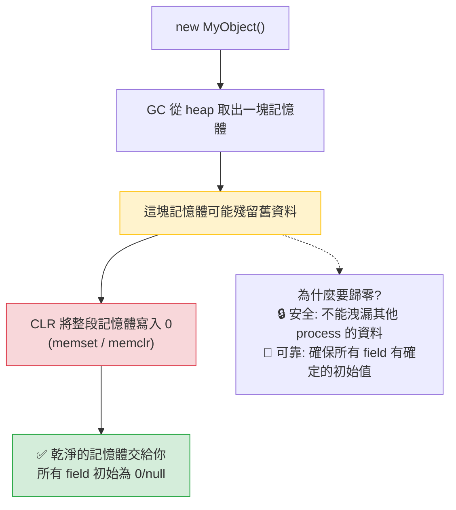
```mermaid
graph TD
    A["new MyObject()"] --> B["GC 從 heap 取出一塊記憶體"]
    B --> C["這塊記憶體可能殘留舊資料"]
    C --> D["CLR 將整段記憶體寫入 0<br/>(memset / memclr)"]
    D --> F["✅ 乾淨的記憶體交給你<br/>所有 field 初始為 0/null"]
    
    C -.-> G["為什麼要歸零?<br/>🔒 安全: 不能洩漏其他 process 的資料<br/>🔧 可靠: 確保所有 field 有確定的初始值"]
    
    style C fill:#fff3cd,stroke:#ffc107
    style D fill:#f8d7da,stroke:#dc3545
    style F fill:#d4edda,stroke:#28a745
```

**為什麼大家常討論 GC 成本，卻很少討論 allocation 成本？**

| | GC | Allocation |
|------|----|------------|
| 發生時機 | 偶發，暫停所有 Thread | 持續不斷，每秒數萬次 |
| 監測方式 | 輕量，記錄「發生了」即可 | 若每次記錄會拖垮效能 |
| 能見度 | 高，工具直接顯示 | 低，需間接推估 |

簡單說：GC 會停下來讓你看，allocation 不會——它一直在跑，你無法一個個追蹤，只能用間接方法推估。

#### a. 三種觀察 Allocation 的方式

既然不能直接監測每次 allocation，以下三種間接方法可以幫你推估 allocation 的成本和規模：

**方法一：透過 GC 頻率反推。** 既然多數 GC 都是由 allocation 觸發的，GC 跑得多頻繁就間接反映你 allocation 有多兇。這是最簡單的切入點。

**方法二：取樣高頻事件。** GC 提供一個 `AllocationTick` 事件，大約每累積 allocate 100KB 就觸發一次。透過收集這個事件，你可以看到哪些類型被 allocate 最多，以及它們的 callstack——就像每隔一段距離拍一張快照，而不是每個物件都拍。

**方法三：透過 CPU 使用狀況觀察 memory clearing 成本。** memory 歸零這個動作會出現在 CPU profile 裡（方法名稱通常是 `memset`、`memclr` 之類的）。如果你在 CPU 取樣中看到 memory clearing 佔比很高，就表示 allocation 正在吃掉可觀的 CPU 資源。

後面的 [Tools](#Measure-allocations) 章節會介紹具體的工具操作。

### IV. 正確觀察 GC Heap 大小

聽起來很簡單，對吧？「GC heap 有多大」——量一下不就好了？但問題是：**什麼時候量**比「量了多少」重要一百倍。

#### a. 根據 GC 發生時機觀察 Heap 大小

假如你不關心 GC 何時發生，只是每秒記錄一次 heap 大小，看看這兩組數據：

**表 1**

| 秒數 | 動作 | 該秒結束時 heap 大小 |
|------|------|---------------------|
| 1 | allocated 1 GB | 1 GB |
| 2 | allocated 2 GB | 3 GB |
| 3 | allocated 0 GB | 3 GB |
| 4 | 發生 GC (500MB 存活)，後 allocated 1GB | 1.5 GB |
| 5 | allocated 3 GB | 4.5 GB |

第 4 秒 heap 從 3GB 驟降到 1.5GB——嗯，大概發生 GC 了。

再來看另一組：

**表 2**

| 秒數 | 動作 | 該秒結束時 heap 大小 |
|------|------|---------------------|
| 1 | allocated 1 GB | 1 GB |
| 2 | allocated 2 GB | 3 GB |
| 3 | 發生 GC (1GB 存活)，後 allocated 2GB | 3 GB |
| 4 | allocated 1 GB | 4 GB |

第 3 秒 heap 是 3GB，第 4 秒還是附近的數字——如果你只看 heap 大小，完全不會發現第 3 秒發生過一次 GC。

兩個表的核心差異：**表 1 的 GC 發生前後 heap 有落差，表 2 沒有（倖存物件多又被新 allocation 填滿）。** 結論：只看 heap 大小快照無法可靠判斷 GC 是否發生。

**所以正確的觀察方式是什麼？** 不要「定時取樣 heap 大小」。你要看的是 **每次 GC 的進入大小和退出大小**——也就是 GC 開始前 heap 有多大（Peak），GC 做完後剩多少（After）。這些數據是 GC 自己提供的，比任何外部工具都準。

這聽起來像是廢話，但其實很多 memory 診斷工具根本沒在管這個。它們的做法是：「來，我給你看現在 heap 長怎樣」，然後就把 snapshot 丟給你。這種 snapshot 在什麼時候有用？**問題越嚴重越有用。** 如果你的程式有持續嚴重的記憶體洩漏，dump-based 工具通常一眼就能看出誰在吃記憶體——這叫做「低垂的果實」，太明顯了。但當你遇到需要精準診斷的效能問題（例如 P95 延遲偶發飆高、某次 GC 突然超長），這種工具就束手無策了，因為你需要的是「什麼時候發生、前後差多少」，不是「現在長怎樣」。

#### b. Allocation 預算

**什麼是 allocation budget？** 就是你「在觸發下一次 GC 之前，總共可以 new 多少記憶體」。可以簡單想成：

```
allocation 預算 ≈ 上次 GC 結束時的 heap 大小 → 這次 GC 開始時的 heap 大小
```

以前面表 1 和表 2 為例，兩者的 allocation 預算都是 3GB——GC 結束後允許你 allocate 3GB，用完就觸發下一次 GC。

> 嚴格來說，pinning 會讓這個等式不精準（被釘住的 object 會吃掉預算卻不一定反映在 heap 大小差上），但「允許的 allocation 總量」這個概念仍然成立。後文會詳述 pinning。

**實際上是怎麼運作的？以 gen0 為例：**

每個 generation 都有自己的預算。gen0 的預算是 GC 根據上次 gen0 存活率動態算出來的。以下用一個簡化例子說明：

| 階段 | gen0 大小 | gen0 空閒 | 預算上限 |
|------|----------|----------|---------|
| **初始** | 2 MB | 1.5 MB | 8 MB |
| **分配 1** (500KB) | 2 MB — 沒增長，直接用空閒空間 | 1 MB | 8 MB |
| **分配 2** (1.5MB) | 2.5 MB — 空閒不夠，擴展 0.5MB | ~0 | 8 MB |
| **分配 3** (6MB) | 需擴展到 2.5+6=8.5MB → **超過 8MB 預算！** | | |

→ **觸發 gen0 GC**：清除死亡 object → 將存活 object promote 到 gen1 → gen0 重置（如回到 1MB）→ 足夠容納 6MB 分配

核心規則：
- 每次 `new` 先用 gen0 現有的空閒空間
- 空閒空間不夠 → 擴展 gen0，但不超過預算上限
- 超過預算 → 觸發 GC
- GC 做完 → gen0 重置，預算也會根據存活率重新計算

**所以我該不該減少 allocation？**

減少 allocation 是最直覺的優化方向，但要注意幾件事：

- **有效的前提**：減少的那些 allocation 真的在影響效能。如果 GC 本來跑得就不頻繁，少 allocate 一點幫助有限
- **代價**：減少 allocation 通常意味著改寫程式邏輯（例如用 object pool、改用 struct），程式可能變得更複雜
- **副作用**：你省掉 allocation，但可能換成其他昂貴的操作（例如多了一堆 lock），未必減輕 GC 負擔
- **第三方函式庫**：你無法控制它們的 allocation 行為

一句話：先 measure 確認 allocation 真的是瓶頸，再動手改。不要盲目省 allocation。

#### c. 分代 GC 的影響

.NET GC 是**分代式（generational）**的，把 heap 切成三個層級：

| 代 | 角色 | 回收頻率 | 成本 |
|----|------|---------|------|
| **gen0** | 最年輕，所有 `new` 都從這裡開始 | 最高（秒級） | 最低 |
| **gen1** | 緩衝區，gen0 存活下來的暫存於此 | 中等 | 中等 |
| **gen2** | 最老，長期存活的 object | 最低（分鐘～小時級） | 最高 |

設計背後的假設：**大多數 object 活不久。** 所以 gen0 頻繁快速回收（短暫的 object 在這就被清掉），gen2 盡量少碰（活的都是長命 object，掃整個 gen2 很貴）。

**回收範圍規則：** genX GC 會回收 genX **及所有更年輕的代**。所以 gen0 GC 只收 gen0，gen1 GC 收 gen0+gen1，gen2 GC 收全部（因此也稱 Full GC）。

專有名詞對照：

| 名詞 | 含義 |
|------|------|
| **Ephemeral GC** | gen0 或 gen1 的 GC（回收年輕代） |
| **Full GC** | gen2 的 GC（回收整個 heap） |
| **STW (Stop-The-World)** | GC 進行期間，你的 Thread 全部暫停 |

Ephemeral GC（gen0/gen1）永遠是 Blocking（STW）的——沒有 concurrent 選項。原因很簡單：gen0/gen1 的暫停通常遠小於 1ms，在這麼短的時間內做 concurrent 沒有意義，切換 context 的開銷可能比直接做完還大。gen2 GC 則可以選擇 Blocking（全程暫停，做壓縮）或 Background/BGC（背景執行，暫停很短但耗 CPU）——後面章節會詳述。

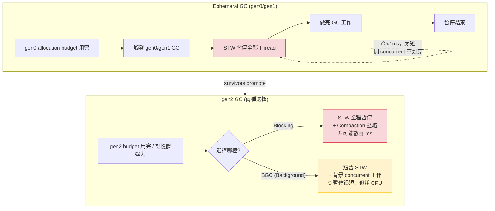
```mermaid
graph TD
    subgraph EPH["Ephemeral GC (gen0/gen1)"]
        A["gen0 allocation budget 用完"] --> B["觸發 gen0/gen1 GC"]
        B --> C["STW 暫停全部 Thread"]
        C --> D["做完 GC 工作"]
        D --> E["暫停結束"]
        C -.->|"⏱ <1ms，太短\n開 concurrent 不划算"| C
    end
    
    subgraph FULL["gen2 GC (兩種選擇)"]
        F["gen2 budget 用完 / 記憶體壓力"] --> G{"選擇哪種?"}
        G -->|"Blocking"| H["STW 全程暫停\n+ Compaction 壓縮\n⏱ 可能數百 ms"]
        G -->|"BGC (Background)"| I["短暫 STW\n+ 背景 concurrent 工作\n⏱ 暫停很短，但耗 CPU"]
    end
    EPH -.->|"survivors promote"| FULL

    style C fill:#f8d7da,stroke:#dc3545
    style H fill:#f8d7da,stroke:#dc3545
    style I fill:#fff3cd,stroke:#ffc107
```

**預算也分代：** 每個 generation 有自己的 allocation budget。你的 `new` 永遠 hit gen0 的預算；gen0 預算用完 → 觸發 GC → 存活 object promote 到 gen1，消耗 gen1 預算；gen1 預算用完 → 觸發 gen1 GC → 存活 object promote 到 gen2。如此層層往上。

**觀察 heap 的影響：** gen2 Full GC 後 heap 可能驟降很多（大掃除），ephemeral GC 後 heap 變化不大（只清年輕代）。這就是為什麼前面說「什麼時候量比量了多少重要」。

**最關鍵的規則：**

> **object 在 genX 裡，就只在 genX GC 時才會被檢查跟回收。**

所以如果你有一個 gen2 的 object，即使它的 reference 早就沒了，但只要 gen2 GC 還沒發生，它就繼續躺著。gen0 GC 跑一百次也不會碰它。這解釋了最常見的困惑：「我明明沒在用這個 object 了，GC 怎麼還不收？」——因為它已經被 promote 到 gen2 了，而 gen2 GC 還沒來。

#### d. LOH (Large Object Heap)

到目前為止，我們都在講 gen0/gen1/gen2。這三個合稱 **SOH (Small Object Heap)**——所有一般大小的 object 都住在這裡，並且一律從 gen0 開始生命。

**但不是所有 object 都住 SOH。** 當你 allocate 一個 ≥ 85,000 bytes（約 83KB）的 object 時，GC 不會把它放進 gen0，而是直接放到一個獨立區域——**LOH (Large Object Heap)**。

```
一般 object (< 85KB):  gen0 → gen1 → gen2  (SOH)
大型 object (≥ 85KB):  直接進 LOH
```

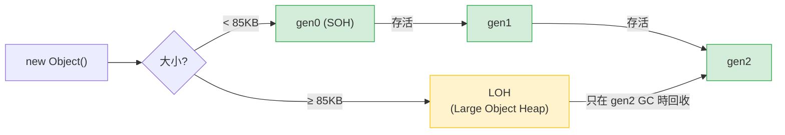
```mermaid
graph LR
    NEW["new Object()"] --> SIZE{"大小?"}
    SIZE -->|"< 85KB"| GEN0["gen0 (SOH)"]
    GEN0 -->|"存活"| GEN1["gen1"]
    GEN1 -->|"存活"| GEN2["gen2"]
    SIZE -->|"≥ 85KB"| LOH["LOH\n(Large Object Heap)"]
    LOH -->|"只在 gen2 GC 時回收"| GEN2

    style GEN0 fill:#d4edda,stroke:#28a745
    style GEN1 fill:#d4edda,stroke:#28a745
    style GEN2 fill:#d4edda,stroke:#28a745
    style LOH fill:#fff3cd,stroke:#ffc107
```

**為什麼要大 object 差別待遇？** 因為大 object 的代價更高：

- **Memory 歸零成本**：還記得前面講的嗎？歸零的開銷跟記憶體大小成正比。一個 100KB 的 object 歸零比 100 個 1KB 的 object 加起來還貴
- **不易找到連續空間**：大 object 需要一大塊連續的空閒記憶體，碎片化的 heap 裡可能根本塞不下
- **移動成本高**：GC 壓縮時需要搬動 object。搬一個 1MB 的大傢伙遠比搬 1000 個小 object 昂貴

**LOH 怎麼回收？** LOH 內部標記為 gen3，但邏輯上它跟 gen2 綁在一起——LOH 只在 gen2 GC 時才會被回收。也就是說，你頻繁 allocate 和釋放大 object = 頻繁觸發 gen2 GC。如果你的 gen2 本身就很大，這等於每次都要掃整個 heap，非常昂貴。

**LOH 的預算：** 跟其他代一樣，LOH 也有 allocation budget。LOH 預算用完 → 觸發 gen2 GC（因為只有 gen2 GC 收得到 LOH）。

**LOH 預設不壓縮：** 搬動大 object 太貴了，所以 LOH 預設不做 compaction（壓縮），而是用 free list 來管理空閒空間。這代表 LOH 容易碎片化。唯一的例外是 .NET Core 3.0 以後在 memory 受限的 container 環境中，LOH 會自動啟用壓縮。

**關鍵數字：**

| 項目 | 值 |
|------|-----|
| LOH 門檻（多大算大 object） | ≥ 85,000 bytes |
| 可調整嗎？ | 可以，透過 `GCLOHThreshold` config |
| 預設壓縮？ | 否，除非在 memory 受限 container |

#### e. 碎片化 (free object) 計入 Heap 大小

**先回答最常見的困惑：「gen2 有大量空閒空間，GC 為什麼不去用？」**

答案：GC 的確在用，但你要看**什麼時候量的**以及**GC 是什麼類型**。

---

**兩種 GC 模式：Compacting vs Sweeping**

.NET GC 回收記憶體時有兩種策略。關鍵差異在於「要不要移動存活的 object」：

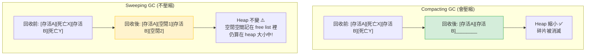
```mermaid
graph TD
    subgraph COMPACT["Compacting GC (會壓縮)"]
        C1["回收前: [存活A][死亡X][存活B][死亡Y]"] --> C2["回收後: [存活A][存活B]________"]
        C2 --> C3["Heap 縮小 ✅\n碎片被消滅"]
    end

    subgraph SWEEP["Sweeping GC (不壓縮)"]
        S1["回收前: [存活A][死亡X][存活B][死亡Y]"] --> S2["回收後: [存活A][空閒1][存活B][空閒2]"]
        S2 --> S3["Heap 不變 ⚠️\n空閒空間記在 free list 裡\n仍算在 heap 大小中!"]
    end

    style C2 fill:#d4edda,stroke:#28a745
    style S2 fill:#fff3cd,stroke:#ffc107
```

| 模式 | 做什麼 | 優點 | 缺點 | Heap 大小變化 |
|------|-------|------|------|-------------|
| **Compacting** | 移動存活 object，擠在一起 | 消滅碎片，heap 變小 | 移動成本高（需更新所有 reference） | 大幅縮小 |
| **Sweeping** | 只標記死亡 object，合併成 free object | 不搬 object，成本低 | 不縮 heap，碎片留著 | 幾乎不變 |

---

**Compacting 與 Sweeping 何時發生？**

這取決於 GC 的類型：

| GC 類型 | 使用的模式 | STW？ | 說明 |
|---------|-----------|-------|------|
| **Ephemeral GC (gen0/gen1)** | Compacting | 是 | 永遠 STW，暫停極短 (<1ms) |
| **Full Blocking GC (gen2)** | Compacting | 是 | 全程暫停，掃整個 heap 並壓縮 |
| **BGC (Background GC)** | Sweeping only | 短暫 STW | 背景並行，只建 free list 不壓縮 |

> **BGC 的設計目的：** gen2 通常很大，掃一遍就很貴了，如果還要 Compacting（移動所有存活 object），STW 會長到無法接受。所以 BGC 只做 Sweeping——建一個 free list，讓後續的 gen1 GC 可以拿這些空閒空間來容納 gen1 的 survivors。代價是 heap 大小不減，碎片化會累積。

---

**Free List 的生命週期**

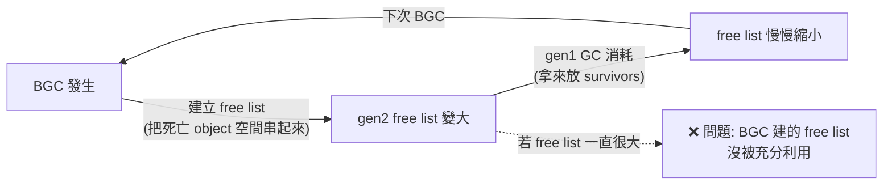
```mermaid
graph LR
    BGC["BGC 發生"] -->|"建立 free list\n(把死亡 object 空間串起來)"| FL["gen2 free list 變大"]
    FL -->|"gen1 GC 消耗\n(拿來放 survivors)"| FL2["free list 慢慢縮小"]
    FL2 -->|"下次 BGC"| BGC
    FL -.->|"若 free list 一直很大"| PROBLEM["❌ 問題: BGC 建的 free list\n沒被充分利用"]
```

**所以何時 free space 是正常的？**

| 時間點 | 看到大量 free space | 判斷 |
|--------|-------------------|------|
| BGC **剛結束** | ✅ 正常 — free list 剛建好，還沒被用 |
| BGC **即將發生前** | ❌ 問題 — 上一輪 BGC 建的 free list 幾乎沒人用 |
| Full Blocking GC **之後** | ❌ 問題 — Compacting 應該消滅碎片，還有就表示有 pinning 擋路 |

[Pinning section](#pinning) 將加劇碎片化問題，後文詳述。

#### f. GC Heap 的實體結構

我們一直在討論 GC heap 有多大、怎麼量。但 GC heap 在記憶體裡到底長什麼樣子？它是怎麼跟 OS 拿記憶體的？

**GC 如何跟 OS 要記憶體？** GC 不是魔法——它跟任何程式一樣，透過 OS 的 API 來申請和歸還記憶體：

| 平台 | 申請 | 歸還 |
|------|------|------|
| Windows | `VirtualAlloc` | `VirtualFree` |
| Linux | `mmap` | `munmap` |

GC 跟 OS 拿到的記憶體是以 **segment（區段）** 為單位來管理的。你可以把 segment 想成 GC 跟 OS 租的一塊地，GC 在上面自己蓋房子（allocate object）。

**初始狀態：** GC heap 初始化時，為 SOH (Small Object Heap) 和 LOH (Large Object Heap) 各保留一個初始 segment。這時候只 commit（真正跟 OS 拿實體儲存）segment 開頭的幾個 Page 來記錄基本資訊，剩下的空間都只是 reserved（預留地址，還沒要實體儲存）。

**最重要的不變式：** gen0 和 gen1 永遠在同一個 segment 上（這個 segment 稱為 **ephemeral segment**）。這代表 gen0+gen1 的總大小不可能超過一個 segment。

> **此時只有 header 被 committed，其餘空間全是 reserved（預留但未分配實體儲存）。** GC 初始化完成後，你的程式還沒 new 任何 object，所以整段 segment 都是空的。

segment 上進行 allocation，memory 會按需 committed。對於 SOH 而言，由於只有一個 segment，此時 gen0、gen1 和 gen2 都位於此 segment 上。

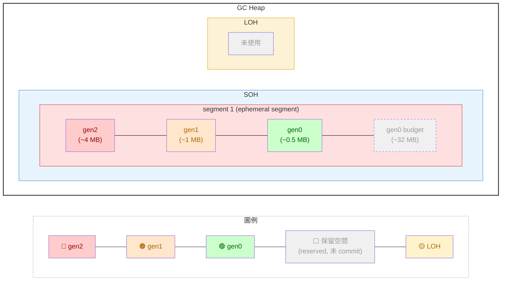
```mermaid
graph TD
    subgraph GCHEAP[" GC Heap "]
        direction LR

        subgraph SOHEAP[" SOH "]
            direction LR
            subgraph SEG1[" segment 1 (ephemeral segment)"]
                direction LR
                S2GEN2["gen2<br/>(~4 MB)"] --- S2GEN1["gen1<br/>(~1 MB)"] --- S2GEN0["gen0<br/>(~0.5 MB)"] --- S2BUDGET["gen0 budget<br/>(~32 MB)"]
            end
        end

        subgraph LOHEAP[" LOH "]
            direction LR
            LFREE1["未使用"]
        end

    end

    subgraph LEGEND[" 圖例 "]
        direction LR
        L1["🔴 gen2"] --- L2["🟠 gen1"] --- L3["🟢 gen0"] --- L4["⬜ 保留空間\n(reserved, 未 commit)"] --- L5["🟡 LOH"]
    end

    GCHEAP ~~~ LEGEND

    style GCHEAP fill:#ffffff,stroke:#333,stroke-width:2px
    style SOHEAP fill:#e8f4fd,stroke:#4a90d9
    style LOHEAP fill:#fdf2d5,stroke:#e6a817
    style SEG1 fill:#ffe0e0,stroke:#c44,stroke-width:1px
    style S2GEN2 fill:#ffcccc,color:#900
    style S2GEN1 fill:#ffe6cc,color:#a60
    style S2GEN0 fill:#ccffcc,color:#060
    style S2BUDGET fill:#f0f0f0,color:#999,stroke-dasharray: 4 4
    style LFREE1 fill:#f0f0f0,color:#999
    style LEGEND fill:#ffffff,stroke:#999,stroke-dasharray: 2 2
    style L1 fill:#ffcccc,color:#900
    style L2 fill:#ffe6cc,color:#a60
    style L3 fill:#ccffcc,color:#060
    style L4 fill:#f0f0f0,color:#999
    style L5 fill:#fff3cd,color:#a60
```

如果 SOH 增長超過單個 segment 容量，會在 GC 期間獲取新 segment。此時 gen0 和 gen1 所在的 segment 成為新 ephemeral segment，原 segment 則成為 gen2 segment。LOH 不同於此，因為用戶 allocation 會直接進入 LOH，新 segment 會在 allocation 時獲取。因此 GC heap 可能如下圖所示（segment 末尾可能有用白色表示的未使用空間）：

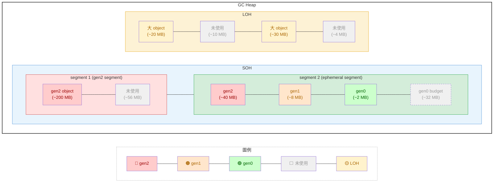
```mermaid
graph TD
    subgraph GCHEAP[" GC Heap "]
        direction LR

        subgraph SOHEAP[" SOH "]
            direction LR
            subgraph SEG1[" segment 1 (gen2 segment)"]
                direction LR
                S1OBJ["gen2 object<br/>(~200 MB)"] --- S1FREE["未使用<br/>(~56 MB)"]
            end
            subgraph SEG2[" segment 2 (ephemeral segment)"]
                direction LR
                S2GEN2["gen2<br/>(~40 MB)"] --- S2GEN1["gen1<br/>(~8 MB)"] --- S2GEN0["gen0<br/>(~2 MB)"] --- S2BUDGET["gen0 budget<br/>(~32 MB)"]
            end
            SEG1 --- SEG2
        end

        subgraph LOHEAP[" LOH "]
            direction LR
            LOBJ1["大 object<br/>(~20 MB)"] --- LFREE1["未使用<br/>(~10 MB)"] --- LOBJ2["大 object<br/>(~30 MB)"] --- LFREE2["未使用<br/>(~4 MB)"]
        end

    end

    subgraph LEGEND[" 圖例 "]
        direction LR
        L1["🔴 gen2"] --- L2["🟠 gen1"] --- L3["🟢 gen0"] --- L4["⬜ 未使用"] --- L5["🟡 LOH"]
    end

    GCHEAP ~~~ LEGEND

    style GCHEAP fill:#ffffff,stroke:#333,stroke-width:2px
    style SOHEAP fill:#e8f4fd,stroke:#4a90d9
    style LOHEAP fill:#fdf2d5,stroke:#e6a817
    style SEG1 fill:#ffe0e0,stroke:#c44,stroke-width:1px
    style SEG2 fill:#d4edda,stroke:#28a745,stroke-width:1px
    style S2GEN2 fill:#ffcccc,color:#900
    style S2GEN1 fill:#ffe6cc,color:#a60
    style S2GEN0 fill:#ccffcc,color:#060
    style S2BUDGET fill:#f0f0f0,color:#999,stroke-dasharray: 4 4
    style S1OBJ fill:#ffcccc,color:#900
    style S1FREE fill:#f0f0f0,color:#999
    style LOBJ1 fill:#fff3cd,color:#a60
    style LOBJ2 fill:#fff3cd,color:#a60
    style LFREE1 fill:#f0f0f0,color:#999
    style LFREE2 fill:#f0f0f0,color:#999
    style LEGEND fill:#ffffff,stroke:#999,stroke-dasharray: 2 2
    style L1 fill:#ffcccc,color:#900
    style L2 fill:#ffe6cc,color:#a60
    style L3 fill:#ccffcc,color:#060
    style L4 fill:#f0f0f0,color:#999
    style L5 fill:#fff3cd,color:#a60
```
> 如果 segment 上完全無存活 object，整個 segment 會被釋放（歸還 OS）。gen0 budget 在 GC 後重新分配。

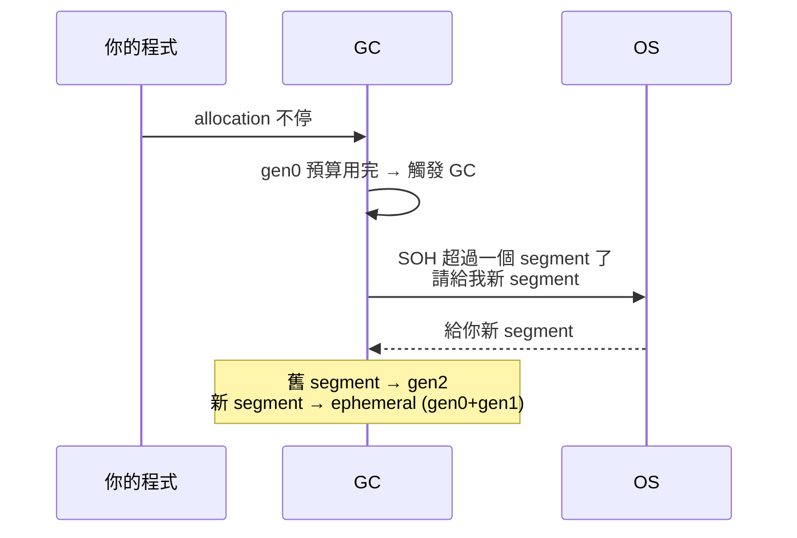
```mermaid
sequenceDiagram
    participant App as 你的程式
    participant GC as GC
    participant OS as OS

    App->>GC: allocation 不停
    GC->>GC: gen0 預算用完 → 觸發 GC
    GC->>OS: SOH 超過一個 segment 了<br/>請給我新 segment
    OS-->>GC: 給你新 segment
    Note over GC: 舊 segment → gen2<br/>新 segment → ephemeral (gen0+gen1)
```

當 GC 發生並回收 memory 時，若 segment 上未發現存活 object，該 segment 會被釋放；ephemeral segment 外的 segment 空間末端（即 segment 上最後一個存活 object 到 segment 末尾的空間）會被 decommit。

**Ephemeral segment 的特殊處理**

常見困惑：「我明明只看到 100MB heap，為什麼 GC committed 了 200MB？」

答案：GC 做完 ephemeral GC 後，**故意保留 gen0 預算（gen0 budget）那麼多的 committed 空間**。因為它知道你的程式馬上會繼續 allocate，這塊 committed 空間裡還沒有 object，所以不算在 heap 大小裡：

| 概念 | 包含什麼 |
|------|---------|
| **Heap 大小**（你看到的） | 實際 object 佔的空間 |
| **Committed 大小**（GC 跟 OS 要的） | Heap 大小 + gen0 預算 |

**Server GC 的例子：** 使用 32-heap 的 Server GC，每個 heap 的 gen0 預算為 50MB → committed 比 heap 多出 32 × 50 = **1.6GB**！這是正常的。

> .NET 5+ 中 decommit 行為有微調：部分 decommit 在 GC 暫停外執行。但用 gen0 預算估算 committed 量仍是相當好的近似值。


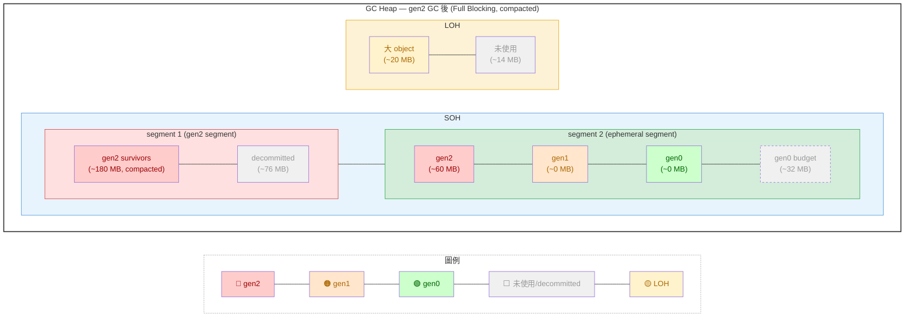
```mermaid
graph TD
    subgraph GCHEAP[" GC Heap — gen2 GC 後 (Full Blocking, compacted)"]
        direction LR

        subgraph SOHEAP[" SOH "]
            direction LR
            subgraph SEG1[" segment 1 (gen2 segment)"]
                direction LR
                S1OBJ["gen2 survivors<br/>(~180 MB, compacted)"] --- S1FREE["decommitted<br/>(~76 MB)"]
            end
            subgraph SEG2[" segment 2 (ephemeral segment)"]
                direction LR
                S2GEN2["gen2<br/>(~60 MB)"] --- S2GEN1["gen1<br/>(~0 MB)"] --- S2GEN0["gen0<br/>(~0 MB)"] --- S2BUDGET["gen0 budget<br/>(~32 MB)"]
            end
            SEG1 --- SEG2
        end

        subgraph LOHEAP[" LOH "]
            direction LR
            LOBJ1["大 object<br/>(~20 MB)"] --- LFREE1["未使用<br/>(~14 MB)"]
        end

    end

    subgraph LEGEND[" 圖例 "]
        direction LR
        L1["🔴 gen2"] --- L2["🟠 gen1"] --- L3["🟢 gen0"] --- L4["⬜ 未使用/decommitted"] --- L5["🟡 LOH"]
    end

    GCHEAP ~~~ LEGEND

    style GCHEAP fill:#ffffff,stroke:#333,stroke-width:2px
    style SOHEAP fill:#e8f4fd,stroke:#4a90d9
    style LOHEAP fill:#fdf2d5,stroke:#e6a817
    style SEG1 fill:#ffe0e0,stroke:#c44,stroke-width:1px
    style SEG2 fill:#d4edda,stroke:#28a745,stroke-width:1px
    style S2GEN2 fill:#ffcccc,color:#900
    style S2GEN1 fill:#ffe6cc,color:#a60
    style S2GEN0 fill:#ccffcc,color:#060
    style S2BUDGET fill:#f0f0f0,color:#999,stroke-dasharray: 4 4
    style S1OBJ fill:#ffcccc,color:#900
    style S1FREE fill:#f0f0f0,color:#999
    style LOBJ1 fill:#fff3cd,color:#a60
    style LFREE1 fill:#f0f0f0,color:#999
    style LEGEND fill:#ffffff,stroke:#999,stroke-dasharray: 2 2
    style L1 fill:#ffcccc,color:#900
    style L2 fill:#ffe6cc,color:#a60
    style L3 fill:#ccffcc,color:#060
    style L4 fill:#f0f0f0,color:#999
    style L5 fill:#fff3cd,color:#a60
```

> **Compacting 後變化：**

| | GC 前 | gen2 GC 後 | 原因 |
|------|------------|------|------|
| seg1 gen2 | ~200 MB | ~180 MB | compacted，空隙擠掉 |
| seg1 末端 | 未使用 | decommitted | 還給 OS |
| seg2 gen2 | ~40 MB | ~60 MB | gen1 survivors 晉升合併 |
| seg2 gen1/gen0 | ~8MB / ~2MB | ~0 MB | 清空，全晉升或回收 |
| LOH | 2 個大 object | 1 個 | 假設一個被回收 |


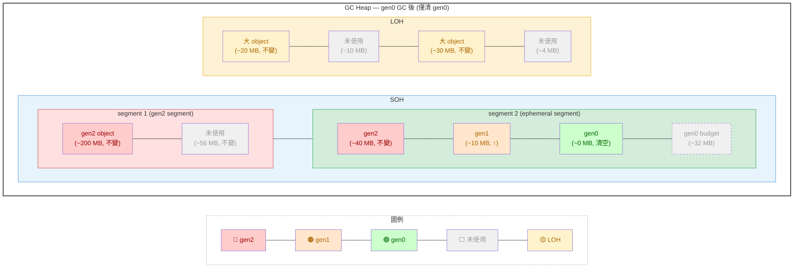
```mermaid
graph TD
    subgraph GCHEAP[" GC Heap — gen0 GC 後 (僅清 gen0)"]
        direction LR

        subgraph SOHEAP[" SOH "]
            direction LR
            subgraph SEG1[" segment 1 (gen2 segment)"]
                direction LR
                S1OBJ["gen2 object<br/>(~200 MB, 不變)"] --- S1FREE["未使用<br/>(~56 MB, 不變)"]
            end
            subgraph SEG2[" segment 2 (ephemeral segment)"]
                direction LR
                S2GEN2["gen2<br/>(~40 MB, 不變)"] --- S2GEN1["gen1<br/>(~10 MB, ↑)"] --- S2GEN0["gen0<br/>(~0 MB, 清空)"] --- S2BUDGET["gen0 budget<br/>(~32 MB)"]
            end
            SEG1 --- SEG2
        end

        subgraph LOHEAP[" LOH "]
            direction LR
            LOBJ1["大 object<br/>(~20 MB, 不變)"] --- LFREE1["未使用<br/>(~10 MB)"] --- LOBJ2["大 object<br/>(~30 MB, 不變)"] --- LFREE2["未使用<br/>(~4 MB)"]
        end

    end

    subgraph LEGEND[" 圖例 "]
        direction LR
        L1["🔴 gen2"] --- L2["🟠 gen1"] --- L3["🟢 gen0"] --- L4["⬜ 未使用"] --- L5["🟡 LOH"]
    end

    GCHEAP ~~~ LEGEND

    style GCHEAP fill:#ffffff,stroke:#333,stroke-width:2px
    style SOHEAP fill:#e8f4fd,stroke:#4a90d9
    style LOHEAP fill:#fdf2d5,stroke:#e6a817
    style SEG1 fill:#ffe0e0,stroke:#c44,stroke-width:1px
    style SEG2 fill:#d4edda,stroke:#28a745,stroke-width:1px
    style S2GEN2 fill:#ffcccc,color:#900
    style S2GEN1 fill:#ffe6cc,color:#a60
    style S2GEN0 fill:#ccffcc,color:#060
    style S2BUDGET fill:#f0f0f0,color:#999,stroke-dasharray: 4 4
    style S1OBJ fill:#ffcccc,color:#900
    style S1FREE fill:#f0f0f0,color:#999
    style LOBJ1 fill:#fff3cd,color:#a60
    style LOBJ2 fill:#fff3cd,color:#a60
    style LFREE1 fill:#f0f0f0,color:#999
    style LFREE2 fill:#f0f0f0,color:#999
    style LEGEND fill:#ffffff,stroke:#999,stroke-dasharray: 2 2
    style L1 fill:#ffcccc,color:#900
    style L2 fill:#ffe6cc,color:#a60
    style L3 fill:#ccffcc,color:#060
    style L4 fill:#f0f0f0,color:#999
    style L5 fill:#fff3cd,color:#a60
```

> **gen0 GC 後唯一變化：** gen0 清空（survivors → gen1），gen1 從 ~8MB 長到 ~10MB。gen2、LOH、segment 結構全部不變。這就是前面說的「gen0 GC 後 heap 變化不大」。

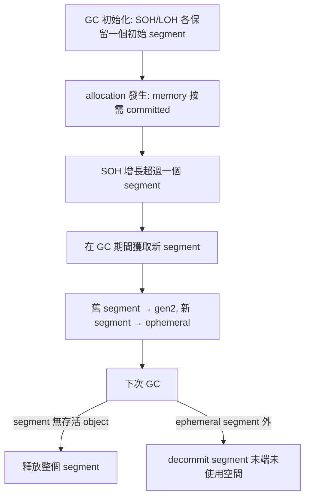
```mermaid
graph TD
    INIT["GC 初始化: SOH/LOH 各保留一個初始 segment"] --> ALLOC["allocation 發生: memory 按需 committed"]
    ALLOC --> GROW["SOH 增長超過一個 segment"]
    GROW --> NEWSEG["在 GC 期間獲取新 segment"]
    NEWSEG --> SWITCH["舊 segment → gen2, 新 segment → ephemeral"]
    SWITCH --> GC["下次 GC"]
    GC -->|"segment 無存活 object"| FREE["釋放整個 segment"]
    GC -->|"ephemeral segment 外"| DECOMMIT["decommit segment 末端未使用空間"]
```

> **記住：** ephemeral generations (gen0/gen1) 永遠在同一個 ephemeral segment。gen2 GC 後可能釋放舊 segment，gen0 GC 後變化較小。

多數情況下無需關注 GC  heap 的 segment 結構，除非在 32 位元系統上——由於虛擬位址空間較小 (總計 2-4G) 且可能碎片化，即使請求小 object 也可能因無法保留新 segment 而出現 OOM。而 64 位元系統（現今主流）有充足虛擬位址空間，保留 segment 不成問題，且 segment 更大。

#### g. GC 自身的 Bookkeeping

GC 不是魔法——它要能判斷「這個 object 還活著嗎？」就需要記錄很多 metadata。這些 GC 自己用的 metadata 統稱為 **bookkeeping**，大約佔 GC heap 大小的 1%。

**為什麼 GC 需要這些 metadata？**

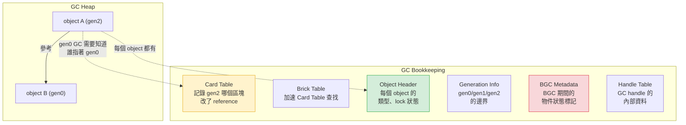
```mermaid
graph TD
    subgraph HEAP["GC Heap"]
        OBJ["object A (gen2)"] -->|"參考"| OBJ2["object B (gen0)"]
    end
    
    subgraph BOOK["GC Bookkeeping"]
        CARD["Card Table\n記錄 gen2 哪個區塊\n改了 reference"] 
        BRICK["Brick Table\n加速 Card Table 查找"]
        HEAD["Object Header\n每個 object 的\n類型、lock 狀態"]
        GEN["Generation Info\ngen0/gen1/gen2\n的邊界"]
        META["BGC Metadata\nBGC 期間的\n物件狀態標記"]
        HANDLE["Handle Table\nGC handle 的\n內部資料"]
    end

    OBJ -.->|"gen0 GC 需要知道\n誰指著 gen0"| CARD
    OBJ -.->|"每個 object 都有"| HEAD

    style CARD fill:#fff3cd,stroke:#e6a817
    style META fill:#f8d7da,stroke:#dc3545
    style HEAD fill:#d4edda,stroke:#28a745
```

**各結構的詳細說明**

**Card Table（卡片表）— 解決「gen2 偷指 gen0」的問題**

這是最重要的 bookkeeping 結構。想像一個場景：你有一個 gen2 的老 object，它的某個 field 突然改指向一個 gen0 的新 object。如果 gen0 GC 要判斷這個 gen0 object 是否存活，它必須知道「有 gen2 在指著它」。但 gen0 GC 只掃 gen0，不掃 gen2（gen2 太大了）。

解決方案：每當任何 object 的 reference 被修改，CLR 就在 Card Table 裡標記「這個記憶體區塊被動過了」。這樣 gen0 GC 只需檢查 Card Table 標記過的少數 gen2 區塊，而不必掃整個 gen2。

```
[gen2 object] 寫入 reference 指向 gen0
       ↓
CLR 在 Card Table 記一筆: "gen2 位置 X 被修改了"
       ↓
下次 gen0 GC: 只檢查 Card Table 標記過的 gen2 位置
```

**Brick Table（磚塊表）— 加速 Card Table 的索引**

Card Table 很大時，查找效率會下降。Brick Table 把 Card Table 再分成更大的「磚塊」，做一層索引加速查找。你可以把 Card Table 想成書的目錄，Brick Table 想成目錄的目錄。

**Object Header（物件標頭）— 每個 object 都有一個**

每個 .NET object 前面都有一個 header（4-8 bytes），記錄了同步區塊（lock 用的）、GC 標記位元（這個 object 被 GC 掃過了沒）、以及型別指標（指向 MethodTable）。

**Generation Info（代際資訊）— 記住各代的邊界**

記錄 gen0 從哪個位址開始、gen1 從哪開始、gen2 從哪開始。這樣 GC 才知道要掃哪些範圍，以及每個 object 屬於哪一代。

**Concurrent GC Metadata（並行 GC 元數據）— BGC 最大的隱藏成本**

這是 BGC 獨有的開銷。BGC 在背景執行時，你的 Thread 仍然在跑，可能隨時修改 object 的 reference。GC 需要額外的標記位元來追蹤「這個 object 在 BGC 期間有沒有被改過」。這部分約佔 heap 大小的 0.5-1%，是 bookkeeping 的最大宗。如果沒啟用 BGC，這部分開銷 = 0。

**Handle Table（句柄表）— GC Handle 的後台資料**

當你使用 `GCHandle.Alloc()` 建立 GC handle 時，GC 需要在內部維護這個 handle 的結構。Handle 越多，這個表越大。

GC Handle 有四種類型，各自用途不同：

| 類型 | 效果 | 常見用途 |
|------|------|---------|
| **Strong (Normal)** | 只要 handle 還在，object 就不會被回收 | 把 managed object 傳給 native code（P/Invoke） |
| **Pinned** | Strong + GC 不能移動這個 object | 讓 native code 直接讀寫 object 的記憶體位址 |
| **Weak** | object 可以被回收，回收後 `Target` 變 `null` | cache、事件訂閱（避免 memory leak） |
| **WeakTrackResurrection** | 比 Weak 更晚清掉（等 finalizer 跑完才變 null） | 少用，特殊情境 |

> **注意：** Pinned handle 用完要呼叫 `handle.Free()`，否則 object 永遠無法被回收 → memory leak + 碎片化。Weak handle 則要常檢查 `Target` 是否已變 `null`。

**總結**

| 結構 | 一句話解釋 | 何時變大 |
|------|-----------|---------|
| Card Table | 追蹤「誰指了年輕代」 | heap 越大，card 越多 |
| Brick Table | Card Table 的索引 | 隨 Card Table 等比 |
| Object Header | 每個 object 都有一個 | object 數量 × 4-8 bytes |
| Generation Info | 各代邊界 | 基本固定 |
| Concurrent GC Metadata | BGC 的物件狀態追蹤 | **BGC 啟用時**，與 heap 保留大小成比例 |
| Handle Tables | GC handle 的登記本 | handle 數量 |

> **重點：** 正常的 .NET 應用中，bookkeeping 約佔 heap 的 1%，通常不需關注。BGC 的 metadata 是最大宗（0.5-1%），關掉 BGC 就省了這部分。如果 heap 是 1GB，bookkeeping 大約 10MB——一般來說無感。

#### h. GC 何時拋出 OOM 異常？

幾乎所有 .NET 開發者都遇過 OOM（Out of Memory）。GC 在拋出 OOM 前會盡全力嘗試回收——它不想丟這個 exception，因為通常代表真的沒救了。

**OOM 前的 GC 升級流程**

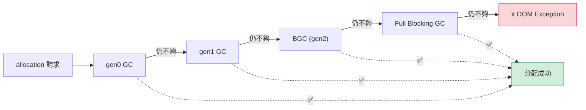
```mermaid
graph LR
    A["allocation 請求"] --> B["gen0 GC"]
    B -->|"仍不夠"| C["gen1 GC"]
    C -->|"仍不夠"| D["BGC (gen2)"]
    D -->|"仍不夠"| E["Full Blocking GC"]
    E -->|"仍不夠"| F["💀 OOM Exception"]
    
    B -.->|"✅"| OK["分配成功"]
    C -.->|"✅"| OK
    D -.->|"✅"| OK
    E -.->|"✅"| OK

    style F fill:#f8d7da,stroke:#dc3545
    style OK fill:#d4edda,stroke:#28a745
```

GC 的路徑是：**gen0 GC → gen1 GC → BGC → Full Blocking GC**。只有最後一關 Full Blocking GC（壓縮整個 heap）也無法釋放空間時，才真的沒救了。

**為什麼有時看不到 Full Blocking GC 就 OOM？**

GC 的啟發式機制會判斷「Full Blocking GC 到底有沒有效」。如果 GC 發現每次做完 Full Blocking GC 都只能回收極少 memory（因為 heap 幾乎全是活 object，壓縮完還是滿的），它會停止反覆嘗試——改為混合執行 gen1 GC + Full Blocking GC 的策略。所以有時 OOM 不是由純 Full Blocking GC 拋出，而是混合模式。

**三種 GC 類型在 memory 壓力下的角色**

| GC 類型 | 回收範圍 | STW？ | 壓力下的行為 |
|---------|---------|-------|------------|
| **Ephemeral GC** | gen0 或 gen0+gen1 | 是（<1ms） | 最先觸發，快速嘗試 |
| **BGC (Background GC)** | gen2（不壓縮） | 短暫 | 建 free list 容納 survivors |
| **Full Blocking GC** | gen0+gen1+gen2+LOH | 是（全程） | 最後手段，壓縮整個 heap |
             
### V. 理解 GC STW：GC 觸發時機與持續時間

當 GC 進行時，你的 Thread 會被暫停——這段時間稱為 **GC Pause**（也稱為 STW，Stop-The-World）。調查 GC 效能問題時，先搞清楚你關心的是哪種暫停：

| 關注點 | 指標 | 影響什麼 |
|--------|------|---------|
| **總暫停時間** | `% Pause Time in GC`（所有 GC 暫停累加） | **吞吐量**（throughput）— GC 佔掉越多時間，你的程式能工作的時間越少 |
| **單次暫停時間** | 每次 GC 的 Pause Msec | **尾延遲**（tail latency, P99/P99.9）— 最長的請求是否被 GC 拖累 |

> Tail latency 通常指 P99（99th percentile）、P99.9 或更高的延遲指標。例如 P99 = 200ms 表示 99% 的請求在 200ms 內完成，但最慢的 1% 可能被 GC 卡住。

#### a. 單次 GC 持續時間

.NET GC 是**追蹤式 GC（tracing GC）**：它從一組 roots（例如 stack 上的變數、GC handle 等）出發，追蹤所有可達的 object，標記為存活。因此 GC 的工作量基本上跟**存活 object 的數量**成正比——你要回收的 object 越多，GC 跑越久。

**Blocking GC vs BGC 的持續時間：**

| GC 類型 | 持續時間 | 你感受到的暫停 | 說明 |
|---------|---------|-------------|------|
| Blocking GC（gen0/gen1/Full Blocking） | = 暫停時間 | 全程停機 | Thread 全部暫停直到 GC 做完 |
| BGC（Background GC） | 較長（背景慢慢跑） | 很短 | 大部分工作在 concurrent 階段完成 |

為什麼這個「成正比」不是 100% 精確？因為 GC 跟其他 process 共享 CPU 核心。即使 GC 暫停了你的 managed Thread，native Thread 和其他 process 仍會佔用 CPU。另外 Server GC 有自己的 Thread 優先級設定，也會影響實際耗時。

GC 有兩種主要模式：Workstation GC 和 Server GC。顧名思義，Workstation GC 預設用於桌面應用（與其他 process 共享機器），Server GC 預設用於 ASP.NET 這類高吞吐服務（通常是機器上的主導 process）。

.NET Core 的預設行為：Console App 在單核心機器上使用 Workstation GC，多核心則使用 Server GC；ASP.NET Core 永遠是 Server GC，除非明確配置為 Workstation。

**兩種模式對比：**

| 特性 | Workstation GC | Server GC |
|------|---------------|-----------|
| Heap 數量 | 1 個<br/>（整個 process 共用一個 heap，所有 object 都放在裡面） | 每個 logical core 1 個<br/>（例如 8-core 機器 = 8 個獨立 heap，object 會分散到不同 heap 上） |
| GC Thread | 在觸發 GC 的用戶 Thread 上執行<br/>（你的程式碼呼叫 `new` → 預算用完 → 同一個 Thread 直接執行 GC） | 每個 heap 有專屬 GC Thread，全部並行<br/>（GC 發生時，所有專屬 Thread 同時開工，各自負責自己的 heap） |
| Thread 優先級 | 普通 | `THREAD_PRIORITY_HIGHEST` |
| BGC 支援 | ✔ | ✔ |
| 記憶體用量 | 較省（1 個 gen0 budget） | 較多（N 個 gen0 budget，N=核心數） |
| 適用場景 | 桌面應用、小型服務 | ASP.NET、高吞吐服務 |

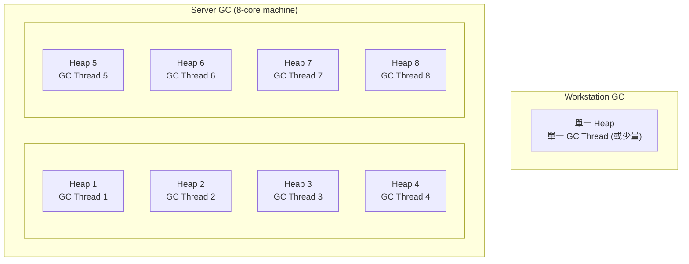
```mermaid
flowchart TB
    subgraph WS["Workstation GC"]
        WSHeap["單一 Heap<br/>單一 GC Thread (或少量)"]
    end

    subgraph Server["Server GC (8-core machine)"]
        direction LR
        subgraph Row1[" "]
            H1["Heap 1<br/>GC Thread 1"]
            H2["Heap 2<br/>GC Thread 2"]
            H3["Heap 3<br/>GC Thread 3"]
            H4["Heap 4<br/>GC Thread 4"]
        end
        subgraph Row2[" "]
            H5["Heap 5<br/>GC Thread 5"]
            H6["Heap 6<br/>GC Thread 6"]
            H7["Heap 7<br/>GC Thread 7"]
            H8["Heap 8<br/>GC Thread 8"]
        end
    end
```

**以一個 process 在 8-core CPU 上為例：**

| | Workstation GC（1 heap） | Server GC（8 heap） |
|------|------|------|
| **GC 時** | 只有 1 個 Thread 在清，其他 7 個核心閒著 | 8 個 Thread 同時清各自的 heap |
| **GC 速度** | 慢，一個人掃全場 | 快，8 個人分頭掃 |
| **committed memory** | 省，只有 1 份 gen0 budget（~32MB） | 多，8 份 gen0 budget（~32MB × 8 = ~256MB） |
| **object 分配** | 全部 object 塞同一個 heap | object 分散到 8 個 heap（GC 自動分配，你看不到） |
| **暫停時間** | 單一 heap 要處理的量集中 | 每個 heap 各自較小，全部 parallel 處理，總暫停更短 |

總結：同一個 process，8 heap = 用更多 memory 換更短的 GC 暫停。這就是為什麼 ASP.NET 預設用 Server GC——高吞吐服務寧可多吃記憶體，也要 GC 快點做完。

**Server GC 的設計考量：** 每個 GC thread 嚴格綁定到對應 logical core（CPU affinity），目的是讓 GC 盡快完成。但要注意：如果有其他 `THREAD_PRIORITY_HIGHEST` 或更高優先級的 Thread 在跑，Server GC thread 會被搶走 CPU → GC 耗時反而更長。多個使用 Server GC 的 process 共存時也可能發生競爭。可以透過[配置選項](https://devblogs.microsoft.com/dotnet/middle-ground-between-server-and-workstation-gc/)限制 Server GC 使用的 heap/Thread 數量。

有人刻意將大型 Server process 拆分為多個較小的 process，並透過 `GCHeapCount` 限制每個 process 只使用 2~4 個 heap（而非預設的 8 個），藉此縮小每個 process 的 gen2 heap 大小 → Full Blocking GC 暫停時間更短。關鍵前提是**要同時降低 `GCHeapCount`**——如果只拆分 process 但不調 heap 數，每個小 process 預設還是拿 8 個 heap（假設 8-core），總 heap 數反而暴增（4 process × 8 = 32 heap），committed memory 爆表。

**為什麼 GC 變快？不是 per-heap 變小，而是「要掃的範圍」變小了。** 注意：不管拆分前還是拆分後，每個 heap 扛的 request 比例是一樣的（8 heap 各扛 12.5%，2 heap 各扛 12.5%）。per-heap 沒變。那為什麼 GC 變快？

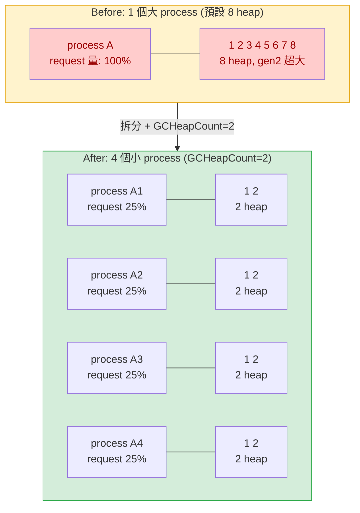
```mermaid
graph TD
    subgraph BEFORE["Before: 1 個大 process (預設 8 heap)"]
        P1["process A<br/>request 量: 100%"] --- H1["1 2 3 4 5 6 7 8<br/>8 heap, gen2 超大"]
    end

    subgraph AFTER["After: 4 個小 process (GCHeapCount=2)"]
        P2["process A1<br/>request 25%"] --- H2["1 2<br/>2 heap"]
        P3["process A2<br/>request 25%"] --- H3["1 2<br/>2 heap"]
        P4["process A3<br/>request 25%"] --- H4["1 2<br/>2 heap"]
        P5["process A4<br/>request 25%"] --- H5["1 2<br/>2 heap"]
    end

    BEFORE -->|"拆分 + GCHeapCount=2"| AFTER

    style BEFORE fill:#fff3cd,stroke:#e6a817
    style AFTER fill:#d4edda,stroke:#28a745
    style P1 fill:#ffcccc,color:#900
    style H1 fill:#ffcccc,color:#900
```

| | 拆分前 | 拆分後 |
|------|--------|--------|
| process 數 | 1 | 4 |
| 每個 process 的 heap 數 | 8（預設） | 2（`GCHeapCount=2`） |
| 總 heap 數 | 8 | 8（4×2） |
| 每個 process 的 gen2 大小 | 大（扛全部 request，存活 object 多） | 小（只扛 25% request，存活 object 少） |
| Full Blocking GC 暫停 | 長 | 短 |

**為什麼 GC 變快？不是 per-heap 變小，而是「要掃的範圍」變小了。** 注意：不管拆分前還是拆分後，每個 heap 扛的 request 比例是一樣的（8 heap 各扛 12.5%，2 heap 各扛 12.5%）。per-heap 沒變。那為什麼 GC 變快？

Full Blocking GC 時，Server GC 的 N 個 GC Thread 全部並行，但暫停時間取決於最慢的那個 Thread。真正讓 GC 變快的原因是：

1. 每個 process 的 gen2 總量變小。Full Blocking GC 是 process 層級的——它要掃整個 process 的所有 heap。拆分前一個 process 有 8 個 heap，拆分後只剩 2 個——即使單個 heap 大小相同，要掃的 heap 數量從 8 降到 2，總工作量就是原來的 1/4。
2. 交叉引用減少，gen2 天生更瘦。一個扛全部 request 的 process，object 之間的交叉引用更多——跨請求的快取、靜態變數、共享狀態等會互相拉著，導致本來該死的 object 一直被引用走不了，一路 promote 到 gen2。拆分後每個 process 只處理一部分流量，交叉引用大幅減少 → 能正常回收的 object 變多 → gen2 更瘦 → GC 更快。

#### b. GC 觸發的頻率

GC 的觸發頻率取決於一個核心概念——**allocation budget（分配預算）**。每個 generation（gen0、gen1、gen2、LOH）都有各自的預算，當某一代的預算用完時，GC 就會被觸發。

舉個例子：gen0 的初始預算可能是 256 KB。每次你 `new` 一個 object，gen0 的已使用量就增加。當累積超過預算時 → 觸發 gen0 GC。

**預算是動態調整的，不是固定值。** GC 會根據每次 GC 後的存活率來重新計算預算，這是 GC 自適應機制的核心：

| 存活率 | 預算調整 | 原因 | 觸發頻率變化 |
|--------|---------|------|------------|
| **高**（大量 object 活著） | 預算 **增大** | object 偏長壽，短期內不會釋放 → 不用一直回收 | 觸發頻率 **降低** |
| **低**（大部分 object 已死） | 預算 **縮小** | object 偏短命 → 可以更頻繁回收，避免 memory 浪費 | 觸發頻率 **升高** |

這就是分代設計的直觀表現：

| 代 | 典型存活率 | 預算 | 觸發頻率 |
|----|-----------|------|---------|
| gen0 | 極低（臨時 object） | 小 | 最高（秒級） |
| gen1 | 中等（緩衝區） | 中 | 中等 |
| gen2 | 高（長期 object） | 大 | 最低（分鐘～小時級） |

因此：**GC 觸發頻率由未存活 object 的量決定**——object 越短命，gen0 預算越快被消耗，GC 越常跑。反之 gen2 因為多數 object 長期存活，預算設得很大，極少被觸發。

**GC 的回收範圍如何決定？** 不只 gen0 預算會觸發 GC——gen1 和 gen2 的預算也會。當 GC 啟動時，它會檢查所有代的預算狀態：

| 哪一代的預算耗盡 | 這次 GC 收哪些代 | 稱呼 |
|----------------|----------------|------|
| 只有 gen0 | gen0 | gen0 GC（Ephemeral） |
| gen1（或 gen0+gen1） | gen0 + gen1 | gen1 GC（Ephemeral） |
| gen2（或全部） | gen0 + gen1 + gen2 | gen2 GC（Full GC） |

所以如果 gen2 的預算也耗盡了，這次 GC 就會直接做 Full GC，收整個 heap。

**什麼情況會觸發 Full Blocking GC？** 除了預算耗盡，還有兩個觸發條件：

1. **機器記憶體壓力高**：整台機器快沒 memory 了，GC 會更積極做 Full Blocking GC 來壓縮 heap（讓 memory 變小），即使 BGC 對暫停時間更友好。
2. **gen2 碎片化極高**：即使記憶體還很充裕，如果 gen2 碎片很嚴重，GC 也會判定「壓縮更有價值」而觸發 Full Blocking GC。

如果你有充足 memory 且想避免長時間暫停，可以將延遲模式設為 [SustainedLowLatency](https://docs.microsoft.com/en-us/dotnet/api/system.runtime.gclatencymode?view=netcore-3.1#System_Runtime_GCLatencyMode_SustainedLowLatency)，指示 GC 只在真正必要時才執行 Full Blocking GC。

#### c. 需牢記的一個規則

雖然內容繁多，但若總結為一條規則，我在談論 GC 觸發頻率與個別 GC 耗時時總是強調：

`存活的 object 通常決定 GC 需做多少工作；未存活的 object 通常決定 GC 觸發的頻率`

以下是應用此規則的極端案例：

情境 1 - gen0 完全無存活。這表示 gen0 GC 會頻繁觸發，但個別 gen0 暫停極短，因為幾乎無工作可做。

情境 2 - gen2 大部分存活。這表示 gen2 GC 極少觸發。但若以 blocking GC 執行，個別 gen2 暫停會很長；若以 BGC 執行，則耗時較長（但暫停仍短）。

你無法同時處於高 allocation 率與高存活率的情境——這會迅速耗盡 memory 。

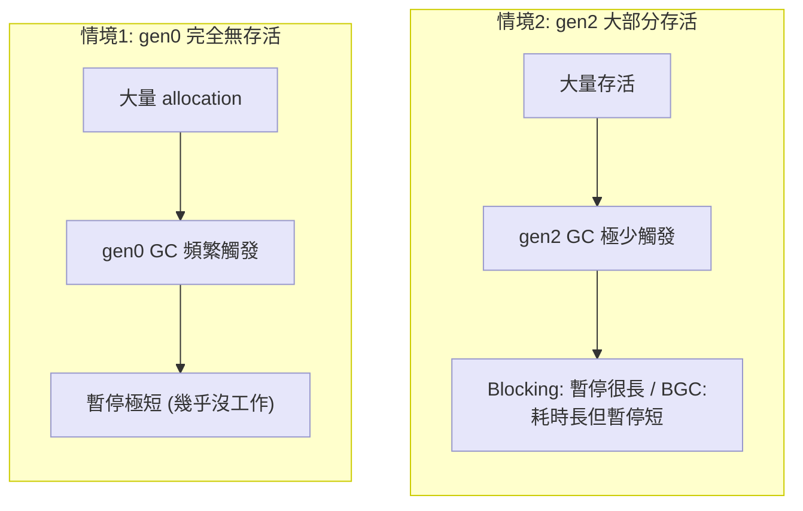
```mermaid
flowchart TB
    subgraph S2["情境2: gen2 大部分存活"]
        direction TB
        A2["大量存活"]
        B2["gen2 GC 極少觸發"]
        C2["Blocking: 暫停很長 / BGC:<br/>耗時長但暫停短"]
        A2 --> B2 --> C2
    end

    subgraph S1["情境1: gen0 完全無存活"]
        direction TB
        A1["大量 allocation"]
        B1["gen0 GC 頻繁觸發"]
        C1["暫停極短 (幾乎沒工作)"]
        A1 --> B1 --> C1
    end

    style S1 fill:#ffffcc,stroke:#cccc00
    style S2 fill:#ffffcc,stroke:#cccc00
    style A1 fill:#e6e6fa,stroke:#9999cc
    style B1 fill:#e6e6fa,stroke:#9999cc
    style C1 fill:#e6e6fa,stroke:#9999cc
    style A2 fill:#e6e6fa,stroke:#9999cc
    style B2 fill:#e6e6fa,stroke:#9999cc
    style C2 fill:#e6e6fa,stroke:#9999cc
```

中等情境：現實中通常介於兩個極端之間。例如 gen0 50% 存活 → gen0 GC 中等頻率觸發，中等暫停時間。兩個極端更多是幫助你建立直覺的思維模型，而非真實程式常態。當你觀察到 GC 行為時，可以用這個規則快速推測：暫停長 → 存活率高（可能 promote 到更高 gen）；觸發頻率高 → 存活率低（gen0 預算消耗快）。

#### d. 使 Object 存活的因素

從 GC 的角度，它透過各種 runtime 元件得知哪些 object 應存活。它不關心這些 object 的類型，只關心存活的 memory 量及這些 object 是否有引用（需追蹤這些引用以觸及應存活的子 object ）。我們持續改進 GC 本身以縮短暫停，但作為撰寫 managed code 的開發者，了解 object 存活的機制是改善 GC 暫停的重要途徑。

###### 1. 分代機制

我們已討論過分代 GC 的影響，因此第一條規則是：

`當某個 generation 未被收集時，表示該 generation 中的所有 object 均假定存活中`

因此，若收集 gen2（Full GC），分代機制無關緊要——因為所有 generation 都會被收集。常見問題是：「我已多次呼叫 `GC.Collect()`，為何 object 仍存在？」這是因為當你強制 Full Blocking GC 時，GC 不參與決定哪些 object 應存活——它僅透過 [user roots](#2-User-roots)（stack 變數、GC handles、finalize queue 等，後續討論）得知。

```C#
public void Example()
{
    // 1. 當宣告並初始化 obj 時：
    var obj = new object();

    // 發生兩件事：
    // a. object() 在 Heap 上創建
    // b. obj 變數在 Stack 上創建，指向 Heap 上的 object

    // Stack:  obj ──────→ Heap: object()
    // obj 是 GC root → object 無法被回收

    // 2. 此時 obj 是一個局部變數，存在於方法的 Stack 框架中
    // 這個 Stack 框架是 GC root 的一種

    GC.Collect();  // object 不會被回收，因為 Stack 還在引用它

    // 3. 當我們設定 obj = null
    obj = null;

    // Stack:  obj (null)      Heap: object() ← 可被回收

    // 4. 現在 Stack 上的變數不再引用 Heap 上的 object
    // GC 可以回收這個 object 了

    GC.Collect();  // 現在 object 可以被回收
}
```

**分代 GC 機制對效能優化的實際影響：**

.NET GC 的分代機制雖然是其核心設計，但在實際效能分析和優化過程中，這個機制的重要影響常常被工具和開發者所忽視。

大多數效能分析工具僅提供 heap dump，這些工具通常只會顯示哪些 stack 變數和 GC handles 持有 object 引用，以及整體 memory 使用情況。然而它們很少展示**跨代引用（cross-generation references）**如何影響 GC 行為。

一個常見的優化誤區：假設你發現應用程式有 GC 暫停問題，分析後移除了大量 GC handle（這些 handle 多半指向 gen2 的 object），期望減少 GC 暫停時間。但結果 GC 暫停幾乎沒有改善——為什麼？

如果應用程式中大部分 GC 暫停來自 **gen0 GC** 而非 gen2 GC，且 gen2 中有其他 object 仍在引用 gen0 的 object（跨代引用），這些 gen0 object 在 gen0 GC 時就必須保持存活。你移除的那些 gen2 object 如果並非持有 gen0 object 的那些，gen0 中的 object 仍然會被其他 gen2 object 引用 → gen0 GC 的工作量和暫停時間不會減少。

有限的效益：即使你真的減少了 gen2 的大小和工作量，**如果 gen2 GC 很少被觸發（相對於 gen0/gen1 GC），對整體效能的影響極小**——gen0/gen1 GC 的暫停時間仍然存在，且可能占總 GC 暫停時間的大部分。

**有效的 GC 優化需要：**
- 先確定**哪一代**的 GC 造成了主要的效能問題
- 理解不同代之間的引用關係，特別是**高代對低代的引用**
- 針對性優化：減少 gen0 GC 暫停 → 處理高代到 gen0 的引用；減少 gen2 GC 次數 → 減少升入 gen2 的 object 數量
- 使用能顯示分代關係和跨代引用的分析工具

###### 2. 用戶根 (User roots)

你可能聽過的常見 root 類型包括指向 object 的 stack 變數、 GC handles 和 finalize queue。我稱之為 user roots，因它們源自 user code。由於這些是 user code 可直接影響的部分，將詳細討論。

- Stack 變數

Stack 變數（尤其是 C# 程式）較少被討論，因 JIT 能有效判斷 stack 變數何時不再使用。方法結束時， stack root 必定消失。甚至在方法結束前， JIT 能判斷 stack 變數是否仍需使用，因此即使方法中途發生 GC， JIT 不會將這個變數告訴 GC 作為 root（當變數不被視為 root 時，其指向的 object 就可能被回收）。注意： DEBUG 版本不適用此情況。

```C#
public class DetailedExample
{
    public void Example ()
    {
        // Release 模式
        var obj1 = new object ();
        var obj2 = new object ();
        
        DoWork (obj1);
        // JIT 知道 obj1 後面不會再用到
        // 如果這時發生 GC：
        // - obj1 不會被報告為 root（可以被回收）
        // - obj2 還會被報告為 root（後面還會用到）
        
        DoWork (obj2);
    }
    
    public async Task AsyncExample ()
    {
        var data = new byte[1000];
        await Task.Delay (100);
        
        // 在 async 方法中
        // 變數生命週期管理更複雜
        // JIT 可能需要保持更多 root 存活
    }
}
```

- GC handles​​

GC handles 是 user code 持有 object 存活或檢查 object 而不持有存活的方式。前者稱為 strong handle，後者稱為 weak handle。 Strong handles 需釋放才能不再持有 object 存活（即需呼叫 handle 的 Free）。有人展示 !gcroot (顯示 object  root 的 SoS 除錯器指) 輸出，指出 strong handle 指向 object 並詢問為何 GC 未回收。設計上，此 handle 告知 GC 該 object 需存活，因此 GC 無法回收。目前以下 [user exposed handle types](https://docs.microsoft.com/en-us/dotnet/api/system.runtime.interopservices.gchandletype?view=netcore-3.1) 為 strong handles： Strong 和 Pinned； weak handles 為 Weak 和 WeakTrackResurrection。但若看過 SoS 的 !gchandles 輸出， pinned handles 可能包含 AsyncPinned。

###### 釘選 (Pinning)

在 .NET 的垃圾收集系統中， pinning 是標記物件不可移動的機制。從 GC 效能角度來看， pinning 會產生記憶體碎片化問題，因為 GC 無法移動這些固定物件來壓縮記憶體空間。

當 GC 執行時，它會將 pinned 物件周圍已釋放的空間轉換為可用空間。然而，若 pinned 物件被 promoted 到較老的代 (如 gen2)，它們周圍的可用空間也會被視為屬於 gen2 。這些空間因此被 " 鎖定 " 在 gen2 中，只能在 gen2 GC 執行時才能用於容納從 gen1 promote 上來的存活物件。在 gen2 GC 發生前，即使這些空間實際是空閒的，也無法用於分配新物件，造成記憶體使用效率低下。由於 gen2 GC 相對較少發生，這個問題會更加明顯。

為解決這個問題，.NET GC 實現了 demotion（降級）機制。該機制會將某些原本應該 promote 到較老代的 pinned 物件降級回 gen0 。這樣做使得 pinned 物件周圍的空閒空間成為 gen0 的一部分，立即可用於新物件分配，無需等待較老代的 GC 發生。這種方法有效地 " 解鎖 " 了被 pinned 物件鎖住的記憶體空間。

這種降級策略使得在這些空間中分配的物件會消耗 gen0 的預算，但不會增加 gen0 的實際大小，因為它使用的是已有的空間。這有效地改善了 pinning 導致的記憶體碎片化問題，提高了整體記憶體利用效率。通過這種巧妙的機制，.NET GC 在保證 pinned 物件安全的同時，最大限度地減輕了它們對記憶體使用效率的負面影響。

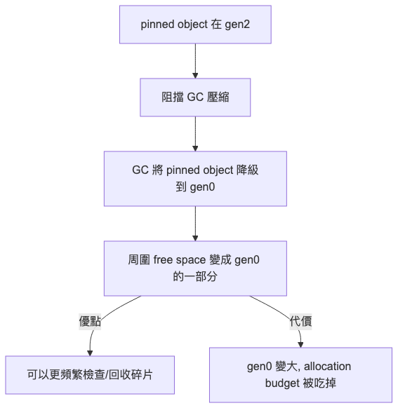

Fig. 5 - demotion （取自舊投影片，外觀與前圖略有不同）

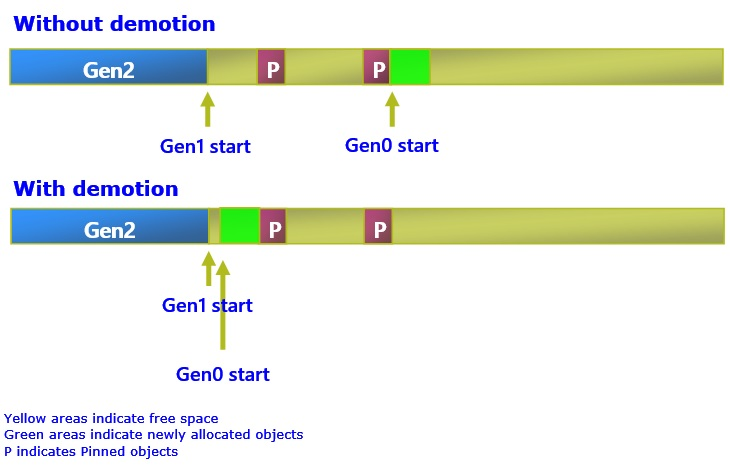

當 GC 透過 demotion 機制將 pinned 物件降級到 gen0 時，這些物件周圍的空閒空間也成為 gen0 的一部分。在這些空間中進行的新物件分配會消耗 gen0 的預算，但不會增加 gen0 的實際大小，因為它們使用的是已存在的空間。系統首先嘗試擴展 gen0 以滿足分配需求，只有當 gen0 達到其預算上限且無法再擴展時，才會觸發 gen0 GC。

然而， GC 並不會無條件地進行降級操作。這是因為讓大量 pinned 物件留在 gen0 中會帶來效能問題：每次 gen0 GC 執行時都需要檢查這些 pinned 物件，增加了 GC 的工作負擔。因此，在 pinning 使用頻繁的情況下， GC 可能選擇不進行降級，這時 gen2 仍可能發生碎片化問題。

為了減輕 pinning 帶來的 GC 壓力，開發者可以採用兩種關鍵策略。首先是 " 提早 pin"——在堆記憶體已經壓縮的區域進行 pinning，這樣可以避免碎片化問題，因為這些物件已經不需要被移動。其次是 " 批次 pin"——不要零散地分配並 pin 單個物件，而是批次分配緩衝區並一次性 pin 它們。

.NET 5 進一步改進了這方面的支援，引入了 [Pinned Object Heap](https://github.com/dotnet/runtime/blob/master/docs/design/features/PinnedHeap.md) (POH)。 POH 允許開發者在分配物件時就指示 GC 將其放置在專門的 pinned heap 中。這種方法有效緩解了碎片化問題，因為 pinned 物件不再散落在一般堆記憶體中，而是集中在特定區域，大大減少了對整體堆記憶體壓縮的干擾。

##### a. 終結器 (Finalizers)

Finalize queue 是另一種 root 來源。若撰寫 .NET 應用一段時間，你可能聽過應避免 finalizers。但有時 finalizers 並非你的程式碼，而是來自使用的函式庫。由於這是 user-facing 功能，需詳細探討。以下是 finalizers 的效能影響：

*Allocation*

·    若 allocation  finalizable object (其類型具 finalizer)，在 GC 返回 VM 端的 allocation helper 前，會將此 object 的位址記錄於 finalize queue。

·    finalizer 的存在意味著你無法使用 Fast allocation helpers，因每個 finalizable object 的 allocation 均需向 GC 註冊。

```C#
public class FastAllocExample
{
    public void Explain ()
    {
        // 小 object  allocation (使用 fast alloc)
        var smallObject = new byte[85]; // 小於 85K
        
        // 大 object  allocation (不使用 fast alloc)
        var largeObject = new byte[85000]; // 大於 85K
        
        // Fast alloc helpers 主要優化：
        // 1. 線程局部 allocation (TLAB)
        // 2. 小 object 快速 allocation 
        // 3. 減少同步開銷
    }
}
```

然而，此成本通常不明顯，因你不太可能主要 allocation  finalizable object 。更顯著的成本通常來自 GC 實際發生時及 finalizable object 在 GC 中的處理。

*Collection*

GC 發生時，會發現存活 object 並 promote 它們。接著檢查 finalize queue 中的 object 是否被 promoted——若未 promotion，表示 object 已死（儘管無法回收，見下段）。若在收集的 generations 中有大量 finalizable object ，此成本可能顯著。例如，有大量已 promote 至 gen2 的 finalizable object （因持續存活），且頻繁執行 gen2 GC，每次 gen2 GC 均需掃描所有 finalizable object 。若 gen2 GC 極少執行，則無此成本。

此即「 finalizers 有害」的原因——為執行 GC 已判定死亡的 object 的 finalizer，該 object 需存活。由於 GC 是分代的，它將被 promote 至更高 generation，這意味著需更高 generation 的 GC (即更昂貴的 G) 來收集此 object 。因此，若 finalizable object 在 gen1 GC 中被判定死亡，它需等待下次 gen2 GC（可能需時甚久），其 memory 回收將大幅延遲。

若使用 `GC.SuppressFinalize` 抑制 finalizer，即告知 GC 無需執行此 object 的 finalizer。因此 GC 無理由 promote 它，將在發現其死亡時回收。

*Running finalizers*

由 finalizer Thread 處理。 GC 發現死亡且 finalizable 的 object (後被 promote) 後，將其移至 finalize queue 中供 finalizer Thread 索取並執行的部分，並通知 finalizer Thread 有工作待處理。 GC 完成後， finalizer Thread 將執行這些 finalizers。移至 finalize queue 此部分的 object 稱為「 ready for finalization」。你可能在工具中見過此術語，例如 SoS 的 !finalizequeue 指令顯示：

`Ready for finalization 0 objects (000002E092FD9920->000002E092FD9920)`

常見此數值為 0 ，因 finalizer Thread 以高優先級執行， finalizers 會迅速執行（除非被阻塞）。

下圖展示兩個 object 及 finalizable object  F 的演變。如圖所示， F 被 promoted 至 gen1 後，若發生 gen0 GC，因 gen1 未被收集， F 仍存活； F 僅在 gen1 GC 中（檢查其所在 generation）才真正死亡。

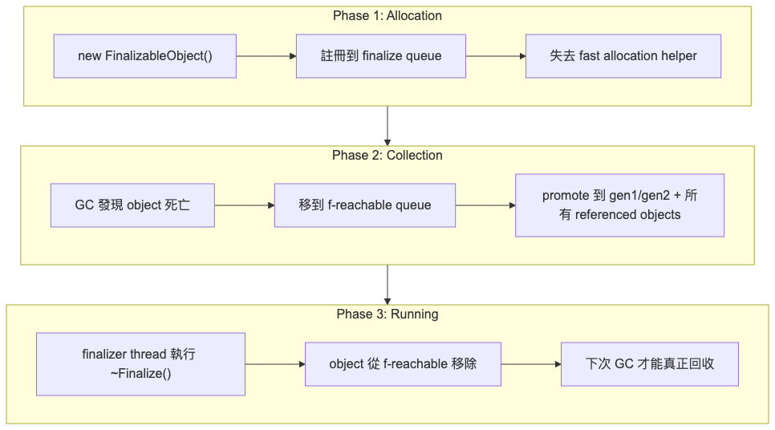

圖 6 - O 為非 finalizable， F 為 finalizable

 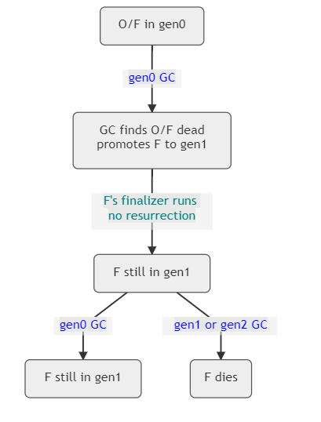

###### 3. Managed Memory Leaks

了解不同類型的 roots 後，可定義 managed memory leak：

`Managed memory leak 表示 process 運行時，至少有一個 user root 直接或間接引用愈來愈多 object 。此為 leak，因 GC 依定義無法回收這些 object 的 memory ，即使盡力執行 Full blocking GC，heap 大小仍持續增長`

注意此處指「 user root」，表示 gen2 object 持有 gen0 或 gen1 object 不算 leak。因此，判斷是否發生 managed memory leak 的最準確方式，是在 gen2 GC 後檢查 heap——此時僅存的 object 是因 user roots 而存活。最簡單的方式（若可行）是在已知 memory 使用應相同的時點（例如每個請求結束時）強制 Full blocking GC，並驗證 heap 大小未增長。顯然，這僅是協助調查 leak 的方法——生產環境中通常不願強制 Full blocking GC。因此需退而求其次，觀察自然觸發的 gen2 GC 時的 heap。最佳方式是 [ 擷取 top-level GC 追蹤 ](#How-to-collect-top-level-GC-metrics)，查看 gen2 GC 的 promoted bytes，此數值表示因 user roots 而存活的 memory 量。

這也意味著 [ 碎片化 ](#fragmentation-free-objects-is-part-of-the-heap-size) 並非 managed memory leak 的指標，因碎片化是 free objects 佔據的空間，而設計上它們無 roots。

#### e. 主流 GC 場景 vs 非主流場景

| 場景 | 特徵 | GC 最佳化程度 |
|------|------|--------------|
| **Mainline** | 只用 stack + heap objects, 無 finalizers/GC handles | 高度最佳化 |
| **Non-Mainline** | 大量 GC handles, finalizers, pinned objects | 仍最佳化但假設數量不多 |

如果一個程式僅使用 Stack 並建立一些 objects 來使用， GC 多年來已對此進行了大量最佳化。基本上就是「掃描 heap 以取得根 (root)，並從那裡處理 objects」。這是許多 GC 論文假設的唯一場景，也就是所謂的「 mainline GC scenario」。當然，作為一個存在數十年且需要滿足各種客戶需求的商業產品，我們還有許多其他機制如 GC handles 和 finalizers。關鍵在於，儘管我們也持續最佳化這些機制，但我們的運作基於「這些機制數量不會太多」的假設——顯然這並非適用於所有人。因此，若您有大量這類機制且正在診斷 memory 問題，值得深入檢視。換言之，若沒有 memory 問題則無需在意；但若有 (例如 GC 耗費高 % 時間)，這些是值得懷疑的對象。

> **初學者筆記**：Mainline 場景就像標準高速公路——GC 經過數十年調校，跑得飛快。Non-mainline 機制（finalizers、pinning、大量 GC handles）就像收費站——偶爾遇到沒關係，但如果你的程式大量使用這些機制，GC 就無法以最高速運行，值得深入調查。

#### f. GC 暫停中與 GC 無關的部分——Thread 暫停 (Thread Suspension)

我們尚未提及的 GC pause 最後一個部分，是與 GC 工作完全無關的部分——我指的是運行時 (runtime) 中的 Thread 暫停機制。 GC 在開始工作前會呼叫暫停機制，讓 process 中的 Thread 停止。我們稱此為讓 Thread 到達安全點 (safe points)。由於 GC 可能搬移 objects， Thread 不能隨機停止；它們必須停在 runtime 能回報 GC heap objects 參考的位置，以便 GC 必要時更新這些參考。一個常見誤解是 GC 負責暫停——實際上 GC 僅呼叫暫停機制來停止 Thread。但暫停被計入 GC 暫停時間，因為 GC 是使用此機制的主要元件。

我們討論過 [concurrent vs blocking GC](#Concurrent-GCBackground-GC)，已知 blocking GC 會在 GC 期間持續暫停Thread，而 BGC (concurrent 類型) 僅短暫暫停Thread，並在用戶 Thread 運行時完成大部分 GC 工作。較少人知的是，讓 Thread 進入暫停狀態可能需要時間。多數情況下這非常快速，但緩慢的暫停是 managed  memory 相關效能問題的一類，我們將專門討論 [ 如何診斷這些問題 ](#PerfView-GC-stop-triggers)。

需注意，在 GC 的暫停階段，只有執行 managed 程式碼的 Thread 會被暫停。執行原生程式碼 (native code) 的  Thread 可自由運行。但若它們在暫停階段需返回 managed 程式碼，則必須等待暫停階段結束。

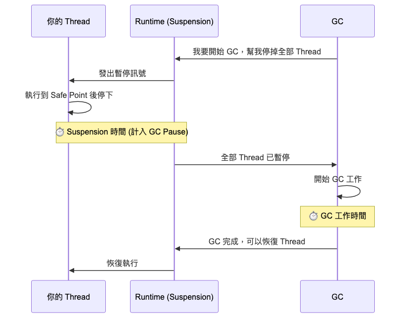

> **初學者筆記**：常見誤解——大家以為 GC 負責暫停 Thread。其實 GC 只是呼叫 Runtime 的暫停機制（就像叫人幫忙關燈），暫停本身是 Runtime 做的。但暫停時間被計入 GC pause time，因為 GC 是唯一使用這個機制的元件。如果你在 PerfView 等工具中看到 Suspend Msec 佔 GC Pause 的很大比例 → 問題不在 GC，在 Thread 到達 Safe Point 太慢（例如 Thread 正在執行長時間的 native code 呼叫或 JIT 編譯）。

# 六、何時需要擔心

與任何效能調查一樣，首要任務是判斷您是否應該擔心該問題。

## 1. 頂層應用指標

如前所述，擁有 [perf goals](#Know-what-your-perf-goal-is) 至關重要——這些目標應由一個或多個高階應用程式指標來體現。它們被稱為應用程式指標是因為它們直接反映應用程式的效能面向，例如：處理的並行請求數量、請求延遲的平均值、最大值或 P95 值。

使用高階應用程式指標來判斷產品開發過程中是否出現效能衰退或改進相對容易理解，因此我們不在此多作說明。但值得指出的是，有時這些指標可能難以保持足夠穩定以觀察月度趨勢甚至每日趨勢，原因單純是工作負載並非每日恆定，尤其是尾部延遲 (tail latency) measure。如何解決此問題？

·    這正是需要measure可能影響效能指標的 [factors](#Measure-the-impact-of-factors-that-likely-affect-your-perf-metrics) 的重要原因之一。當然，您很可能無法事先掌握所有因素。隨著認知增加，可將它們加入需measure的項目清單。

·    建立有助判斷工作負載變異程度的高階組件指標。對 memory 而言，一個簡單指標是完成的 allocation 量。若今日尖峰時段的 allocation 量是昨日的兩倍，即可推斷今日工作負載可能對 GC 造成更大壓力 (allocation 絕對不是影響 GC 暫停的唯一因素，請參閱上方 [GC Pauses](#Understanding-GC-pauses-ie-when-GCs-are-triggered-and-how-long-a-GC-lasts) 章節)。但此指標廣受追蹤的原因之一，在於它直接關聯用戶程式碼——您可在程式碼行中看到 allocation 發生時機，而將 GC 與程式碼行直接關聯則困難許多。

## 2. 頂層 GC 指標

既然您閱讀此文件，顯然關心的組件之一就是 GC。那麼應該追蹤哪些高階 GC 指標？又該如何判斷何時需擔憂？

我們提供多種可measure的 GC 指標——顯然您無需全數關注。事實上，要判定是否 / 何時該開始關注 GC，只需一兩個高階 GC 指標即可。表 3 根據您的效能目標列出相關的高階 GC 指標。收集方法將在 [later section](#How-to-collect-top-level-GC-metrics) 說明。

Table 3

| **應用程式效能目標** | **相關 GC 指標**                           |
| ------------------------- | ------------------------------------------------- |
| 吞吐量 (Throughput)                | GC 中的 % 暫停時間 (可能包含 GC 中的 %CPU 時間) |
| 尾部延遲 (Tail latency)              | 個別 GC 暫停                              |
|  memory 佔用量 (Memory footprint)         | GC heap 大小直方圖 (histogram)                           |

以下為各指標的初學者白話解釋，幫助你理解每個指標在實務上代表什麼意義，以及如何判斷好壞：

| 指標 | 白話解釋 | 好/壞的判斷 |
|------|---------|-----------|
| % Pause time in GC | 你的 Thread 有多少比例的時間被 GC 暫停，無法處理使用者請求 | `<5%` 通常可接受；`>20%` 需要調查；介於中間則取決於你的延遲目標 |
| % CPU time in GC | GC Thread 吃掉多少 CPU 資源 | 需結合 `% Pause time in GC` 和 BGC 比例一起看；BGC 用 CPU 換取短暫停是正常取捨 |
| Max GC Heap Size | GC heap 在歷史上的最大大小 | 需對比 process 總 memory 使用量，判斷 GC heap 是否為 memory 的主要消費者 |
| Individual GC Pauses | 單次 GC 最長暫停多久 | 直接影響 tail latency（P95/P99 延遲）；若超出 SLA 則需檢查對應的 GC generation |
| Physical Memory Usage | process 的總 memory 使用量 | 需區分 GC heap vs 非 GC heap（如 native memory、thread stacks、loaded libraries），才能判斷問題根源 |
| GC Frequency | 各代 GC 觸發次數 | gen0 GC 頻繁是正常現象（表示大量短命 object 被快速回收）；gen2 GC 頻繁則需注意（可能暗示 managed memory leak 或 heap 持續增長） |

## 3. 何時需要擔心 GC

如果你理解 [GC 基礎知識 ](#GC-Fundamentals)，應該非常清楚 GC 行為是由應用程式行為驅動的。頂層應用程式指標應該告訴你何時存在效能問題。而 GC 指標有助於你調查這些效能問題。例如，如果你知道工作負載在一天中的長時間段處於休眠狀態，那麼查看 "% Pause time in GC" 指標的日平均值就沒有意義，因為 "% Pause time in GC" 的平均值會非常小。更合理的方式是查看這些 GC 指標時問「我們在 X 點左右發生了中斷，查看該時段的 GC 指標以確認 GC 是否可能是原因」。

當相關 GC 指標顯示 GC 影響很小時，將精力集中在其他方面會更有效。*如果指標顯示 GC 確實有重大影響，此時你應該開始擔心如何進行受控 memory 分析*，這也是本文檔的主要內容。

讓我們詳細檢視每個目標，以理解為何需要查看其對應的 GC 指標——

**吞吐量** 

要提升吞吐量，你希望 GC 盡可能少地中斷你的 Thread。 GC 會以兩種方式干擾 -

· GC 可以暫停你的 Thread —— blocking GC 會在整個 GC 期間暫停它們，而 BGC 會短暫暫停。此暫停由 "% Pause time in GC" 表示。

· GC Thread 會消耗 CPU 進行工作，雖然 BGC 不會大幅暫停你的 Thread，但它會與你的 Thread 競爭 CPU。因此還有另一個指標稱為 "% CPU time in GC"。

這兩個數字可能差異很大。"% Pause time in GC" 的計算方式為：

`Thread 被 GC 暫停的經過時間 / process 的總經過時間`

因此，如果 process 啟動後經過 10 秒，且 Thread 因 GC 暫停了 1 秒，則 "% Pause time in GC" 為 10%。

"% CPU time in GC" 可能大於或小於 "% Pause time in GC"，即使不考慮 BGC，因為它取決於 process 中其他事物如何使用 CPU。當 GC 進行時，我們希望它盡快完成；因此我們希望在其執行期間看到盡可能高的 CPU 使用率。這曾是一個非常令人困惑的概念，但現今似乎較少發生。我曾收到擔憂的報告稱「當我看到 [Server GC](#Server-GC) 時，它使用了 100% 的 CPU！我需要減少這個！」。我向他們解釋這實際上正是我們希望看到的 —— 當 GC 暫停了你的  Thread 時，我們希望使用所有可用的 CPU 以便更快完成 GC 工作。假設 "% Pause time in GC" 為 10%，且在 GC 暫停期間達到了 100% CPU 使用率（例如，如果你有 8 核心， GC 完全使用了所有 8 核心），而在 GC 之外你的 Thread 達到 50% CPU 使用率，且沒有發生 BGC (意味著 GC 僅在Thread 暫停時工作)，則 "% CPU time in GC" 為：

`(100% * 10%) / (100% * 10% + 50% * 90%) = 18%`

我建議先監控 "% Pause time in GC"，因為監控成本低且是判斷是否需關注 GC 的頂層指標。監控 "% CPU time in GC" 成本更高 (需要實際收集 CPU 樣本)，通常除非你的應用進行大量 BGC 且 CPU 確實飽和，否則不那麼關鍵。

通常行為良好的應用在主動處理工作負載時， GC 暫停時間 < 5%。如果你的應用為 3%，即使你能減少一半（這將很困難），也不會大幅提升整體效能。

**尾延遲 (Tail latency)**

[ 先前 ](#Measure-the-impact-of-factors-that-likely-affect-your-perf-metrics) 我們討論了如何思考影響尾延遲的因素。如果尾延遲是你的目標，除了其他因素， GC 或最長 GC 可能發生在那些最長的請求期間。因此measure這些單個 GC 暫停以查看它們對延遲的貢獻程度很重要。[ 本文後續 ](#GC-event-sequence) 將介紹輕量級方法來得知單個 GC 暫停的開始和結束。

如果你的目標是減少特定百分位的延遲，關注不影響那些請求的單個暫停是無效的，因為減少它們不會改變該百分位。例如，如果你當前的目標是減少約 50ms 的 P95 延遲，它們不受耗時 100ms 的 GC 影響。當然，消除這些 100ms 的 GC (可能影響 P99 延) 是好的，但對當前任務無幫助。

** memory 佔用**

如果你尚未閱讀 [GC heap size vs process memory size](#GC-heap-is-only-one-kind-of-memory-usage-in-your-process) 及如何正確 [ measure GC heap size](#How-to-look-at-the-GC-heap-size-properly)，我強烈建議現在閱讀。實際上， managed process 常有顯著甚至大量的 memory 使用 (除 GC heap 外)，因此理解是否屬於此情況很重要。如果 GC heap 僅佔 process 總 memory 使用的一小部分，專注於減少 GC heap 大小就沒有意義。

# 七、選擇正確工具並解讀數據

## 1. 效能工具概況

選擇正確工具的重要性再怎麼強調都不為過。我常見到人們因未發現正確工具或如何使用而花費大量時間（有時數月）試圖解決問題。這並非說有了正確工具就無需努力 —— 有時只需一分鐘，有時可能需要數分鐘或數小時。

選擇正確工具的另一挑戰是除非進行基本分析，否則可選工具並不多。換言之，解決簡單問題的工具更多，因此若你解決的是此類問題，選擇哪個工具並不重要。例如，如果你在開發環境中重現了嚴重的受控 memory 洩漏，可輕鬆找到能比較 heap 快照的工具，以查看哪些不應存活的 object 存活了。你很可能藉此解決問題。無需關心如何measure heap 大小，如我們在 [ 如何正確measure GC heap 大小 ](#How-to-look-at-the-GC-heap-size-properly) 章節中詳細討論的內容。

以下決策樹幫助你根據遇到的問題類型快速選擇正確的工具：

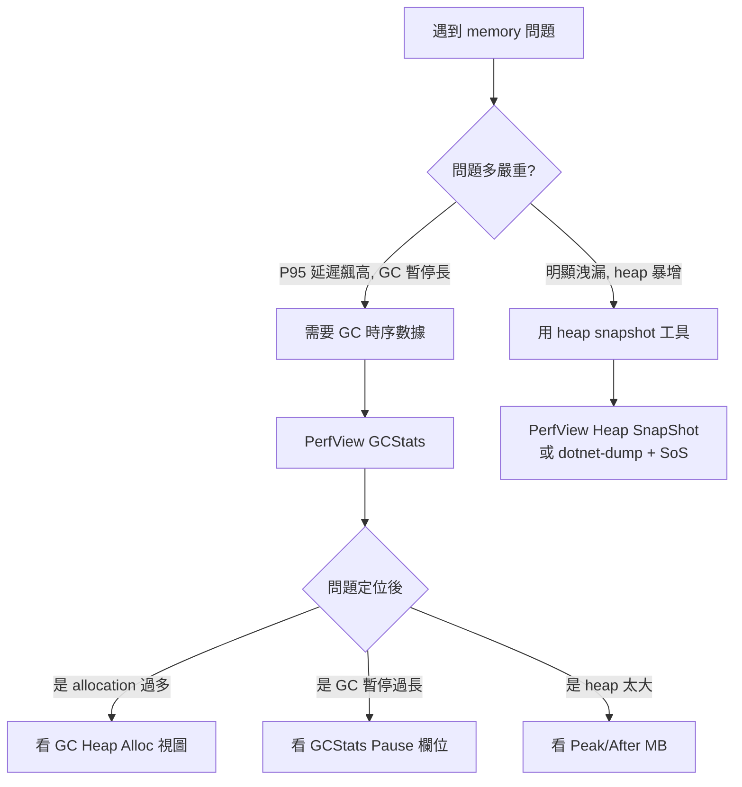
```mermaid
graph TD
    A["遇到 memory 問題"] --> B{"問題多嚴重?"}
    B -->|"明顯洩漏, heap 暴增"| C["用 heap snapshot 工具"]
    B -->|"P95 延遲飆高, GC 暫停長"| D["需要 GC 時序數據"]
    D --> E["PerfView GCStats"]
    C --> F["PerfView Heap SnapShot<br>或 dotnet-dump + SoS"]
    E --> G{"問題定位後"}
    G -->|"是 allocation 過多"| H["看 GC Heap Alloc 視圖"]
    G -->|"是 GC 暫停過長"| I["看 GCStats Pause 欄位"]
    G -->|"是 heap 太大"| J["看 Peak/After MB"]
```

## 2. 我們使用的工具及其工作方式 

執行階段團隊開發且我常用的工具是 [PerfView](https://github.com/microsoft/perfview/) —— 許多人可能聽過它。但我未見許多人充分使用它。 PerfView 的核心使用 [TraceEvent](#https://github.com/microsoft/perfview/tree/master/src/TraceEvent)，這是一個用來 decode：來自執行階段提供者、核心提供者及其他提供者的 ETW (Event Tracing for Windows) 事件的函式庫。若你未曾接觸 ETW 事件，可將其視為各組件隨時間發出的數據。它們共享相同格式，因此解碼 ETW 事件的工具可共同檢視來自不同組件的事件。這對效能調查非常強大。在 ETW 術語中，事件按提供者（如執行階段提供者）、關鍵字 (如 G) 和詳細程度（如 Information 級別通常輕量， Verbose 級別通常更重）分類。使用 ETW 的成本與收集的事件量成正比。若需要一直收集這些事件，在 GC Information 級別，開銷是非常小。
由於 .NET Core 跨平台，而 Linux 上沒有 ETW，我們有其他事件機制 (如 LTTng 或 EventPip) 旨在使此過程透明。因此，若使用 TraceEvent 函式庫，可在 Linux 上獲取這些事件資訊，如同在 Windows 使用 ETW 事件。然而，在 Linux 上收集這些事件需使用 [ 不同工具 ](https://github.com/dotnet/diagnostics/blob/master/documentation/dotnet-trace-instructions.md)。

PerfView 中有個我較少使用、但身為 GC 使用者可能會更常接觸的功能是 heap 快照 (即顯示 heap 上的 objects 及其相互關聯)。我較少使用此功能的原因在於： GC 本身並不關心 object 的具體類型。

### I. Heap 快照的本質
- 此功能主要用於視覺化 heap  memory 結構  
- 能顯示：  
  - 各 object 的類型 (例如 `string`, `Customer` 類別實例)  
  - object 之間的引用關係 (例如 `Order` object 指向對應的 `Customer` object)  
- 典型應用場景：  
  - 偵測 memory 洩漏 (找出意外存活的 objects)  
  - 分析 object 保留路徑 (retention path)  

### II. GC 與 Object 類型的關係
- GC 機制僅專注於：  
  - object 的存活狀態 (live/dead)  
  -  memory 空間的回收效率  
- 無需理解 object 的語義意義：  
  - 無論是 `string` 還是自定義類別， GC 回收邏輯完全一致  
  - 類型資訊對 GC 演算法無影響  

### III. 功能定位差異
| 功能類型         | 適用場景                         | 使用者角色               |  
|------------------|----------------------------------|-------------------------|  
| **Heap 快照**    | object 層級的 memory 分析             | 應用開發者、效能調優人員 |  
| **GC 指標分析**  |  memory 管理機制的效能診斷         | 系統級調優、 GC 專家      |  


你可能也使用過我們的 debug 工具擴展 [SoS](https://docs.microsoft.com/en-us/dotnet/framework/tools/sos-dll-sos-debugging-extension)。我很少在效能分析中使用 SoS，因為它更多是 debug 工具而非分析工具。它也不多用於查看 GC，主要用於查看 heap，即 heap 統計和 dump 單個 object。

在本節剩餘部分，我將展示如何使用 PerfView 正確進行 memory 分析。我將多次引用 [ 基礎知識 ](#Memory-Fundamentals) 以解釋為何以此方式進行分析，而非讓你死記步驟。

## 3. 如何開始 Memory 效能分析

開始 memory 效能分析時，以下是否似曾相識？

1)   擷取 CPU 分析檔，查看能否能夠減少任何頂層函式的 CPU 使用
2)   在工具中打開 heap 快照，查看有哪些內容我們可以著手
3)   擷取 allocation，查看有哪些內容我們可以著手

根據你試圖解決的問題，這些方法可能有缺陷。假設你有尾延遲問題並進行 1)，你可能希望查看能否減少程式碼或某些函式庫的 CPU 使用。但若 [ 尾延遲 ](#Measure-the-impact-of-factors-that-likely-affect-your-perf-metrics) 受長 GC 影響，減少這些 CPU 使用可能完全無助於改善長 GC 情況。

有效解決問題的方式是從影響效能目標的因素出發。我們討論了影響 [ 不同效能目標 ](#Know-what-your-perf-goal-is) 的 [Top GC 指標 ](#top-level-GC-metrics)。我們將討論如何收集它們並分析每個指標。

本文檔多數讀者已知如何收集與 memory 相關的通用指標，因此我將簡要介紹。由於我們知道 [GC heap 僅是 process memory 使用的一部分，但 GC 知曉實體 memory 負載 ](#Understanding-the-GC-heap-memory-usage-vs-the-processmachine-memory-usage)，我們需要measure process 的 memory 使用及機器上的實體 memory 負載。在 Windows 上，可通過收集以下效能計數器實現：

`Memory\Available MBytes`
`Process\Private Bytes`

對於一般 CPU 使用，可監控：

`Process\% Processor time`

計數器：調查 CPU 時間的常見做法是定期短時間擷取 CPU 樣本分析檔（例如，有人可能每小時進行一分鐘），並查看 aggregated CPU stack。

```
GC performance counters 指的是 .NET 中與「垃圾回收 (Garbage Collection, GC)」相關的性能監控指標 (Performance Counters)。這些計數器用於追蹤和衡量 GC 的行為與效能，幫助開發者診斷 memory 管理問題或優化應用程式的 memory 使用。是內建在 .NET 運行時 (CL) 中的統計數據，透過作業系統 (如 Windows 的 Performance Monito) 或診斷工具 (如 PerfView、 dotnet-counter) 可即時監控以下資訊：
1. GC 觸發的頻率 (如 Gen 0/1/2 的回收次數)。
2.  memory  allocation 與回收量 (如各代 object 的大小、存活 object 量)。
3. GC 暫停時間（如 GC 造成的應用程式暫停時間）。
4.  heap (Hea) 的狀態（如 heap 大小、碎片化程度）。
```

## 4. 如何收集頂層 GC 指標

Top Level GC Metrics 是衡量垃圾回收機制 (G) 對應用程式效能影響的最核心高層級指標，用於快速判斷 GC 行為是否對以下關鍵效能目標造成顯著影響：

- 吞吐量 (Throughput)
- 尾延遲 (Tail Latency)
-  memory 佔用 (Memory Footprint)

核心指標與作用

| 指標名稱 (英文)           | 指標名稱 (中文)          | 用途說明                                                                 | 衡量目標               |
|--------------------------|--------------------------|--------------------------------------------------------------------------|------------------------|
| **% Pause time in GC**    | GC 暫停時間百分比        | 應用 Thread 被 GC 暫停的時間佔總運行時間的比例                              | 吞吐量、延遲           |
| **% CPU time in GC**      | GC CPU 時間百分比        | GC Thread 消耗的 CPU 資源佔總可用 CPU 的比例                              | 吞吐量、 CPU 競爭       |
| **Max GC Heap Size**      | 最大 GC  heap 大小           | 追蹤期間 GC  heap 佔用的峰值 memory 量                                         |  memory 佔用             |
| **Individual GC Pauses**  | 單次 GC 暫停時間         | 每次 GC 暫停的具體持續時間（如最長暫停時間）                             | 尾延遲                 |
| **Physical Memory Usage** | 實體 memory 使用量         | process 總 memory 佔用 (包含 GC  heap 與非 GC  memory)                             | 整體 memory 健康狀態     |
| **GC Frequency**          | GC 頻率                  | 各代 (Gen0/1/2) GC 觸發次數                                              |  memory  allocation 壓力           |

這些指標被稱為 "Top Level" 是因為：

1. 快速診斷：無需深入底層細節，即可判斷 GC 是否為效能瓶頸。
2. 關聯業務指標：直接映射到業務關心的吞吐量、延遲、 memory 成本等。
3. 決策依據：例如：若 `% Pause time in GC > 10%`，表明需優先優化 GC；若 `<3%` 則無需投入資源。

指標收集工具

| 工具                  | 適用場景                  | 關鍵指標獲取方式                              |
|-----------------------|---------------------------|---------------------------------------------|
| **PerfView**          | Windows 深度分析          | `GCStats` 視圖直接顯示所有頂層指標           |
| **dotnet-counters**   | 跨平台實時監控            | `dotnet-counters monitor` 命令實時輸出       |
| **Application Insights** | 雲端監控整合          | 自訂儀表板聚合 `GC Time %` 等指標            |
| **GCMemoryInfo API**  | 程式碼內抽樣檢測          | .NET 5+ 的 `GC.GetGCMemoryInfo ()` 方法       |


GC 發出輕量級 Information 級別事件，可收集（若需要可始終開啟）涵蓋所有 Top GC 指標。使用以下 PerfView 命令列收集這些事件 -

`perfview /GCCollectOnly /AcceptEULA /nogui collect`

完成後，在 perfview cmd 視窗按 `s` 停止。

應運行足夠長時間以擷取足夠 GC 活動，例如若已知問題發生時段，應涵蓋 *導致* 問題發生的時間（不僅是問題時段）。若不確定問題何時開始，可長時間開啟。

若知道運行收集的時間長度，使用以下（實際情況上更常用）-

`perfview /GCCollectOnly /AcceptEULA /nogui /MaxCollectSec:1800 collect`

將半小時替換成 1800 秒。當然也可將此參數應用於其他命令列。結果將生成名為 PerfViewGCCollectOnly.etl.zip 的檔案。在 PerfView 術語中，我們稱此為 GCCollectOnly 追蹤。

在 Linux 上，等效的 dotnet trace 命令列為：

`dotnet trace collect -p <pid> -o <outputpath with .nettrace extension> --profile gc-collect --duration <in hh:mm:ss format>`

其為等效，因收集相同的 GC 事件，但僅針對已啟動的單一 process，而 perfview 命令列收集整個機器的 ETW，即該機器上所有 process 的 GC 事件，包括收集開始後啟動的 process。

還有其他方式收集 Top GC 指標，例如在 .NET Framework 上有 GC 效能計數器；在 .NET Core 上 [ 部分 GC 計數器 ](https://docs.microsoft.com/en-us/dotnet/core/diagnostics/dotnet-counters#dotnet-counters-collect) 也被引入。計數器與事件的最大差異在於計數器是抽樣，而事件捕獲所有 GC，但抽樣可能足夠。在 .NET 5 中，我們也加入了 GC 抽樣 API —

```csharp
public static GCMemoryInfo GetGCMemoryInfo (GCKind kind);
```
返回的 GCMemoryInfo 基於 GCKind，解釋見 [GCMemoryInfo.cs](https://github.com/dotnet/runtime/blob/master/src/libraries/System.Private.CoreLib/src/System/GCMemoryInfo.cs) —


```csharp
/// <summary>Specifies the kind of a garbage collection.</summary>
/// <remarks>
/// A GC can be one of the 3 kinds - ephemeral, full blocking or background.
/// Their frequencies are very different. Ephemeral GCs happen much more often than
/// the other two kinds. Background GCs usually happen infrequently, and
/// full blocking GCs usually happen very infrequently. In order to sample the very
/// infrequent GCs, collections are separated into kinds so callers can ask for all three kinds 
/// while maintaining
/// a reasonable sampling rate, e.g. if you are sampling once every second, without this
/// distinction, you may never observe a background GC. With this distinction, you can
/// always get info of the last GC of the kind you specify.
/// </remarks>
public enum GCKind
{
    /// <summary>Any kind of collection.</summary>
    Any = 0,
    /// <summary>A gen0 or gen1 collection.</summary>
    Ephemeral = 1,
    /// <summary>A blocking gen2 collection.</summary>
    FullBlocking = 2,
    /// <summary>A background collection.</summary>
    /// <remarks>This is always a gen2 collection.</remarks>
    Background = 3
};
```

GCMemoryInfo 提供與此 GC 相關的多種資訊，如其暫停時間、 committed bytes、 promoted bytes、是否壓縮或並行，及每個被回收 generation 的資訊。完整列表請參閱 [GCMemoryInfo.cs](https://github.com/dotnet/runtime/blob/master/src/libraries/System.Private.CoreLib/src/System/GCMemoryInfo.cs)。你可按所需頻率呼叫此 API 以抽樣 process 中的 GC。

## 5. 顯示頂層 GC 指標

這些在 PerfView 的 `GCStats` 視圖中方便地顯示。使用你剛收集的追蹤檔開啟 PerfViewGCCollectOnly.etl.zip，即運行 PerfView 並瀏覽至該目錄雙擊該檔案；或運行「 PerfView PerfViewGCCollectOnly.etl.zip」命令列。你將看到該檔案名下有多個節點。我們感興趣的是 `Memory Group` 節點下的 `GCStats` 視圖。雙擊開啟。頂部如下：

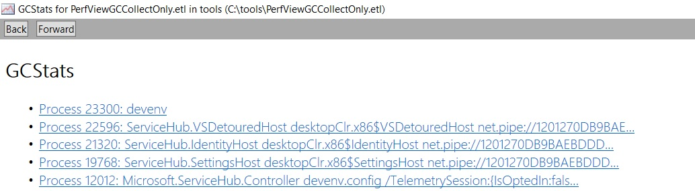

我運行了 Visual Studio（ managed 應用）— 頂部的 devenv process。

對於每個 process，你將獲得以下詳細資訊 —— 我為非 self-explanatory 部分添加了註解：

- `Summary` – 包括命令列、 CLR 啟動標誌、 GC 暫停時間百分比等。

- `GC stats rollup by generation` – 對於 gen0/1/2 ，包含該 generation 進行的 GC 次數、平均暫停時間等。

- `GC stats for GCs whose pause time was > 200ms`

- `LOH Allocation Pause (due to background GC) > 200 Msec for this process` - 大 object allocation 與 Background GC 的注意事項是我們在 BGC 進行時不允許過多 LOH allocation。若在 BGC 期間 allocation 過多，你將在此看到表格顯示哪些 Thread 在 BGC 期間被阻塞（及阻塞時長），因為存在過多 LOH allocation。這通常表明減少 LOH allocation 有助於避免 Thread 阻塞。

- `Gen2 GC stats`

- `All GC stats`

- `Condemned reasons for GCs`

- `Finalized Object Counts`

- `Runtime version` 基本無用，因僅顯示通用版本。但你可使用 Events 視圖中的 FileVersion 事件獲取確切執行階段版本。

- `CLR Startup Flags` 對 GC 調查的主要目的是查看 CONCURRENT_GC 和 SERVER_GC。若兩者皆無，*通常* 意味著開啟了禁用並行 GC 的 Workstation GC。不幸的是，不一定就是這樣的，因為在捕獲此事件後可能被更改。可用其他方式驗證。注意：目前 [.NET Core/.NET 5 不發出這些標誌 ](https://github.com/dotnet/runtime/issues/52042)，因此此處的內容不重要。

- `Total CPU Time and Total GC CPU Time` 除非實際收集 CPU 樣本，否則始終為 0 。

- `Total Allocs` 追蹤期間此 process 的總 allocation。

- `MSec/MB Alloc` 除非收集 CPU 樣本，否則為 0 (即 Total GC CPU time / Total allocated bytes)。

- `Total GC pause` GC 暫停的總掛起時間。注意包括暫停時間，即 GC 開始前暫停 managed Thread 的時間。

- `% Time paused for Garbage Collection` 即 "% Pause time in GC" 指標。

- `% CPU Time spent Garbage Collecting` 即 "% CPU time in GC" 指標。除非收集 CPU 樣本，否則為 NaN%。

- `Max GC Heap Size` 追蹤期間此 process 的最大 managed heap 大小。

其餘為連結，本文檔將部分介紹。

`All GC stats` 表顯示追蹤期間發生的每個 GC（若過多將有連結顯示未列出的 GC）。此表有多列。因表格過寬，我僅顯示與各主題相關的列。

其他 Top GC 指標 (如單個暫停和 heap 大) 作為此表的一部分顯示如下（ Peak MB 表示該 GC 進入時的 heap 大小， After 為退出時）——

| **GC**    | **Pause** | **Peak** | **After** |
| :-------: | :-------: | :------: | :-------: |
| **Index** | **MSec**  | **MB**   | **MB**    |
| 804       | 5.743     | 1,796.84 | 1,750.63  |
| 805       | 6.984     | 1,798.19 | 1,742.18  |
| 806       | 5.557     | 1,794.52 | 1,736.69  |
| 807       | 6.748     | 1,798.73 | 1,707.85  |
| 808       | 5.437     | 1,798.42 | 1,762.68  |
| 809       | 7.109     | 1,804.95 | 1,736.88  |

現在，這是一個 HTML 表格且無法排序。如果您需要排序（例如找出最長的單次 GC 暫停），可以點擊每個 process 開頭的「 View in Excel」連結 -

·    `Individual GC Events` 

​             o  `View in Excel`

這將會在 Excel 中開啟上述表格，您可依任意欄位排序。在 GC 團隊中，由於我們需要更深入地切割分析數據，我們使用自己的 [ 效能基礎架構 ](https://devblogs.microsoft.com/dotnet/gc-perf-infrastructure-part-1/)，直接運用 TraceEvent 進行處理。

## 6. PerfView 中的其他相關視圖 

除了 GCStats 視圖外，還有幾個其他 PerfView 視圖值得介紹，我們後續會使用到這些功能。

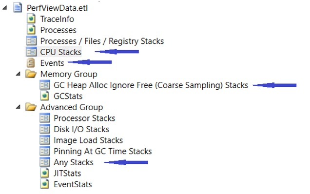

**CPU Stacks** 如其名 — 如果在 trace 中收集了 CPU sample 事件，此 view 將顯示相關數據。值得注意的一點是，我通常會先清空三個 highlighted 顯示的文字框（如下圖所示），您需要點擊 update 按鈕刷新：

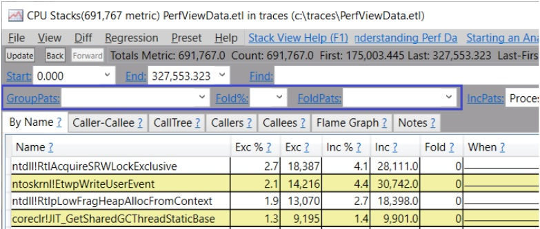

我很少發現這 3 個文字框有用。偶爾我會需要按模組分組，你可以閱讀 PerfView 的說明文件了解如何操作。

**Events** 是我們上面提到的原始事件視圖。聽起來可能對用戶不太友好，因為它是原始資料，但它有一些方便的功能。你可以透過「 Filter」文字框篩選事件。若需按多個字串篩選，可使用「|」。例如，若想取得所有名稱包含「 file」的事件及 GC/Start 事件，可使用 file|GC/Start（不加空格）。

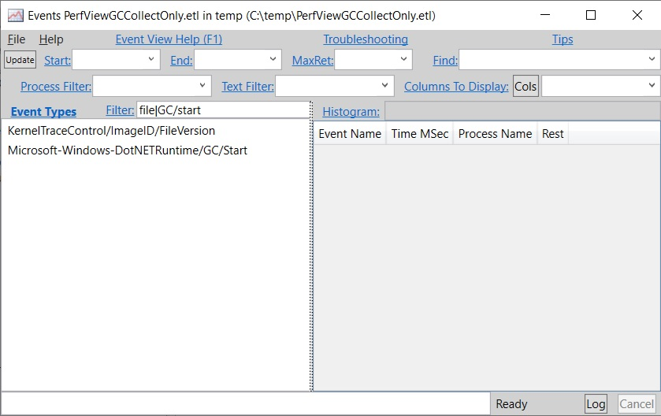

雙擊事件名稱可顯示該事件的所有發生次數，並可搜尋特定細節。例如，若想確認 coreclr.dll 的確切版本，可在「 Find」文字框中輸入 **coreclr**：

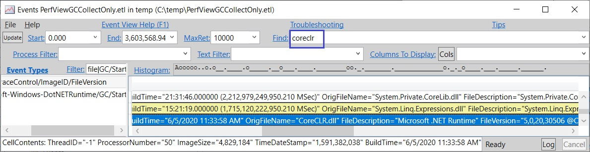

接著即可看到使用的 coreclr.dll 的詳細版本資訊。

我也經常使用「 Start/End」來限制 events 的時間範圍、「 Process filter」來限制特定 process，以及「 Columns to display」來限制顯示的事件欄位（這允許我按 event 的某個欄位排序）。

**GC Heap Alloc Ignore Free** （位於 Memory 群組下）是我們用來查看 allocations 的工具。

**Any Stacks** 顯示所有事件及其 stack（如果 stack 有被 collected）。若想檢視特定事件且無現成視圖，或現成視圖無法滿足需求，此功能非常方便。

#### a. 比較 Stack Views

類似 CPU Stacks 的視圖 (例如 Heap Snapshot 或 GC Heap Alloc 視) 提供比較功能。若在同一個 PerfView 實例中開啟 2 個 traces，並為每個 trace 開啟 stack 視圖，「 Diff」選單會提供「 with Baseline」選項 (詳見說明文件中的「 Diffing Two Traces」)。

關於比較兩個執行個體 - 當你比較兩個執行個體以查看效能倒退時，最好讓工作負載盡可能相似。例如，若你進行了減少 allocations 的效能改動，與其讓兩個執行個體運行相同時間，不如讓它們處理相同數量的請求，因為這樣能確保新版本處理的工作量相同。否則，一個執行個體可能運行更快，從而處理更多請求，這意味著它本質上需要進行不同量的 allocations，使比較變得更困難。

以下是比較兩個 trace 的逐步操作指南：

| 步驟 | 操作 |
|------|------|
| 1 | 收集兩個 trace（baseline 基準版本 vs current 當前版本） |
| 2 | 在 PerfView 中開啟第一個 trace（current） |
| 3 | 在 GC Heap Alloc 或 CPU Stacks 視圖中，使用 Diff → With Baseline |
| 4 | 選擇第二個 trace（baseline）作為比較基準 |
| 5 | 觀察差異：紅色表示新版本 allocation/CPU 使用增加，藍色表示減少 |

**初學者提醒**：比較兩個 trace 時，讓工作負載盡可能相同。例如：讓兩個版本處理相同數量的請求（而非相同時間），這樣才能公平比較。否則新版跑更快 → 處理更多請求 → 自然做更多 allocation，比較失準。

## 7. GC 中的高 % Pause Time

若不清楚如何收集 GC pause time 資料，請參考 [ 如何收集 top level GC 指標 ](#How-to-collect-top-level-GC-metrics) 的說明。

若總 pause time 過高，可能是由於 GC 次數過多（即觸發太頻繁）、 GC 暫停時間過長，或兩者兼具。

#### a. Pause 次數過多 (即 GC 次數過多)

根據我們的 [ 唯一規則 ](#The-one-rule-to-remember) 部分， GC 觸發頻率由「未存活的資料量」決定。因此，若進行大量臨時 object  allocation（意味著它們不會存活），將觸發大量 GC。此時應檢視這些 allocations。若能消除部分 allocations 當然理想，但有時並不實際。我們提到過 [ 三種 ](#3-ways-to-look-at-allocations) 檢視 allocations 的方法，以下說明如何執行每種分析。

「 GC 觸發頻率由未存活的資料量決定」意味著：
- 系統主要關注的是產生了多少垃圾，而非單純的 memory 使用總量
- 當短時間內產生大量不再使用的 object 時， GC 會更頻繁地執行
- 這遵循的是「代際假說」(Generational Hypothesis)：大多數 object 生命週期很短

### I. Measure Allocations

**取得已 allocate 的 bytes**

在 .NET 3.0+ 中，我們提供 [GC.GetTotalAllocatedBytes](https://docs.microsoft.com/en-us/dotnet/api/system.gc.gettotalallocatedbytes?view=net-6.0) API，可在呼叫時回傳已 allocate 的總 bytes。此外，在 PerfView 的 GCStats view 中，每個 process 的 summary 提供了 allocate 的 bytes 數量。此視圖還顯示每次 GC 的 gen0  allocation  bytes：

| GC Index | Gen   | Gen0 Alloc MB  |
| -------: | ----: | -------------: |
| 7        | 0N    | 95.373 |
| 8        | 1N    | 71.103 |
| 9        | 0N    | 103.02 |
| 10       | 2B    | 0      |
| 11       | 0N    | 111.28 |
| 12       | 1N    | 94.537 |

Nonconcurrent GC (標記為 N)
1. 暫停應用程式執行：當執行 Nonconcurrent GC 時，.NET 運行時會暫停所有應用程式 Thread （這就是所謂的 "Stop-the-World" GC）
2. 完全阻塞：應用程式在整個 GC 週期期間無法執行任何操作，整個過程中應用程式保持暫停狀態
3. 適用於所有 generation： Gen 0 、 Gen 1 和 Gen 2 都可以是 Nonconcurrent
4. 低延遲要求較低的應用：更適合可以容忍短暫暫停的應用程式
5. 在表格中標記：在 PerfView 的 GCStats 視圖中以 "0N"、"1N" 或 "2N" 表示
6. Gen0 和 Gen1 收集總是使用 Nonconcurrent 模式 (顯示為 "0N" 和 "1N")

`應用程式執行 --> [暫停] --> GC 執行 --> [恢復] --> 應用程式執行`

Background GC (標記為 B)
1. 並行執行： GC 與應用程式並行執行，大部分時間應用程式可以繼續運行
2. 僅限於 Gen 2 ：只有完整的 Gen 2 收集可以是背景式的（因此只會看到 "2B"，不會有 "0B" 或 "1B"），當說 " 只有 Gen2 收集可以是 Background 的 " 時，並不意味著 Gen2 GC 不是 STW
3. 減少暫停：顯著減少應用程式暫停時間，提升回應性
4. 分階段執行：只在某些特定階段（如標記的開始和結束）需要短暫暫停
5.  memory 佔用較高：由於並行操作，可能會暫時使用更多的 memory 
6. 在表格中標記：在 PerfView 中以 "2B" 表示

Foreground GC (標記為 F)
1. 特殊情況：在 Background GC 進行期間發生的 ephemeral（短期） GC
2. 優先級：必須處理當前需要的 memory  allocation 
3. 與 BGC 協調：與正在進行的背景 GC 協調工作

Stop-The-World (STW) 與暫停時間 :
1. 所有 GC 都有 STW 階段，包括背景 GC
2. 差別在於 STW 暫停的長度和發生的時機

關鍵誤解澄清：當說 " 只有 Gen2 收集可以是背景式的 " 時，並不意味著 Gen2 GC 不是 STW。實際上：
傳統的非背景 Gen2 GC (2N):
1. 是完全 STW 的
2. 暫停應用程式整個 GC 週期
3. 對大型 heap 可能導致長時間暫停

Background Gen2 GC (2B):
1. 仍有 STW 階段，但比傳統 Gen2 GC 短很多
2. 大部分收集工作在背景 Thread 進行，應用程式可繼續執行
3. 通常分為幾個階段：
(1) 初始標記階段 (短暫 STW)
(2) 並發標記階段 (應用程式繼續運行)
(3) 最終標記階段 (短暫 STW)
(4) 並發清除階段 (應用程式繼續運行)

為什麼只有 Gen2 可以是 Background 的？這是基於幾個技術考量：
資源效益 :
- Gen0/Gen1 收集通常非常快速 (毫秒級)
- 用 Background 模式處理會增加複雜度，但收益有限

設計原理 :
- Gen0/Gen1 主要處理短壽命 object ，需要快速釋放空間
- Gen2 包含長壽命 object ，收集時間長，最適合背景處理

 memory 壓力 :
- 當 Gen0 空間不足時，需要立即釋放 memory 
- Background 模式可能無法滿足這種立即需求

| 特性 | 非背景 GC (0N, 1N, 2N) | 背景 GC (只有 2B) |
|------|----------------------|----------------|
| 適用代數 | 所有代 (Gen0, Gen1, Gen2) | 只有 Gen2 |
| STW 暫停 | 完整的 STW，整個收集過程暫停應用程式 | 部分 STW，只在特定階段暫停 |
| 暫停時間 | Gen0/Gen1 通常較短， Gen2 可能很長 | 多次短暫暫停，減少單次長暫停 |
|  memory 壓力處理 | 直接快速處理 | 可能需要配合前景 GC (F) |
|  memory 使用 | 較少 | 較多 (需要額外 memory 追踪並行狀態) |
| 適用場景 | 批次處理、 memory 受限系統 | 互動式應用、伺服器應用 |

當說「 Gen0 或 Gen1 的 allocation 預算已經超出」時，意思是：
1. 自上次 GC 以來，應用程式已 allocation 的新 object  memory 總量超過了系統為該代設定的閾值
2. 這是觸發該代 GC 的信號，表明需要進行垃圾回收以釋放未使用的 memory 
3. 這是 GC 自動調節的一部分，確保 memory 使用不會無限制增長

GC Index #10 Background Gen2 GC 的 Gen0 Alloc MB 為什麼是 0 ：
1. 當系統需要執行 Background Gen2 GC (2B) 時，如果發現 Gen0 或 Gen1 的 allocation 預算已經超出
2. 系統會先執行一次 Gen0 或 Gen1 的 GC
3. 然後才開始執行背景 Gen2 GC
4. 因此，那些 Gen0  allocation 的位元組數已經在之前的 Gen0/Gen1 GC 中計算並顯示出來了
5. 所以背景 Gen2 GC (2B) 的 Gen0 Alloc MB 顯示為 0

當 gen0 的 allocation budget 被超過時，將觸發 GC。此資料預設不會顯示在 GCStats 中（因表格欄位已太多），但可透過點擊 GCStats 表格前的 <ins>**Raw Data XML file (for debugging)**</ins> 連結取得。生成的 XML 檔案包含更詳細的資料。每個 GC 會有如下資訊（已簡化避免過寬）：

```xml
<GCEvent GCNumber="9" GCGeneration="0" Reason="AllocSmall">
  <GlobalHeapHistory FinalYoungestDesired="9,830,400" NumHeaps="12"/>
```

FinalYoungestDesired 是此 GC 計算出的最終 gen0 budget。由於所有 heap 的 budget 均相同，此值代表每個 heap 的 budget。因共有 12 個 heap，任一 heap 用盡其 gen0 budget 都會觸發下一次 GC。

**查看帶有 stacks 的取樣 allocations**

自然你會想要了解這些 allocations。 GC 提供了一個名為 AllocationTick 的事件，大約每 allocate 100KB 時就會觸發。對於小 object  heap (small object heap, SOH) 來說， 100KB 意味著許多 object (即對 SOH 進行取樣)，但對於 LOH 來說，這實際上是精確的，因為每個 object 至少有 85000 位元組。此事件有一個名為 AllocationKind 的欄位 — Small 表示它是因 SOH 上的 allocation 剛好使累積 allocation 量超過 100KB 而觸發（之後該量會被重置）。因此，你實際上不知道最後一次 allocation 的大小。但根據此事件的頻率，它仍然是一個非常好的近似方法，用於查看哪些類型被 allocate 最多，以及 allocation 它們的callstack。

顯然，收集這些資訊會比僅收集 GCCollectOnly trace 增加顯著的開銷，但這仍然是可以接受的。

`PerfView.exe /nogui /accepteula /KernelEvents=Process+Thread+ImageLoad /ClrEvents:GC+Stack /BufferSize:3000 /CircularMB:3000 collect`

這將收集帶有 callstacks 的 AllocationTick 事件，這些 Stack allocation 了被取樣的 object 。然後，你可以在 Memory 群組下的 “ GC Heap Alloc Ignore Free (Coarse Sampling)” 視圖中打開此資料：

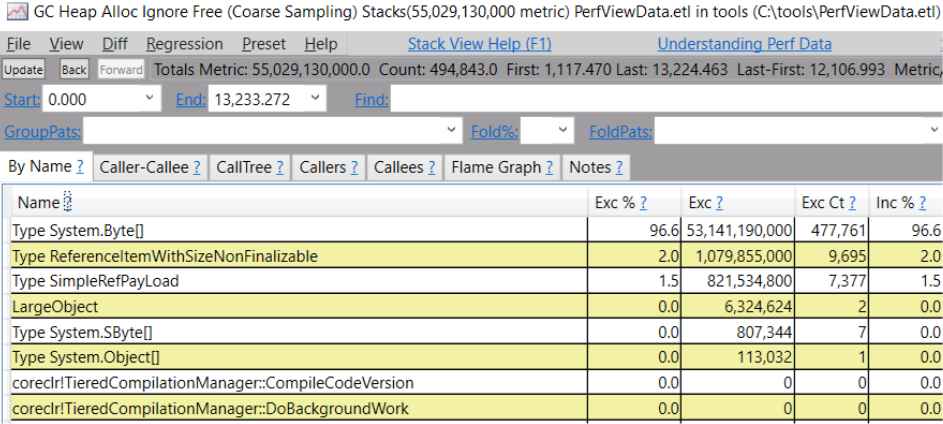

點擊類型會顯示 allocation 該類型實例的 stacks：

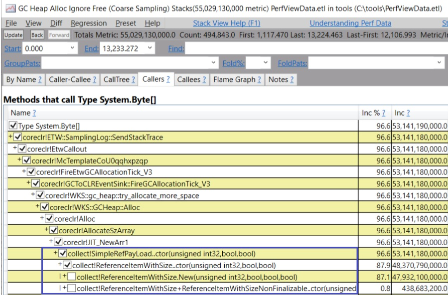

注意，當你在同一個 PerfView 實例中打開兩個 trace 時，可以比較兩個 GC Heap Alloc 視圖 —

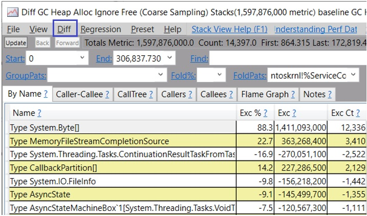

你可以雙擊每個類型來查看 allocate 它們的 callstacks。

另一種查看 AllocationTick 事件的方法是使用 Any Stacks 視圖，因為它按大小分組。例如，這是從客戶的 trace 中看到的（類型名稱已匿名化或縮短）：

| **Name**                                                     | **Inc**   |
| ------------------------------------------------------------ | --------- |
| Event  Microsoft-Windows-DotNETRuntime/GC/AllocationTick     | 627,509   |
| + EventData TypeName  Entry[CustomerType,CustomerCollection][] | 221,581   |
| \|+ EventData Size 106496                                    | 4,172     |
| \|\|+ EventData Kind Small                                   | 4,172     |
| \|\| + coreclr                                               | 4,172     |
| \|\|   + corelib!System.Collections.Generic.Dictionary`2[CustomerType,System.__Canon].Resize (int32,bool) | **4,013** |
| \|\|   +  corelib!System.Collections.Generic.Dictionary`2[CustomerType,System.__Canon].Initialize (int32) | **159**   |
| \|+ EventData Size 114688                                    | 3,852     |
| \|\|+ EventData Kind Small                                   | 3,852     |
| \|\| + coreclr                                               | 3,852     |
| \|\|   + corelib!System.Collections.Generic.Dictionary`2[CustomerType,System.__Canon].Resize (int32,bool) | **3,742** |
| \|\|   +  corelib!System.Collections.Generic.Dictionary`2[CustomerType,System.__Canon].Initialize (int32) | **110**   |

這表示大部分 allocation 來自字典的 Resize 操作，你也可以從 GC Heap Alloc 視圖中看到這一點，但取樣計數資訊提供了更多線索（ Resize 有 4013 次，而 Initialize 有 159 次）。因此，如果能夠合理預測字典的大小，可以設置更大的初始容量來大幅減少這些 allocation 。

**透過 CPU 取樣查看 memory clear 成本**

如果沒有包含 AllocationTick 事件但包含 CPU 取樣的 trace（這很常見），你也可以查看 memory clear 的成本 –

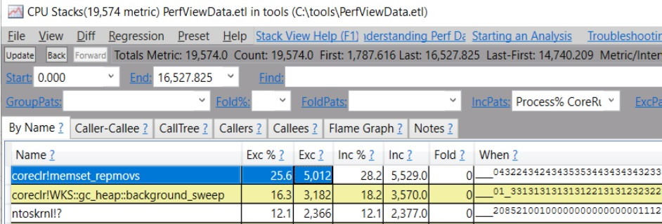

如果查看 `memset_repmovs` 的呼叫者， highlighted 的兩個 callers 來自 GC 在 allocate 新 object 前的 memory clear: 

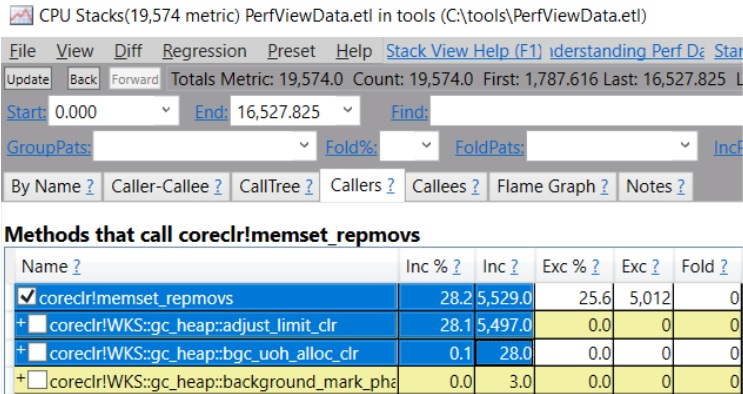

（此為 .NET 5 的結果，舊版本中會看到 WKS::gc_heap::bgc_loh_alloc_clr 而非 WKS::gc_heap::bgc_uoh_alloc_clr）。

在此範例中，由於測試幾乎全是 allocation 操作， allocation 成本非常高 — 占總 CPU 使用率的 25.6% 獨佔成本。

### II. 如何查看 GC 為什麼要決定回收某個 Generation

在 GCStats 中，每個 GC 都有一個名為 “ Trigger Reason” 的欄位，說明該 GC 是如何被觸發的。可能的觸發原因在 PerfView 儲存庫的 [ClrTraceEventParser.cs](https://github.com/microsoft/perfview/blob/master/src/TraceEvent/Parsers/ClrTraceEventParser.cs) 中定義為 `GCReason`：

```csharp
public enum GCReason
{
  AllocSmall = 0x0,
  Induced = 0x1,
  LowMemory = 0x2,
  Empty = 0x3,
  AllocLarge = 0x4,
  OutOfSpaceSOH = 0x5,
  OutOfSpaceLOH = 0x6,
  InducedNotForced = 0x7,
  Internal = 0x8,
  InducedLowMemory = 0x9,
  InducedCompacting = 0xa,
  LowMemoryHost = 0xb,
  PMFullGC = 0xc,
  LowMemoryHostBlocking = 0xd
}
```

其中最常見（且需關注）的原因是 *AllocSmall* — 這表示 gen0 的預算已用盡。若最常見的是 *AllocLarge*，很可能表示問題 — 這表示 GC 是因 allocate 大 object 超過 LOH 預算而觸發。如我們所知，這意味著將 [ 觸發 gen2 GC](#LOH-Large-Object-Heap)：

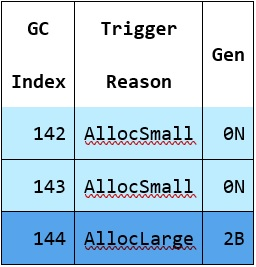

而觸發頻繁的 Full GC 通常會導致效能問題。其他因 allocation 而觸發的原因包括 OutOfSpaceSOH 和 OutOfSpaceLOH — 這些比 AllocSmall 和 AllocLarge 少見 — 它們表示目前 memory 接近 physical space 限制（例如，短暫區段 (ephemeral segment) 即將用盡）。

#### a. 找出強制 GC 的原因

C# 的強制垃圾回收 (induced G) 是指程序員主動觸發 .NET 運行時進行垃圾回收的過程。在 C# 中，通常可以通過調用 System.GC.Collect () 方法來實現這一點。強制垃圾回收允許開發者在特定時刻手動觸發垃圾回收器運行，而不是等待 .NET 運行時自動決定何時進行垃圾回收。

最需警惕的是 `Induced (强制)` 原因，這表示某些程式碼主動觸發了 GC。我們有 GCTriggered 事件專門用於找出觸發 GC 的程式碼及其 callstack。你可以收集一個非常輕量的 trace，僅包含 GC 資訊級別與 stack 及核心事件：

`PerfView.exe /nogui /accepteula /KernelEvents=Process+Thread+ImageLoad /ClrEvents:GC+Stack /ClrEventLevel=Informational /BufferSize:3000 /CircularMB:3000 collect`

然後在 Any Stacks 視圖中查看 GCTriggered 事件的 stacks：

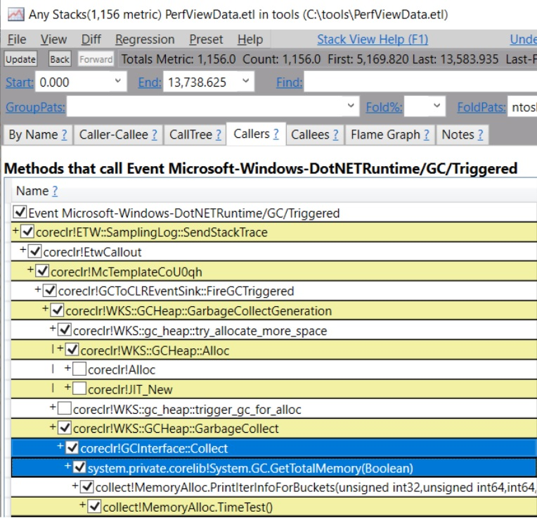

“ Trigger reason” 是 GC 啟動或產生的原因。若 GC 啟動的最常見原因是 SOH 上的 allocation ，則該 GC 會以 gen0 GC 啟動 (因為 gen0 預算已用盡)。在 GC 啟動後，我們會決定實際回收哪個世代。它可能保持為 gen0 GC，或升級為 gen1 甚至 gen2 GC — 這是 GC 中最先決定的步驟之一。導致我們升級到更高世代 GC 的因素稱為 “ condemned reasons”（因此一個 GC 只有一個 trigger reason，但可能有多個 condemned reasons）。

以下是在表格前的 “ Condemned reasons for GC” 部分的說明文字：

*此表格詳細說明了 GC 決定回收某個世代的原因。將游標懸停在欄位標題上以獲取更多資訊。*

此處不再重複資訊。最值得關注的是升級到 gen2 GC 的原因 — 通常由 gen2 *高 memory 負載* 或 *高碎片化* 引起。

#### b. 長時間單次 Pause

如果你不知道如何收集 GC 暫停時間資料，請依照 [ 如何收集 Top GC 指標 ](#How-to-collect-top-level-GC-metrics) 的說明操作。

如果你不熟悉單次 GC 暫停的構成因素，請先閱讀 [GC 暫停 ](#Understanding-GC-pauses-ie-when-GCs-are-triggered-and-how-long-a-GC-lasts) 章節，該章節解釋了影響 GC 暫停時間的因素。

如我們所知，所有短暫世代 (ephemeral) GC 都是 blocking 的，而 gen2 GC 可以是 blocking 或 Background GC。短暫世代 GC 和 BGC 應產生短暫暫停。但若出問題，我們將展示如何分析這些情況。

如果 heap size 很大，我們知道 blocking gen2 GC 會導致長時間暫停。但通常我們傾向在需要進行 gen2 GC 時使用 Background GC。因此，若長時間 GC 暫停是由 blocking gen2 GC 引起，我們需找出為何要執行這些 blocking gen2 GC。

長時間的 individual pauses 可能由以下因素或組合引起：

- pause time 有大量 GC 工作需執行。

- GC 試圖執行工作但無法完成，因為 [CPU 被佔用 ](#How-long-an-individual-GC-lasts)。

以下將說明如何分析每種情境。

在開始深入診斷之前，可先快速檢查以下常見原因的診斷清單：

```
長時間單次 Pause 的可能原因：
1. □ 太多 GC 工作 → 看 Promoted MB，若異常大 → 檢查 allocation/survival 模式
2. □ GC 無法工作 → 看 CPU Stacks，若 GC thread 無 CPU 使用 → 可能是其他 process 搶 CPU
3. □ Thread Suspension 太慢 → 看 Suspend Msec vs Pause Msec 佔比
4. □ BGC Final Pause 太長 → 看 BGC 的 final pause 是否異常
```

### III. 首先，是否存在托管內存洩漏？

若不清楚何謂 managed memory leak，請先複習 [ 該章節 ](#3-managed-memory-leaks)。根據定義，這不是 GC 能協助解決的問題。若有 managed memory leak， GC 的工作量勢必會持續增加。如該章節所述，可擷取 GC trace 驗證此情況：

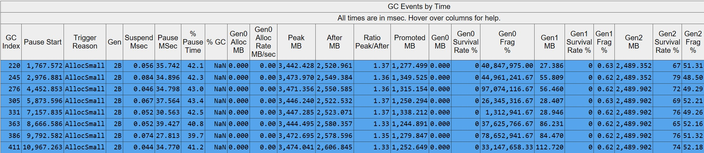

在此範例中，`PromotedMB` 欄位顯示穩定，表示沒有 managed  memory 洩漏。

若條件允許，可主動觸發 full blocking GC — 在生產環境可能不建議，但在開發階段可行。例如，若產品處理請求，可在每個請求結束或每 N 個請求後觸發 full blocking GC。可用工具驗證，預期的 memory 使用量是否相同。此簡單情境可使用多種工具， PerfView 也提供此功能。可透過 Memory/Take Heap Snapshot 擷取 heap 快照。部分選項需注意：

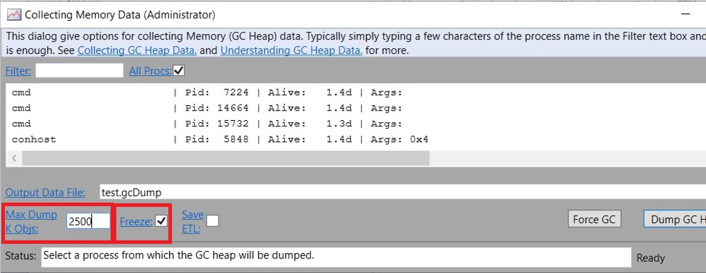

“ Max Dump K Objs” 是為了「智能」取樣，避免 dump 所有 object。建議至少設為預設值 (250) 的 10 倍。 Freeze 選項用於生產環境診斷，避免產生 full blocking GC 暫停。生產環境應取消勾選，以 concurrent 方式擷取 heap 快照。若在開發階段使用，可勾選以獲得準確資料。

生成的 .gcDump 檔案可在 PerfView 中以 Stack 式視圖開啟，顯示根 object 資訊（如 GC handle 持有的 object ）與類型實例的聚合資料。此視圖支援差異比較功能，可比較兩個 gcDump 檔案。

在生產環境中，可先嘗試不勾選 Freeze。若已有生產環境的 dump 檔案，可透過 "Memory\Take Heap Snapshot From Dump" 選項載入，生成 .gcDump 檔案。開啟此檔案後，將按類型顯示 object 累積大小（需清除 highlighted 文字框，否則可能顯示誤導結果）

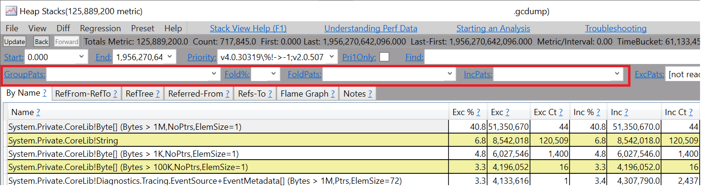

點擊類型將顯示持有該 object 的上層類型：

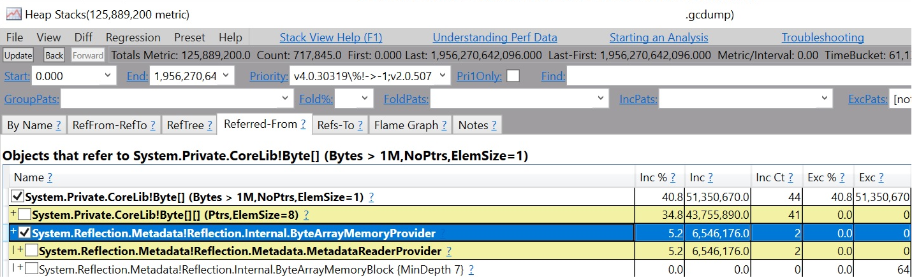

對於習慣使用 sos !gcroot 指令的使用者，此為更高效診斷 object 存活原因的方式。

若發現 object 佔用的 memory 持續增長，即存在 memory 洩漏 (memory leak)。這表示您需要多次 **擷取快照並進行比較**。僅憑單次 dump 或 heap 快照無法判定洩漏，因為「洩漏」本質上是增長現象。除非能通過 object 類型直接判斷——某些類型根本不應存在，或其實例數量明顯異常。例如：若每個請求 allocation 一個類型 X 的實例，且請求結束後理應釋放，但卻觀察到 10 萬個此類實例，而您明知系統並未同時處理 10 萬個請求。顯然這些實例未被正確釋放。

### IV. 長時間 Pause 是由 Ephemeral GC、Full Blocking GC 或 BGC 引起？

GCStats 視圖在每個 process 頂部提供彙總表格，顯示各 generation 的 Max/Mean/Total 暫停（應區分 full blocking GC 與 BGC，但目前可參考 Gen2 表格）。範例：

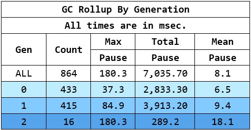

以下是 GCStats Rollup 彙總表格的解讀指南，幫助你根據觀察到的數值判斷診斷方向：

| 觀察 | 診斷方向 |
|------|---------|
| gen0 GC Max Pause 大 | 檢查 promotion spike（參見 [### VI. 分析 Ephemeral GC 的工作量](###-VI-分析-Ephemeral-GC-的工作量)），可能是短時間內大量 object 存活導致 |
| gen1 GC Max Pause 大 | 檢查 gen1 promotion → gen2 的數量是否異常，可能表示 object 存活時間超過預期 |
| gen2 Blocking Max Pause 大 | 檢查 gen2 heap 大小 + 是否為 forced compaction；可考慮改用 BGC 來減少暫停 |
| gen2 BGC Max Pause 大 | 通常是 BGC final pause 過長 → 檢查 CPU contention（GC thread 是否被其他 process 搶佔） |
| Suspend Msec >> Pause Msec | 問題在 Thread Suspension，非 GC 工作本身 → 檢查執行緒是否有 Pin 或難以安全暫停的程式碼 |

### V. 分析 gen2 GC 的工作量

對於 gen2 GC，我們希望多數或全部以 BGC 執行。但若出現 full blocking GC (GCStats 中以 2N 標示)，且 heap 較大時，其暫停時間通常較長（ gen2 GC 的 Promote MB 遠高於 ephemeral GC）。此時通常會擷取 Heap 快照分析 heap 內容並嘗試減少。但首先需確認為何執行 full blocking GC。可檢查 Condemned Reasons 表格。最常見原因為 [ 高 memory 負載 ](#GC-is-per-process-but-is-aware-of-physical-memory-load-on-the-machine) 與 [gen2 碎片化 ](#How-often-GCs-are-triggered)。要查看各 GC 觀察到的 memory 負載，點擊 GCStats 中 "GC Rollup By Generation" 表格上方的 "Raw Data XML file (for debugging)" 連結，生成包含額外資訊（如 memory 負載）的 XML 檔案。範例（已簡化）：

```c
<GCEvent GCNumber="45" GCGeneration="2" >
      <GlobalHeapHistory FinalYoungestDesired="69,835,328" NumHeaps="32"/>
      <PerHeapHistories Count="32" MemoryLoad="47">
      </PerHeapHistory>
   </GCEvent>
```

此表示 GC#45 發生時觀察到 memory 負載為 47%。

### VI. 分析 Ephemeral GC 的工作量

GC 工作量大致與 [ 存活 object 量成正比 ](#How-long-an-individual-GC-lasts)，由 GCStats 表格中的 “ Promoted Bytes” 欄位反映：

「 GC 工作量與存活 object 量成正比」：
1. GC 的主要工作是找出哪些 object 還活著（標記階段）
2. 只有被標記為活著的 object 需要被處理（移動、更新引用等）
3. 垃圾 object 在標記過程中不會被訪問，在清除階段只需簡單地被丟棄

因此，如果希望減少 GC 對性能的影響，應該關注減少長期存活 object 的數量，而不僅僅是減少 allocation 總量。這也是為什麼 .NET 的分代 GC 設計如此高效 - 大多數 object 在 Gen0 很快就死亡，使得大部分 GC 工作量相對較小。

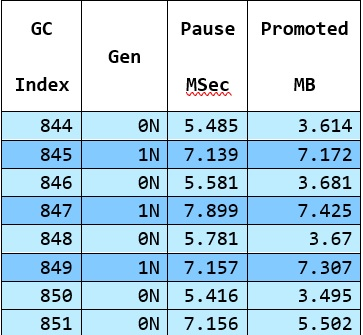

符合預期 — gen1 GC 的 promotion 量高於 gen0 ，因此耗時更長。其 promotion 量通常不高，因僅回收 heap 的（小）部分。

「 Promotion」是指 object 從較年輕代升級到較老代的過程：
1. Gen1 的 promotion 量高於 Gen0 ：
- Gen1 object 的存活率通常高於 Gen0
- 這增加了 Gen1 GC 的相對工作量和耗時
2. 相對於整個 heap， promotion 量通常不高：
- 即使 Gen1 有較高的存活率，絕對數量仍相對較小
- 這體現了分代式 GC 的效率：專注於處理 heap 的小部分

若 ephemeral GC 的 promotion 量突增， pause 時間將顯著延長。常見原因為觸發罕見程式路徑，導致預期應回收的 object 存活。目前工具對分析此問題支援有限 — .NET 5 新增 [ 運行時支援 ](https://github.com/dotnet/runtime/pull/40332)，可在 PerfView 使用 Generational Aware 視圖查看 old gen objects 導致 young gen objects 存活的關聯。範例如下：

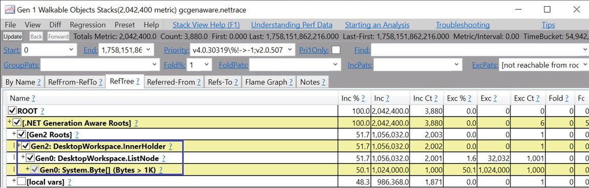

目前尚未有其他工具能便捷提供此資訊（若有工具能顯示 old generation objects 持有 young gen objects 導致其存活的資訊，請告知！）。

注意：若 gen2/LOH 中的 object 持有 young gen objects 的 references，且不再需要時，需手動將參考欄位設為 null。否則將持續 [ 導致 object 存活並 promotion](#1-The-generational-aspect)。對 C# 程式而言，這是導致 ephemeral objects 存活的主因（ F# 程式較少見）。

```
這段說明涉及 .NET 中的一個重要 memory 管理技巧：當長期存活的 object (Gen2 或 LOH 中的 objec) 持有對短期 object (young gen object) 的引用時，如何適當地管理這些引用。
引用關係說明
1. 首先，讓我們理清這段描述中的引用關係：
- 持有引用的 object ： Gen2/LOH 中的 object (長期存活的 object)
- 被引用的 object ： Young gen objects（年輕代 object ，如 Gen0 或 Gen1 中的 object ）

    [Gen2/LOH object  ] -- 引用 --> [Young gen object  ]

2. 為什麼需要這樣做？當 Gen2/LOH object 引用了 young gen objects 時，會產生以下問題：

強制 young gen objects 存活：
- 垃圾回收器從根開始標記可達 object 
- Gen2/LOH object 通常存活時間很長
- 它們引用的所有 young gen objects 也會被標記為存活
- 即使這些 young gen objects 實際上已經不再需要

導致不必要的 promotion：
- 這些本該被回收的 young gen objects 會在 GC 時被 promoted 到更高的代
- 從 Gen0 promote 到 Gen1 ，再從 Gen1 promote 到 Gen2
- 最終占用寶貴的 Gen2 空間，而 Gen2 GC 成本很高

降低 GC 效率：
- 分代式 GC 的效率依賴於「大多數 object 生命週期短」的假設
- 如果太多 object 被不必要地 promotion，會導致 GC 效率下降
- 可能增加 GC 暫停時間，降低應用程式的回應性
```

可透過 GCStats 生成的 Raw XML（點擊 "GC Rollup By Generation" 表格上方的 "Raw Data XML file (for debugging)" 連結）查看。以下為簡化範例：

```c
<GCEvent GCNumber="9" GCGeneration="0">

  <PerHeapHistories Count="12" MemoryLoad="20">

  <PerHeapHistory MarkStack="0.145 (10430)" MarkFQ="0.001 (0)" 

                  MarkHandles="0.005 (296)" MarkOldGen="2.373 (755538)">

  <PerHeapHistory MarkStack="0.175 (14492)" MarkFQ="0.001 (0)" 

                  MarkHandles="0.003 (72)" MarkOldGen="2.335 (518580)">
```

各 GC thread 因不同 [roots](#What-makes-an-object-survive) 而 promoted 的 bytes，屬於 PerHeapHistory 數據的一部分 —
1. MarkStack/FQ/Handles 分別代表標記 Stack變數 (marking stack variables)、終結佇列 (finalize queue) 與 GC 句柄 (GC handles)
2. MarkOldGen 表示因舊世代 (older generations) object  references 而 promote 的 bytes。

例如：若執行 gen1 GC，此數值反映 gen2 object 持有 gen0/gen1 object 導致其存活的量。

.NET 5 對 Server GC 的一項效能改進，是在標記 OldGen roots object 時考量 GC thread 的工作負載，因此，此類操作通常會產生最大 promotion 量。若您的應用中此數值嚴重失衡，升級至 .NET 5 將有所改善。

### VII. 判斷長時間 GC 是否由 GC 工作導致

若某次 GC 耗時長且不符合上述任何情境（即 GC 需處理的工作量不大，但仍導致長時間暫停），則需查明為何 GC 無法在需要時執行工作。此類問題通常看似隨機發生。

偶發性長時間暫停的範例：

 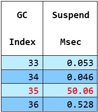

PerfView 提供一項實用功能稱為 stop trigger（停止觸發條件），其意義為「當觀察到特定條件被滿足時，盡快停止追蹤，以便捕捉到最相關的最後部分（即觸發條件時的關鍵數據）。」。 PerfView 已內建數個專為 GC 設計的停止觸發條件。

```
進一步拆解說明：

1. 「觀察到條件滿足」
- 指 PerfView 監控的某種「觸發條件」成立，例如：
    GC 暫停時間超過設定閾值（如 200 毫秒）。
    GC 執行時間過長。
2. 「盡快停止追蹤」
- 一旦條件觸發， PerfView 會立即停止收集數據，避免後續無關的數據淹沒關鍵信息。
- 類似「斷點」機制：觸發後立即停止，保留觸發前後的關鍵上下文。
3. 「捕捉最相關的最後部分」
- 觸發條件時，**最近的數據（即觸發前後的數據）** 通常是最關鍵的，因為它們直接關聯問題的根源。
- 例如：若因 GC 暫停過長觸發停止，此時追蹤檔會保留暫停期間的完整數據 (如Thread 狀態、 CPU 使用、事件順序)，方便分析具體原因。
```

#### a. GC 事件序列

要理解這些觸發條件，需先簡要了解 GC 事件 sequence。以下為相關的 6 個事件：

```
Microsoft-Windows-DotNETRuntime/GC/SuspendEEStart
Microsoft-Windows-DotNETRuntime/GC/SuspendEEStop
Microsoft-Windows-DotNETRuntime/GC/Start
Microsoft-Windows-DotNETRuntime/GC/Stop
Microsoft-Windows-DotNETRuntime/GC/RestartEEStart
Microsoft-Windows-DotNETRuntime/GC/RestartEEStop
```

(可在 Events 視圖中查看這些事件)

在典型的 blocking GC（包含所有 ephemeral GC 和 full blocking GC）中，事件 sequence 順序非常簡單：

```
GC/SuspendEEStart
GC/SuspendEEEnd <– suspension 完成
GC/Start 
GC/End <– 實際 GC 完成
GC/RestartEEStart
GC/RestartEEEnd <– 恢復完成
```

GC/SuspendEEStart 和 GC/SuspendEEEnd 用於暫停； GC/RestartStart 和 GC/RestartEEEnd 用於恢復。恢復耗時極短，無需討論。暫停可能耗時較長。

Background GC 的流程更複雜，完整 BGC 事件順序如下：

```
1) GC/SuspendEEStart
2) GC/SuspendEEStop
3) GC/Start <– BGC 開始

<- 此處可能發生 ephemeral GC，若發生則會看到：
GC/Start
GC/Stop

4) GC/RestartEEStart
5) GC/RestartEEStop <– 完成初始 suspension

<- 此處可能發生 0 次或多次 foreground ephemeral GC，例如：
GC/SuspendEEStart
GC/SuspendEEStop
GC/Start
GC/Stop
GC/RestartEEStart
GC/RestartEEStop

6) GC/SuspendEEStart
7) GC/SuspendEEStop 
8) GC/RestartEEStart 
9) GC/RestartEEStop <– 完成 BGC 的第二次暫停

<- 此處可能發生 0 次或多次 foreground ephemeral GC

10) GC/Stop <– BGC 結束
```

因此， BGC 在過程中會有第二次暫停 / 恢復。目前 GCStats 視圖會合併這兩次暫停（未來計劃分開顯示），但若發現 BGC 暫停時間過長，可透過 Events 視圖確認是哪次暫停導致。以下範例取自客戶追蹤檔的事件順序，觸發了剛才提及到的 [runtime bug](#Long-pause-due-to-bugs)：

| **Event  Name**   | **Time  MSec** | **Reason**       | **Count** | **Depth** | **Type**        | **explanation**                                              |
| ----------------- | -------------- | ---------------- | --------- | --------- | --------------- | ------------------------------------------------------------ |
| GC/Start          | 160,551.74     | AllocSmall       | 188       | 2         | BackgroundGC    |                                                              |
| GC/Start          | 160,551.89     | AllocSmall       | 189       | 0         | NonConcurrentGC | We are doing a gen0 at the  beginning of this BGC            |
| GC/Stop           | **160,577.48** |                  | 189       | 0         |                 |                                                              |
| GC/RestartEEStart | **160,799.87** |                  |           |           |                 | **There's a long period of time  here between last event and this one due to the bug** |
| GC/RestartEEStop  | 160,799.91     |                  |           |           |                 |                                                              |
| GC/SuspendEEStart | 161,803.36     | SuspendForGC     | 188       |           |                 | A Foreground gen1 happens                                    |
| GC/SuspendEEStop  | 161,803.42     |                  |           |           |                 |                                                              |
| GC/Start          | 161,803.61     | AllocSmall       | 190       | 1         | ForegroundGC    |                                                              |
| GC/Stop           | 161,847.14     |                  | 190       | 1         |                 |                                                              |
| GC/RestartEEStart | 161,847.15     |                  |           |           |                 |                                                              |
| GC/RestartEEStop  | 161,847.23     |                  |           |           |                 | The Foreground gen1 ends                                     |
| GC/SuspendEEStart | **161,988.57** | SuspendForGCPrep | 188       |           |                 | BGC's 2nd suspension starts with  SuspendForGCPrep as its reason |
| GC/SuspendEEStop  | 161,988.71     |                  |           |           |                 |                                                              |
| GC/RestartEEStart | 162,239.84     |                  |           |           |                 |                                                              |
| GC/RestartEEStop  | **162,239.94** |                  |           |           |                 | **BGC's 2nd suspension ends,  another long pause due to the same bug** |
| GC/Stop           | 162,413.70     |                  | 188       | 2         |                 |                                                              |

透過在 CPU Stacks 視圖中查看長時間暫停的時間範圍（ 160,577.482-160,799.868 和 161,988.57-162,239.94 ），即可發現該 bug。

**自動停止 PerfView 對 gc 的數據收集**

PerfView 是一個效能分析工具，它可以持續收集系統性能數據。「停止觸發條件」(Stop Triggers) 是 PerfView 的一個特性，用於：
1. 自動停止數據收集：當特定條件滿足時，自動結束跟踪會話
2. 捕獲特定性能問題：讓您能夠精確捕獲導致性能問題的關鍵時刻

PerfView 提供 3 個專用於停止收集 GC 的條件：

| **Trigger name**            | **What it measures**                                         |
| --------------------------- | ------------------------------------------------------------ |
| StopOnGCOverMsec            | 當 GC/Start 至 GC/Stop 的時間超過設定值 (且非 BG) 時觸發 |
| StopOnGCSuspendOverMSec     | 當 GC/SuspendEEStart 至 GC/SuspendEEStop 的時間超過設定值時觸發 |
| StopOnBGCFinalPauseOverMSec | 當 GC/SuspendEEStart (原因為 SuspendForGCPre) 至 GC/RestartEEStop 的時間超過設定值時觸發 |

常用於 /StopOnGCOverMSec 和 /StopOnBGCFinalPauseOverMSec 的指令範例：

`PerfView.exe /nogui /accepteula /StopOnGCOverMSec:15 /Process:A /DelayAfterTriggerSec:0 /CollectMultiple:3 /KernelEvents=default /ClrEvents:GC+Stack /BufferSize:3000 /CircularMB:3000 /Merge:TRUE /ZIP:True collect`

若目標行程名為 A.exe，需指定 /Process:A。可將 15 調整為符合實際問題的值。各參數的詳細說明可參考 [ 此部落格文章 ](https://devblogs.microsoft.com/dotnet/you-should-never-see-this-callstack-in-production/)。

#### b. 調試隨機性長時間 GC

以下範例展示如何 debug 某次 GC 突然耗時遠超其他 promotion 量相近的 GC。使用上述指令收集追蹤檔後，在 GCStats 中發現 GC#4022 耗時 20.963 ms，但其 promotion 量與前次 gen0 GC 相近（耗時卻短許多）：

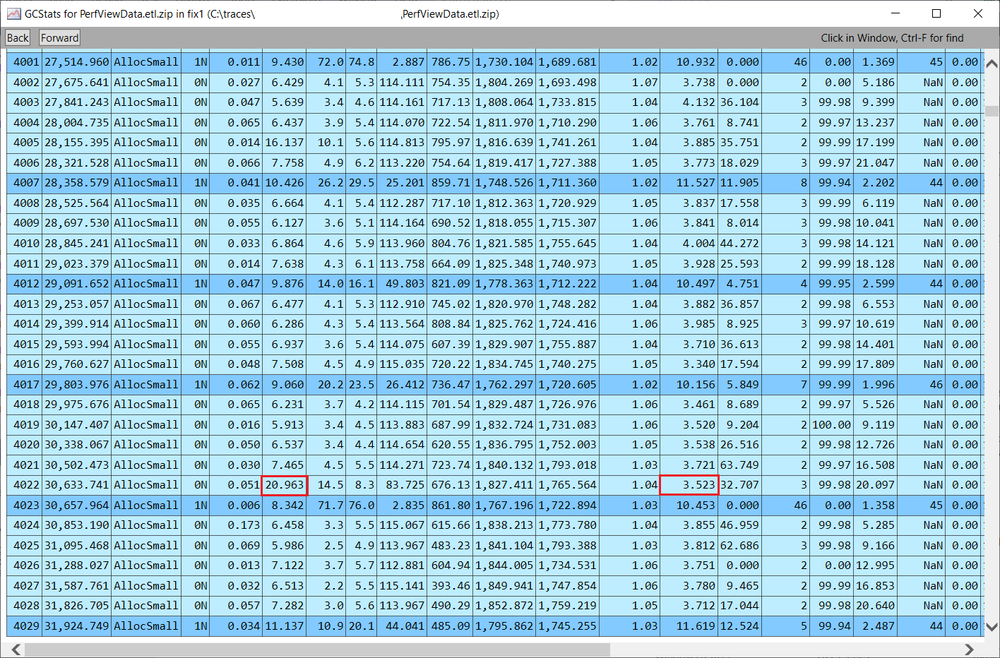

在 CPU Stacks 視圖中輸入 GC#4022 的開始與結束時間戳（ 30,633.741 至 30,654.704 ），發現負責實際 GC 工作的 coreclr!SVR::gc_heap::gc_thread_function 有兩段無 CPU 使用率的區間（以 ____ 表示）：

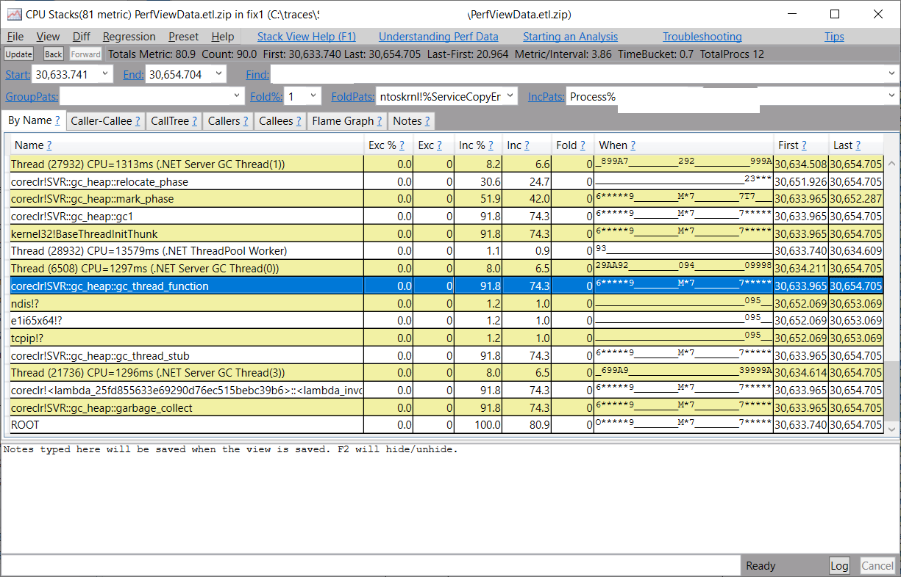

在 CPU Stacks 視圖中選取第一段空白區間，右鍵點選「 Set time range」可顯示該時段內行程的 CPU 使用狀況（此處無任何使用）。接著清除 IncPats 中的 process 名稱，以顯示所有 process 在此時段的 CPU 使用：

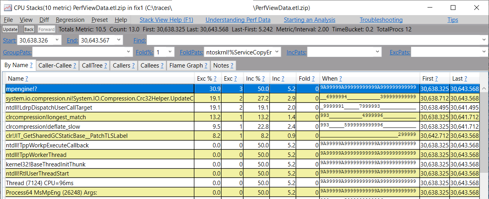

可看到來自 MsMpEng.exe process 的 mpengine module 佔用 CPU（雙擊 mpengine cell 可確認所屬 process）。若要確認此 process 是否干擾目標 process，可在 Events 視圖中輸入時間戳並查看原始 CPU 取樣事件 (使用方法請參見 [PerfView 的其他相關視圖 ](#Other-relevant-views-in-PerfView))：

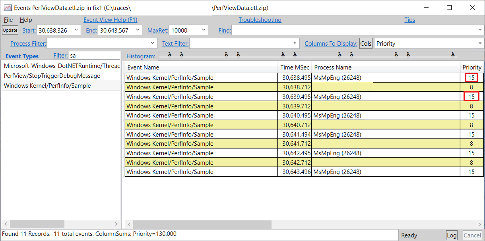

可見 MsMpEng.exe process 的取樣優先級為 15 （極高），而 Server GC Thread 的優先級約為 11 。

對於長時間 suspension 問題，通常需收集包含 ContextSwitch 和 ReadyThread 事件的 ThreadTime trace log。此類追蹤檔資料量大，但能精確顯示 GC thread 在呼叫 SuspendEE 時的等待對象：

`PerfView.exe /nogui /accepteula /StopOnGCSuspendOverMSec:200 /Process:A /DelayAfterTriggerSec:0 /CollectMultiple:3 /KernelEvents=ThreadTime /ClrEvents:GC+Stack /BufferSize:3000 /CircularMB:3000 /Merge:TRUE /ZIP:True collect`

若 ThreadTime 追蹤檔過大導致應用程式無法正常運作，可改用預設核心事件追蹤：

`PerfView.exe /nogui /accepteula /StopOnGCSuspendOverMSec:200 /Process:A /DelayAfterTriggerSec:0 /CollectMultiple:3 /KernelEvents=Default /ClrEvents:GC+Stack /BufferSize:3000 /CircularMB:3000 /Merge:TRUE /ZIP:True collect`

關於除錯長時間暫停的詳細範例，可參考 [ 此部落格文章 ](https://devblogs.microsoft.com/dotnet/work-flow-of-diagnosing-memory-performance-issues-part-2/)。

### VIII. 大型 GC Heap 大小

如果您不知道如何收集 GC  heap 大小數據，請按照 [ 如何收集 top level GC 指標 ](#How-to-collect-top-level-GC-metrics) 中的說明操作

#### a. 調試 OOM

在我們將大型 GC  heap 大小作為一般問題類別討論之前，我想特別提到 debug OOM，因為這是大多數讀者熟悉的 exception。有些人可能使用過 SoS !AnalyzeOOM 命令，該命令會顯示兩件事 - 1) 是否存在真正的 managed OOM。因為 [GC heap is only one kind of memory usage in your process](#GC-heap-is-only-one-kind-of-memory-usage-in-your-process)， OOM 不一定是由於 GC  heap 造成的； 2) 如果是 managed OOM，[ 是什麼操作導致了它 ](https://github.com/dotnet/diagnostics/blob/master/src/SOS/Strike/strike.cpp#L5088)，例如 GC 嘗試保留新的 segment 但失敗（在 64 位系統上您永遠不會真正看到此情況）或在嘗試進行 allocation 時無法 commit。

即使不使用 SoS，您也可以通過簡單查看 GC  heap 使用的 memory 量與 process 使用的 memory 量來驗證 GC  heap 是否是 OOM 的罪魁禍首。我們將在下面討論如何分析 heap 大小。如果您驗證 GC  heap 佔用了大部分 memory 使用量，並且由於我們知道 OOM 是在 GC [ 盡力減少 heap 大小但失敗後 ](#When-would-GC-throw-an-OOM-exception) 拋出的，這意味著由於 [ 用戶根 ](#2-User-roots) 存在大量存活的 memory， GC 無法回收它。您可以按照 [managed memory leak](#First-of-all-do-you-have-a-managed-memory-leak) 調查來找出存活的內容。

現在讓我們討論您沒有遇到 OOM 但需要查看 heap 大小以確定是否可以優化或如何優化的情況。在 [ 如何正確查看 GC  heap 大小 ](#How-to-look-at-the-GC-heap-size-properly) 部分，我們詳細討論了 heap 大小及其measure方法。因此，我們知道 heap 大小在很大程度上取決於您measure的時間點與 GC 發生的時間以及 allocation 預算的關係。 GCStats 視圖顯示 GC 進入時和退出時的大小，即 Peak 和 After -

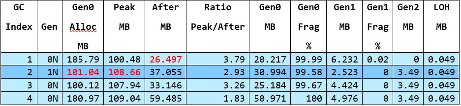

這有助於進一步剖析大小。 After MB 列是

Gen0 MB + Gen1 MB + Gen2 MB + LOH MB 的總和

另外請注意， Gen0 Frag % 顯示為 99.99%。我們知道這是由於 [pinning](#Pinning) 造成的。因此，部分 gen0 的 allocations 將會填補這些 fragmentation。對於 GC #2 ，它從 GC #1 結束時的 26.497 MB 開始，接著 allocation 了 101.04 MB，並在 GC #2 開始時以 108.659 MB 的大小結束。

要確定 GC  heap 大小是否 *過大*，我們應查看以下因素 -

#### b. 峰值大小是否過大，但回收後大小不大？ 

如果是這種情況，通常意味著在下一次 GC 觸發之前有太多 gen0 allocation。在 .NET Core 3.0 中，我們啟用了一個名為 GCGen0MaxBudget 的 config 來限制此情況 - 我通常不建議大家設置此值，因為您可能設置得太小，從而導致 GC 觸發過於頻繁。這是為了限制最大 gen0 allocation 預算。當您使用 Server GC 時， GC 在設置 gen0 預算時非常激進，因為它認為 process 在機器上使用大量資源是可以接受的。這通常沒問題，因為如果 process 使用 [Server GC](#Server-GC)，通常意味著它可以使用大量資源。但如果您確實需要更頻繁地觸發 GC 以換取更小的 heap 大小，可以使用此 config。我希望將來我們會將其作為某些高級 config 的一部分，允許您向我們表明您希望進行此權衡，以便 GC 可以自動為您調整此設置，而不是您自己使用非常底層的 config。

過去使用 GC performance counters 的人知道 "#Total Committed Bytes" 計數器，他們曾詢問如何在 .NET Core 中獲取此數據。首先，如果您以這種方式measure committed bytes，由於 [ 對 ephemeral segment 的 committed 的特殊處理 ](#Special-handling-of-the-ephemeral-segment)，您可能會看到它更接近 Peak Size 而不是 After size。因為 "After size" 沒有報告我們將使用但尚未使用的 gen0 預算部分。因此，您可以將 GCStats 中報告的 Peak Size 用作近似總 committed。但如果您使用 .NET 5 ，可以通過調用我們之前提到的 [GetGCMemoryInfo](#How-to-collect-top-level-GC-metrics) API 獲取此數字 - 它是 GCMemoryInfo 結構返回的屬性之一。

還有一種不太方便的方法是使用 [per heap history event](#https://github.com/microsoft/perfview/blob/master/src/TraceEvent/Parsers/ClrTraceEventParser.cs#L4773) 中的 [ExtraGen0Commit](https://github.com/microsoft/perfview/blob/master/src/TraceEvent/Parsers/ClrTraceEventParser.cs#L5131) 字段。您可以在已獲取的 heap 大小信息 (即 [GCHeapStats](https://docs.microsoft.com/en-us/dotnet/framework/performance/garbage-collection-etw-events#gcheapstats_v2-event) 事) 之上添加此值（如果使用 Server GC，則是所有 heap 的 ExtraGen0Commit 的總和）。但我們在 PerfView 的 UI 中未公開此信息，因此您需要自行使用 [TraceEvent](#https://github.com/microsoft/perfview/tree/master/src/TraceEvent) 庫來獲取此數據。

#### c. 回收後大小是否過大？

如果是，大部分大小是否在 gen2/LOH 中？您是否主要進行 BGC (不 compact)？如果您已經進行 full blocking GC 且 After 大小仍然過大，則僅意味著有太多數據存活。您可以按照 [managed memory 洩漏調查 ](#First-of-all-do-you-have-a-managed-memory-leak) 來找出存活的內容。

另一種可能的情況是 heap 的大部分位於 gen0 中，但主要是 fragmentation。如果您長期 pin 某些 object 並且它們在 heap 上分散得足夠開，就會發生這種情況。因此，即使 GC 已將它們 [ 降級 ](#pinning) 到 gen0 ，只要這些 pin 未消失， heap 的該部分仍無法回收。您可以收集 [GCHandle](https://devblogs.microsoft.com/dotnet/gc-handles/) 事件來確定它們何時被 pinned。 PerfView 命令行為

```
GC 中的降級 (Demotio) 機制：在 .NET 垃圾收集器中，"demotion" 是一個特殊情況，主要與固定 (pinned) object 有關：
1. 正常的代際進階：
- 通常 object 只會從較低代升級 (promot) 到較高代
- 例如： Gen0 → Gen1 → Gen2
2. 固定 object 的特殊處理：
- 當 object 被固定 (pinne) 時，它阻止了有效的 memory 壓縮
- 特別是長時間固定的 object 會導致周圍區域的 memory 碎片化
3. 降級 (Demotio) 策略：
- GC 可能決定將某些固定 object 及其周圍的碎片區域 " 降級 " 到 Gen0
- 這是一種優化策略，目的是更頻繁地檢查這些區域，看是否可以回收碎片
```

`perfview /nogui /KernelEvents=Process+Thread+ImageLoad /BufferSize:3000 /CircularMB:3000 /ClrEvents:GC+Stack+GCHandle /clrEventLevel=Informational collect`

Advanced Group 中的 Pinned Stacks 視圖將顯示 pinned handle 何時開始指向 object 以及何時被銷毀 -

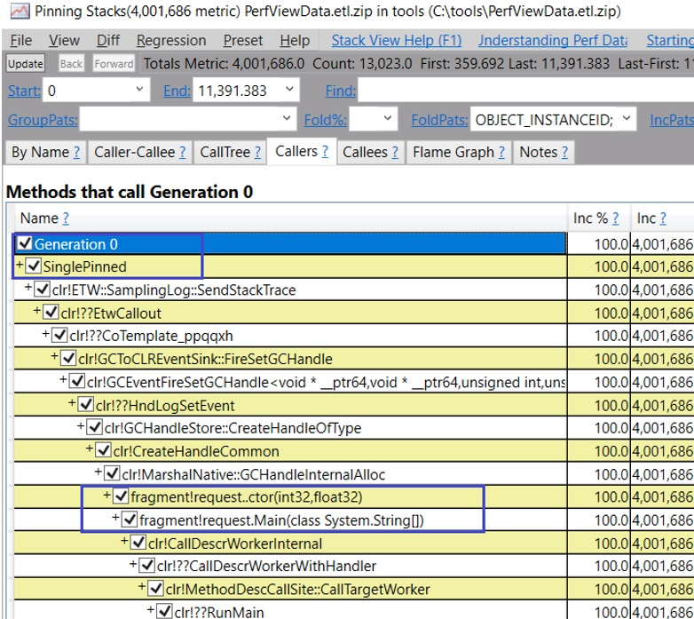

#### d. 您是否主要對 gen2 GC 進行 BGC?

如果您主要進行 BGC，是否有效使用了 fragmentation，即當 BGC 開始時， gen2 Frag % 是否非常大？如果不大，則表示工作最佳。否則這表明存在 BGC 調度問題 - 請告知我。

```
原文提到的判斷標準是：「當 BGC 啟動時， Gen2 Frag % 是否非常大？」

1. 理想情況 (BGC 工作最佳)：
- 當 BGC 啟動時， Gen2 Frag % 較低
- 這表明 BGC 調度得當，在碎片化程度不太嚴重時就啟動了
- BGC 能夠及時清理和整理 memory ，防止碎片化積累到嚴重程度
2. 問題情況 (BGC 調度問題)：
- 當 BGC 啟動時， Gen2 Frag % 已經很高
- 這表明 BGC 啟動得太晚，碎片化已經變得嚴重
- 系統沒有在適當時機觸發 BGC，導致碎片化積累
```

如我們所知， GCStats 視圖中的表顯示 GC 結束時的數據。因此，對於 BGC，它僅顯示結束時的 fragmentation 比率。然而，很可能您在期間進行了 ephemeral GC。因此，您始終可以查看 BGC 之前的 ephemeral GC 的 gen2/LOH 數據。這是一個示例 -

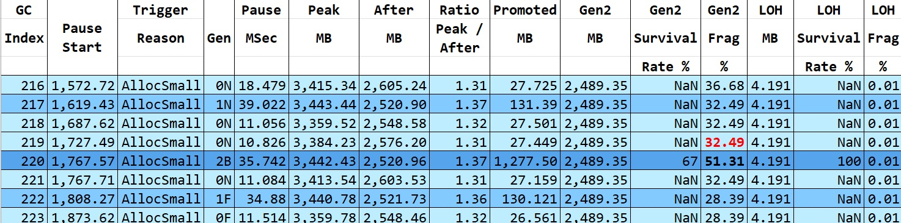


我們可以看到 GC#220 是 BGC，它顯示在此 BGC 結束時，"Gen2 Frag %" 為 51%。之前的 GC#219 是 gen0 GC，在該 GC 結束時，"Gen2 Frag %" 為 32%。因此，這將是 BGC 開始時的 gen2 fragmentation 比率。

另一種更詳細的查看方式是通過 GCStats 視圖中的 Raw XML 鏈接。我已將數據精簡至僅相關部分 (這來自客戶的不同 trace)-

```
<GCEvent GCNumber=  "1174" GCGeneration="2" Type= "BackgroundGC" Reason= "AllocSmall">
  <PerHeapHistory>
    <GenData Name="Gen2" SizeBefore="187,338,680" SizeAfter="187,338,680" ObjSpaceBefore="177,064,416" FreeListSpaceBefore="10,200,120" FreeObjSpaceBefore="74,144"/>
    <GenData Name="GenLargeObj" SizeBefore="134,424,656" SizeAfter="131,069,928" ObjSpaceBefore="132,977,592" FreeListSpaceBefore="1,435,640" FreeObjSpaceBefore="11,424"/>
```

SizeBefore = ObjSpaceBefore + FreeListSpaceBefore + FreeObjSpaceBefore

`SizeBefore` 是 generation 的總大小。

`ObjSpaceBefore` 是此 generation 中有效 object 佔用的空間。

`FreeListSpaceBefore` 是此 generation 中 free list 佔用的空間。

`FreeObjSpaceBefore` 是此 generation 中因太小而無法進入 free list 的 free object 佔用的空間。

(FreeListSpaceBefore + FreeObjSpaceBefore) 就是我們所稱的 fragmentation。

在此案例中，我們看到 ((FreeListSpaceBefore + FreeObjSpaceBefore) / SizeBefore) 為 5%，這相當小，意味著我們充分利用了 BGC 建立的 free space。當然，我們希望此比率盡可能小，但如果 free space 太小，意味著 GC 可能無法使用它們。通常，如果此比率為 15% 或更小，我不會擔心，除非我們看到 free space 足夠大但未被使用。

您也可以從我們之前提到的 [GetGCMemoryInfo](#How-to-collect-top-level-GC-metrics) API 獲取此數據。

#### a. BGC 開始時的高 gen2 碎片化比率

如果您看到 BGC 開始時 gen2 fragmentation 比率非常高，例如 70% 或 80%，這不是好情況。這意味著我們真的沒有充分利用 BGC 建立的 free list。

BGC 和 Free List 的關係，背景垃圾收集 (BG) 在工作過程中會建立和維護 free list：
1. BGC 如何構建 free list：
- BGC 在背景執行過程中識別不再使用的 object 
- 回收這些 object 的 memory 空間
- 將這些空閒空間添加到 free list 中
- 整理和可能合併相鄰的空閒塊以減少碎片化
2. Free list 的目的：
- 提供一個記錄可用 memory 的機制
- 使新的 memory  allocation 能夠重用這些空間，而不必擴展 heap
- 減少 memory 壓縮的需求，因為適當大小的空閒塊可以直接使用

"Free list" 是 .NET GC 用來管理和重用已回收 memory 空間的一種機制。 BGC 在工作時會識別未使用的 object 並將其 memory 添加到 free list 中，以便後續的 memory  allocation 可以重用這些空間。

當新的 BGC 開始時如果發現碎片化率仍然很高，意味著系統沒有充分利用前一個 BGC 構建的 free list。這是一種效率低下的情況，表明 BGC 的工作沒有被最大化利用，可能需要調整應用的 memory  allocation 模式或 GC 的調度策略。

這通常發生在 peak workload (峰值工作負載) 導致 GC heap 的增加，但當 workload 變低時， GC 不覺得需要 compact，因為仍有大量 memory 可用。這本身不會導致問題（因為無論如何都有 memory 可用），但確實會導致容量規劃問題 - 當 workload 變輕時，人們希望看到 heap 變小。因此，我們提供了 [GCConserveMemory](https://learn.microsoft.com/en-us/dotnet/core/runtime-config/garbage-collector#conserve-memory) config 來解決此問題。此 config 告訴 GC 您希望它對未使用的空間有多保守。因此，如果我們遇到上述情況，即 workload 從重變輕，並且 BGC 建立的大部分 free list 未被使用，這意味著 BGC 進入時的 fragmentation 比率高於您用此 config 值指定的值，我們將進行 full compacting GC 以減少 fragmentation（ Full compacting GC 正是通過移動存活 object 來創建連續的未使用 memory 空間。）。

```
"Peak workload" 在引用段落中指的是：
1. 高強度使用期：
- 應用程序經歷了一段高強度使用期間
- 在這段時間內，應用程序需要 allocation 大量 memory 來處理請求或任務
2.  memory 使用高峰：
- 這段高強度使用導致應用程序需要更多的 memory 空間
- GC 會適應性地擴展 heap (hea) 以滿足這些需求
3. 暫時性需求：
- 峰值工作負載通常是暫時的，不代表應用程序的常態需求
- 例如，一個網站可能在特定時間（如促銷活動）經歷流量激增
```

您可以將此值大致視為 gen2 fragmentation 比率的倒數，以 10% 為增量。 70% 的 frag 比率對應 3 （即 (100% - 70%) / 10%）， 20% 對應 8 。因此，假設您在 BGC 進入時看到 70% 的 gen2 fragmentation 比率，並且希望它更接近 20%，則應將此 config 設置為 8 。

#### e. 您是否從 GC 的角度看到合理的 Heap 大小，但仍希望 Heap 更小？

在完成上述步驟後，您可能會發現這從 GC 的角度都可以解釋。但如果您仍希望 heap 更小怎麼辦？

您可以將 process 置於 memory 受限的環境中，即具有 memory 限制的 container，這意味著 GC 將自動識別其可使用的 memory。但是，如果使用 Server GC，您需要至少升級到 .NET Core 3.0 ，該版本使 container 支持更加健壯。在該版本中，我們還添加了 2 個新 config，允許您指定 GC  heap 的 memory 限制 - [GCHeapHardLimit and GCHeapHardLimitPercent](https://docs.microsoft.com/en-us/dotnet/core/run-time-config/garbage-collector#heap-limit)。此 [ 博客文章 ](https://devblogs.microsoft.com/dotnet/running-with-server-gc-in-a-small-container-scenario-part-1-hard-limit-for-the-gc-heap/) 中解釋了這些內容。

當您的 process 在具有其他 processes 的機器上運行時， GC 開始生效的默認 memory 負載可能不適用於每個 process。您可以考慮使用 [GCHighMemPercent](https://docs.microsoft.com/en-us/dotnet/core/run-time-config/garbage-collector#high-memory-percent) config 並將該閾值設置得更低 - 這將使 GC 更積極地進行 full blocking GC，因此即使有 memory 可用，也不會過度增長 heap。

#### f. GC 是否為其自身的 Bookkeeping 使用了過多 Memory？

在少部分情況下，有人報告觀察到大量 memory 用於 GC bookkeeping。您可以通過 GC 的 `gc_heap::grow_brick_card_tables` 進行的 VirtualAlloc 調用來查看此情況。這是因為由於 heap 地址空間中的某些 unexpected regions 被保留， heap 範圍被擴展得太遠。如果您確實遇到此問題且無法防止 unexpected 保留，可以考慮使用 GCHeapHardLimit/GCHeapHardLimitPercent 指定 memory 限制，這樣整個限制將預先保留，您就不會遇到此問題。

```
GC Bookkeeping 的主要內容
1. 卡表 (Card Tables)：
- 用於記錄代際間引用（例如從 Gen2 object 指向 Gen1 或 Gen0 object 的引用）
- 使 GC 能夠在進行部分收集 (如只收集 Gen) 時確定哪些老年代 object 引用了年輕代 object 
- 避免掃描整個 heap 來找到對年輕代 object 的引用
2. 磚表 (Brick Tables)：
- 一種更大粒度的追蹤結構，用於處理大範圍的 memory 
- 與卡表一起工作，提高對代際間引用的追蹤效率
3. object 頭資訊 (Object Headers)：
- 每個 object 的元信息，包括 object 類型、大小、 GC 代別等
- 用於識別 object 和確定其特性
4. 代際信息 (Generation Info)：
- 追蹤每個代際的邊界和大小
- 管理代際之間的 object promotion
5. object 映射 (Object Maps)：
- 用於快速確定 memory 中的哪些位置是有效 object 的開始
- 在標記 - 清除過程中幫助 GC 識別存活 object 
6. GC 句柄表 (Handle Tables)：
- 追蹤 GC 句柄（弱引用、固定句柄等）
- 管理 object 的根引用
```

# 八、性能問題的明確跡象

如果您看到以下任何情況，毫無疑問存在性能問題。與任何性能問題一樣，正確確定優先級始終很重要。例如，您可能遇到非常長的 GC 暫停，但如果它們不影響您關心的性能指標，您最好將時間花在其他地方。

我使用 PerfView 中的 GCStats 視圖來顯示症狀。如果您不熟悉此視圖，請參閱 [ 此部分 ](#displaying-top-level-gc-metrics)。您不必使用 PerfView；只要工具能顯示以下數據，使用任何工具都可以。

以下三種明確跡象可供快速對照：

| 跡象 | GCStats 中看什麼 | 典型數值 |
|------|-----------------|---------|
| 暫停時間過長 | Pause Msec 欄 | >10ms 單次暫停 |
| 隨機長時間 GC | 找 Promoted MB 相近但 Pause 差很多的 GC | e.g. 5ms/200ms/6ms |
| 大部分 GC 是 Full Blocking | Gen 欄位顯示 2N (blocking gen2) | >50% GC 是 Full Blocking |

## 1. 暫停時間過長

每次發生暫停通常遠少於 1ms。如果您看到 10 或 100 ms 級別的情況，無需懷疑是否存在性能問題 - 這是明確的跡象。

如果您發現大部分 GC 暫停時間被 suspension 佔用，尤其是持續如此，並且總 GC 暫停時間過長，您應立即調試它。我在 [ 此博客文章 ](https://devblogs.microsoft.com/dotnet/work-flow-of-diagnosing-memory-performance-issues-part-2/) 中詳細舉例說明了如何調試長時間 suspension 問題。

這由 GCStats 視圖中的 "Suspend Msec" 和 "Pause Msec" 列指示。我模擬了一個示例 -

| GC Index | Suspend Msec | Pause Msec |
| -------- | ------------ | ---------- |
| 10       | 150          | 180        |
| 11       | 190          | 200        |

兩個 GC 的大部分暫停時間都花在 suspension 上。

正常情況下每次 GC Pause 應 <1ms。10-100ms 級別就是明確效能問題。

重點看：Suspend Msec vs Pause Msec。如果 Suspend Msec 佔大部分 → 問題在 Thread Suspension（Thread 無法快速到達 Safe Point），而非 GC 工作本身。

如果是 GC 工作導致 Pause 長 → 回到前面 [### V. 有效管理 Pinning](#v-effective-management-of-pinning)、[### VI. 大 Object 堆 (LOH) 的影響](#vi-impact-of-the-large-object-heap-loh)、[### VII. Finalizers](#vii-finalizers) 章節依序診斷。

## 2. 隨機長時間 GC Pauses

" 隨機長時間 GC pauses" 意味著突然發現某次 GC 未比平常 promote 更多，但花費更長時間。這是一個模擬示例 -

| GC Index | Suspend Msec | Pause Msec | Promoted MB |
| -------- | ------------ | ---------- | ----------- |
| 10       | 0.01         | 5          | 2.0         |
| 11       | 0.01         | 200        | 2.1         |
| 12       | 0.01         | 6          | 2.2         |

所有 GC promote 了約 2MB/ 次，但 GC#10 和 #12 花費了幾 ms，而 GC#11 花費了 200ms。這表明 GC#11 期間出現了問題。有時您可能會看到突然花費很長時間的 GC 也導致了長時間的 suspension，因為導致長時間 suspension 的原因也影響了 GC 工作。

我在 [ 上文 ](#debugging-a-random-long-gc) 舉例說明了如何調試此問題。

什麼叫「隨機」？某次 GC 突然花費遠超其他同量 promotion 的 GC。例如上表中 GC#11 的 Promoted MB (2.1) 與 #10 (2.0) 幾乎相同，但 Pause 從 5ms 飆升至 200ms，這就是隨機長時間 GC。

通常原因：CPU contention（其他高優先級 process 搶走 CPU）、Thread suspension 異常、或 GC 特定路徑的 bug。

診斷方向：參見 [#### b. 調試隨機性長時間 GC](#debugging-a-random-long-gc)（前面已詳述）。

## 3. 大部分 GC 是 Full Blocking GC

如果您發現大多數 GC 是 full blocking，這通常需要較長時間 (如果 heap 很大)，這就是性能問題。我們不應該一直進行 full blocking GC。即使您處於 [ 高 memory 負載 ](#GC-is-per-process-but-is-aware-of-physical-memory-load-on-the-machine) 情況，進行 full blocking GC 的目的是減少 heap 大小，使 memory 負載不再高。 GC 有方法應對具有挑戰性的場景，例如針對高 memory 負載 + 大量 pinning 的 [provisional mode](https://devblogs.microsoft.com/dotnet/provisional-mode/)，以避免進行不必要的 full blocking GC。我見過的最常見原因實際上是强制的 full blocking GC，這很容易調試，因為 GCStats 會顯示觸發原因是 Induced。這是一個模擬示例 -

| GC Index | Trigger Reason | Gen  | Pause Msec |
| -------- | -------------- | ---- | ---------- |
| 10       | Induced        | 2NI  | 1000       |
| 11       | Induced        | 2NI  | 1100       |
| 12       | Induced        | 2NI  | 1000       |

[ 此部分 ](#finding-out-what-induced-gcs) 討論了如何找出強制的 GC。


> 正常 GC 的啟動流程：當 GC 啟動時，其標準流程如下：
>
> 1. 決定回收代別 (Generation)
>    根據 memory 壓力與 allocation 模式，選擇回收 Gen 0 、 Gen 1 或 Gen 2 。
> 2. Gen 2 的執行模式選擇
>    - 若回收 Gen 2 ，決定使用 background GC（非阻塞）或 blocking GC（完全暫停）。
> 3. 執行回收工作
>    基於上述決策開始回收，過程中暫停應用程式線程 (Blockin) 或並行執行 (Background)。
>
> ---
>
> Provisional Mode 的作用：此模式允許 GC 在運行中動態調整回收策略：
>
> - 動態切換代別
>    - 例如：原計劃回收 Gen 2 ，但檢測到 Gen 2 高碎片化後改為回收 Gen 1 。
>    - 目前僅在 高 memory 負載 + Gen2 高碎片化 時觸發。
>
> - 解決預測難題：避免因預測失準導致 Gen 2 低效回收 (如頻繁 Full GC)。
>
> ---
>
> 觸發 Provisional Mode 的單一情境
> 1. 觸發條件
>    - 在 Full Blocking GC 中檢測到以下任一：
>      - 高 memory 負載 (High Memory Load)
>      - Gen2 高碎片化 (High Fragmentation)
>
> 2. 退出條件
>    - 當 Full Blocking GC 中不再檢測到上述情況時，關閉此模式。
>
> ---
>
> 為何需要 Provisional Mode？
> 未引入此模式前的問題：
>
> - 過度 Full Compacting GC
>   - 預期：壓縮 Gen2 可減少 heap 大小。
>   - 現實：若碎片化由 Pinning 引起且未消失，壓縮無效。
>     例： Pinned Objects 佔據 Gen2 空間，壓縮後仍無法釋放 memory ，但一直進行了 Full GC。
>
> ---
>
> 具體運作流程
> 1. 觸發 Provisional Mode
>    - GC 檢測到 高 memory 負載 或 Gen2 高碎片化。
>    - 進入臨時模式，調整回收策略。
>
> 2. Gen1 存活 object 的特殊處理
>    - 正常行為： Gen1 存活 object  promote 到 Gen2 的新區域 (可能擴展 Gen2 大小)。
>    - Provisional Mode：
>      - 將 Gen1 存活 object  compact 至 Gen2 的 Free List（現有空閒區塊）。
>      - 例： Gen2 原有 100MB (存活 80MB + Free 20MB)，壓縮 Gen1 10MB 至 Free 空間 → 存活 90MB + Free 10MB，物理大小仍為 100MB。
>
> 3. 避免 Gen2 擴張
>    - 邏輯大小 (存活 + Fre) 可能增加，但 物理大小 保持不變。
>    - 推遲 Full GC 觸發，減少暫停時間。
>
> ---
>
> 設計考量
> 1. 效能提升實例
>    - 問題：某團隊因頻繁 Full GC 導致高暫停時間 (% Pause Time)。
>    - 解決：啟用 Provisional Mode 後：
>      - Full GC 次數減少（轉為 Gen1 GC）。
>      - 暫停時間降低， heap 大小維持穩定。
>
> ---
>
> 技術細節
> - 支援版本：
>   - .NET Framework 4.7.x
>   - .NET Core 3.0+
> - 觸發標記： PMFullGC（ GCStats 中顯示的觸發原因）。

# 九、幫助我們調試性能問題的有用信息

在某些時候，即使您遵循了本文的建議並進行了盡職調查，仍發現性能問題未解決。我們很樂意提供幫助！為了節省您和我們的時間，我們建議提供以下信息 -

尋求幫助時，請確認已備妥以下資料：

```
□ 1. Runtime 檔案版本 (clr.dll / coreclr.dll / libcoreclr.so 的 FileVersion)
□ 2. 執行環境 (OS 版本、CPU 核心數、RAM 大小、container 限制)
□ 3. GC 設定 (Server/Workstation GC? BGC enabled? 任何自訂 config?)
□ 4. 你已做過什麼診斷? (收集了什麼 trace? 看到了什麼?)
□ 5. 效能 trace 檔案 (不是 dump! 不是 counter!)
```

## 1. 運行時的檔案版本

每個版本都會有新的 GC 變更，因此我們需要確切知道您使用的運行時版本，以了解該版本包含哪些 GC 變更。提供此資訊至關重要。版本如何對應到「公開名稱」(如 .NET 4.) 並不容易追蹤，因此提供 DLL 的 "FileVersion" 屬性對我們非常有幫助。此屬性會顯示分支名稱的版本號（適用於 .NET Framework）或實際提交（適用於 .NET Core）。您可透過以下 PowerShell 指令取得此資訊：

```PowerShell
PS C:\Windows\Microsoft.NET\Framework64\v4.0.30319> (Get-Item C:\Windows\Microsoft.NET\Framework64\v4.0.30319\clr.dll).VersionInfo.FileVersion
4.8.4250.0 built by: NET48REL1LAST_C

PS C:\> (Get-Item C:\temp\coreclr.dll).VersionInfo.FileVersion
42,42,42,42424 @Commit: a545d13cef55534995115eb5f761fd0cecf66fc1
```

對於 Linux：

```
strings ~/dotnet70/shared/Microsoft.NETCore.App/7.0.0-rc.2.22451.11/libcoreclr.so | grep "@(#)"
@() Version 7.0.22.45111 @Commit: 6d10e4c8bcd9f96ccd73748ff827561afa09af57
```

另一種方式是透過 [windbg](https://learn.microsoft.com/en-us/windows-hardware/drivers/debugger/) 的 lmvm 命令（部分內容省略）:

```
0:000> lmvm coreclr
Browse full module list
start             end                 module name
00007ff8`f1ec0000 00007ff8`f4397000   CoreCLR    (deferred)             
    Image path: C:\runtime-reg\artifacts\tests\coreclr\windows.x64.Debug\Tests\Core_Root\CoreCLR.dll
    Image name: CoreCLR.dll
    Information from resource tables:
        FileVersion:      42,42,42,42424 @Commit: a545d13cef55534995115eb5f761fd0cecf66fc1
```

注意： windbg 也能載入來自 Linux 的 core dump。

若您擷取 ETW trace，也可在 `KernelTraceControl/ImageID/FileVersion` 事件中找到此資訊（部分內容省略）:

```
ThreadID="-1" ProcessorNumber="2" ImageSize="10,412,032" TimeDateStamp="1,565,068,727" BuildTime="8/5/2019 10:18:47 PM" OrigFileName="clr.dll" FileVersion="4.7.3468.0 built by: NET472REL1LAST_C"
```

請注意，此事件可能未包含在您的 trace 中。因此即使您提供 trace，仍建議同時提供版本資訊，以防萬一。由於我們可能處於不同時區，與其來回詢問耗時一兩天，直接提供資訊會更有效率。

## 2. 執行場景的環境

提供以下資訊將有助於我們理解您的場景：

+ 您使用的作業系統是？

+ 機器規格 - 核心數與 RAM 容量。

+ 場景是作為獨立應用程式運行，還是在 container 中運行？若為後者，您配置了哪些 container 設定 (memory/cpu 限制)？

+ 是否有設定任何 GC 配置（如環境變數或應用程式 / 運行時配置）？例如基本配置如使用 Server GC。這可能導致 memory 使用量與未配置時差異極大。

建議以以下格式提供環境資訊：

| 項目 | 範例 |
|------|------|
| OS | Windows 11 / Ubuntu 22.04 |
| CPU 核心數 | 8 cores |
| RAM | 32 GB |
| Container? | Docker, limit=2GB |
| .NET 版本 | .NET 8.0.1 |
| GC 模式 | Server GC (default) |
| 自訂 GC config | GCHighMemPercent=80 |

## 3. 你對此 issue 已經執行了什麼診斷？

若您已按照本文件技巧自行進行診斷（強烈建議），請分享您的操作與結論。這不僅節省我們的工作量，也能讓我們了解提供的資訊是否有效協助診斷，以便調整未來對客戶的支援方式。

提供診斷結果時，可參考以下結構：

```
我已經做過的診斷：
- 收集了 [GC trace / CPU trace / heap snapshot]
- 觀察到 [% Pause time / Gen2 GC 次數 / Heap大小]
- 已經排除 [洩漏 / allocation過多 / pinning]
- 困惑點: [具體描述你卡在哪一步]
```

## 4. 效能資料

對於效能問題，缺乏效能資料時我們只能給出一般建議。要精確定位問題，我們需要效能資料。

如本文多次提及，效能 trace 是診斷效能問題的主要方法。除非您已執行診斷並確認無需 top level GC trace，否則我們通常會要求您先 [ 收集此類 trace](#how-to-collect-top-level-gc-metrics)。若需詳細分析 GC 工作，我通常還會要求包含 CPU 樣本的 trace。指令如下：

`PerfView /nogui /KernelEvents=Process+Thread+ImageLoad+Profile /ClrEvents:GC+Stack /clrEventLevel=Informational /BufferSize:3000 /CircularMB:3000 /MaxCollectSec:600 collect gc-with-cpu.etl`

此指令會收集 10 分鐘資料。雖無法解碼 managed frames，但足以分析 GC 工作。

我們可能根據初始 trace 的線索要求額外 trace。

一般來說， dump 不適合調查效能問題。但若無法取得 trace 而只有 dump，請在無隱私疑慮下分享，並確保我們能存取。

計數器 (counters) 通常僅用於監控，不足以診斷問題。因此我們首要要求通常是收集 top level GC trace。

# 十、常見問題

## 1. 常見問題 #1：我完全沒有修改程式碼，為何升級 .NET 版本後看到 memory 使用量增加？

一個類似（且更常見）的問題是：

「升級 .NET 後看到的 memory 增加是由哪些 GC 變更引起的？」

答案是：「這不一定是 GC 的變更造成的」。需理解兩個關鍵點：

- GC 是運行時提供的元件，用於管理 memory 。若您的 allocation 模式或 object 存活模式改變， GC 行為也會隨之變化。

- 您的 process 不只運行您的程式碼，還包含您使用的函式庫。實際上，大多數用戶的程式碼只佔運行內容的一小部分。不同 .NET 版本間，函式庫和運行時 (含 G) 的程式碼都會變更。跨主要版本時，函式庫與運行時的變更量極大，可能顯著改變 allocation/ 存活模式。

當然， GC 的變更也可能導致 memory 行為變化。但您呼叫的函式庫變更同樣容易影響 memory 行為。

若觀察到 heap 大小增加，且發生 full blocking GC（無論是手動觸發或自然發生），表示 heap 已縮減至最小， GC 無法回收更多 memory 。殘留的 object 純粹由應用程式持有。若 heap 仍較大，表示您或使用的函式庫持有了更多 memory 。可透過收集 [top level GC metrics](#How-to-collect-top-level-GC-metrics) 指標驗證，查看是否有標記為 2N 的 GC (表示 full blocking GC)。下例顯示這是一個 誘發的 full blocking GC ('I')：

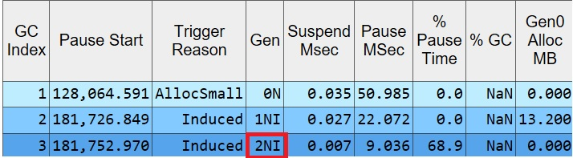

若未發生 2N GC 或問題不在 heap 大小，分析此類 memory 使用增加的起點是檢查是否 allocation 增加。可透過 [ measure allocation](#Measure-allocations) 章節的方法取得資訊。若問題在存活模式而非 allocation，則需深入分析。建議收集新舊版本的 [top level GC metrics](#How-to-collect-top-level-GC-metrics)，比較差異以定位問題類別，再依本文指引診斷。需注意函式庫與運行時同時變更時，因變更量龐大，釐清原因可能極其困難。

為解決此問題，自 .NET 6 起，我們更注重 GC 與運行時介面的向後兼容性，以便升級時僅 GC 變更生效。最佳做法是使用獨立 GC DLL，僅套用 GC 變更，觀察是否仍存在 memory 增加情況。次佳做法是僅替換 coreclr.dll，隔離運行時與函式庫變更。但涉及 system.private.corelib.dll 時，因其與高階函式庫的介面可能大幅變更，難以完全隔離。

## 2. 常見問題 #2：為何 GC 不回收這些 object？它們應該被回收！

常見誤解是認為 GC 應回收實際上依設計不該回收的 object 。如本文開頭所述，理解基礎原理至關重要。關鍵知識點：

*當 full blocking GC 發生時，GC 不參與決定 object 生命週期。若 object 仍在 heap 上，表示它被[用戶根](#2-User-root) 持有。換言之，您的程式碼或呼叫的函式庫仍在使用它，GC 絕不能回收（否則屬 GC 的功能錯誤）。*

例如，若持有 object 的強參照 (strong handl) 未釋放，即告知 GC 該 object 仍在使用。曾有用戶試圖解決碎片問題，卻同時持有大量 async pinned handles（強參照）指向 object 。

以下常見提問案例：

+ **「GC heap 大幅增長，手動觸發 GC 或觀察到 blocking gen2 GC 後，heap 仍龐大。為何？」"**.  

部分用戶誤以為手動觸發了 GC 但實際未成功。建議透過收集 [a top level GC trace](#How-to-collect-top-level-GC-metrics) 驗證是否確實觸發 GC。

full blocking GC 後可能出現兩種情況：

- heap 碎片化比率高：表示 heap 有大量未使用的碎片空間，通常由 pinning 導致 GC 無法移動 object 。某些用戶會嘗試強制壓縮 LOH：

```csharp
GCSettings.LargeObjectHeapCompactionMode = GCLargeObjectHeapCompactionMode.CompactOnce;
GC.Collect (2, GCCollectionMode.Forced, true, true);
```

若執行後仍有大量碎片，需檢查 pinning 來源。診斷方法見 [After 大小是否過大 ?](#Is-the-After-size-too-large) 章節。

- heap 碎片化比率低：表示有大量存活 object 無法回收。診斷方法見是否存在 [managed memory 洩漏？](#First-of-all-do-you-have-a-managed-memory-leak) 章節。

+ 另一個常見的類似問題是：「觀察到多次 full blocking GC，前幾次 heap 大小未減少，最後一次才減少。為何前幾次 GC 沒有效果？」

根據前述關鍵知識點，這表示前幾次 GC 發生時，某些 object 仍被持有，但最後一次 GC 時已釋放。 GC 僅根據當時 object 存活狀態回收，並非「效率不足」。

可能原因包括 finalization。當可終結 object 死亡時，會晉升以執行 finalizer (見 [Finalizers](#Finalizers) 章節)。若可終結 object 持有其他 managed object ，這些 object 需等待可終結 object 被回收。若 finalizer 未及時執行， object 將持續存活。

+ 典型測試案例：「 object  o 在呼叫 GC.Collect 後看似不再使用，為何未被回收？」

```csharp
public static int Main ()
{
    MyType o = new MyType (128, 256);

    // 建立指向 object 的弱參照，不應影響其生命週期
    GCHandle h = GCHandle.Alloc (o, GCHandleType.Weak);

    // 看似 o 不再使用，呼叫 Collect () 應回收，對嗎？
    GC.Collect ();

    // 錯誤！輸出：
    // Collect called, h.Target is not collected
    Console.WriteLine ("Collect called, h.Target is {0}", 
                      (h.Target == null) ? "collected" : "not collected");

    return 0;
}
```

原因在於 JIT 可能延長 object 生命週期至方法結束。此例中， JIT 將 o 的生命週期延長至 `Main` 結束，因此誘發的 full blocking GC 無法回收 o。解決方法是將 object 使用封裝到獨立方法並禁用內聯：

```csharp
[MethodImpl (MethodImplOptions.NoInlining)]
public static void TestLifeTime ()
{
    MyType o = new MyType (128, 256);
    h = GCHandle.Alloc (o, GCHandleType.Weak);
}

public static int Main ()
{
    TestLifeTime ();
    GC.Collect ();
    // 輸出：
    // Collect called, h.Target is collected
    Console.WriteLine ("Collect called, h.Target is {0}",
            (h.Target == null) ? "collected" : "not collected");

    return 0;
}
```

## 3. 常見問題 #3：為何需要關心作業系統差異？.NET 是跨平台的，應自動處理！

我們雖致力於抽象化 OS 差異，但行為不可能完全相同。某些 OS 的底層差異仍會影響效能。例如有用戶在 Linux 上遭遇較 Windows 更差的效能，原因在於 Linux 目錄名稱區分大小寫，導致其比較目錄的方法建立更多 object，而 Windows 不區分大小寫。結果在 Linux 上的 allocation 量增加十倍。

另一差異來源是 OS 可能不支援某些功能，或 API 行為不同。雖嘗試抽象化這些差異，但部分難以完全遮蔽。最佳做法仍是收集效能資料並分析差異。

以下列出常見的跨平台差異及其對 memory 效能的潛在影響：

| 差異 | Windows | Linux | 影響 |
|------|---------|-------|------|
| 檔案路徑大小寫 | 不區分 | 區分 | 可能導致更多 string allocation |
| Memory commit 行為 | commit 時保證空間 | overcommit, 實際使用時才分配 | Linux 的 OOM 可能突然發生 |
| 分頁檔 | pagefile.sys | swap file/partition | 機制類似但效能特性不同 |
| GC 事件來源 | ETW | EventPipe/LTTng | 收集工具不同 (PerfView vs dotnet-trace) |

## 4. FAQ #4：我們正在收集 GC 中時間百分比的 counter，顯示為 99%。我們該如何解決效能問題？

儘管工具文件中對此 counter 有準確描述，許多人仍誤解其含義。以下是 .NET Framework 的描述：

「% Time in GC 是自上次 GC 週期以來，執行垃圾回收 (GC) 所花費的時間百分比。此 counter 通常表示 Garbage Collector 代表應用程式進行 memory 回收與壓縮的工作量。此 counter 僅在每次 GC 結束時更新，其值反映最後一次觀察到的數值；並非平均值。」

(你可以在 perfmon 中點擊此計數器的「顯示描述」核取方塊看到此說明)

而對於 .NET core，[ 文件頁面 ](https://docs.microsoft.com/en-us/dotnet/core/diagnostics/available-counters) 提到此 counter 名稱為「% Time in GC since last GC」，描述為「自上次 GC 以來在 GC 中花費的時間百分比」

兩份文件都明確指出這是「自上次 GC 以來在 GC 中花費的時間百分比」，而非平均值。如果最後一次 GC 恰好是耗時的，這意味著若你在該 GC 後立即取樣，此 counter 的值會非常高。假設你每 1 秒執行一次 GC，並恰好在每次 GC 之間取樣，那麼你的取樣將完美反映實際情況。但取樣的陷阱在於，實際情況可能完全不同，這取決於你取樣的頻率與被取樣事件發生的時機，以及 counter measure的內容。例如，若你每 10 分鐘取樣一次（這完全正常），此 counter 可能會嚴重誤導實際情況。假設你在一次耗時 GC 後立即取樣，顯示 GC 時間百分比為 99%，接下來的 10 分鐘它仍會保持 99%，因為你尚未取得下一個取樣值。有些人會誤解他們的「效能問題」持續了 10 分鐘，而這很可能完全不正確。

與其試圖透過文件解釋（且未能成功，因為我不得不向許多人反覆說明），我決定我們應該提供一個更佳、更實用、更有價值的 counter。因此，我已提交 [ 此 issue](https://github.com/dotnet/runtime/issues/69324) 以提供反映累積 GC 時間百分比的新 counter。在此 counter 推出前，你可以採取以下措施：

+ 使用 top level [top level GC metrics](#How-to-collect-top-level-GC-metrics) 擷取事件追蹤
+ 增加取樣頻率（我通常不偏好使用 counter，但理解其簡單性使其對一般監控具吸引力（儘管對診斷實際問題幾乎無幫助））；當然，這可能意味著若需儲存 counter 值，你需要更多儲存空間。

## 5. FAQ #5：我可以獲取您協助的最有效方式是什麼？

我承認這其實不是常見問題，但我真心希望它是。我經常看到需要幫助的人未能有效讓他人（非常願意協助的人）提供幫助。這讓我感到遺憾，因此想藉此機會談談。

+ 為他人節省時間。有時我被加入冗長的電子郵件討論串，卻完全未說明問題究竟是什麼。當看到有人用幾句話總結問題時，我總是心懷感激，因為這省去我大量閱讀郵件的時間。

請注意，為他人總結問題始終是幫助他人協助你的絕佳方式。我的一位擅長 debugging 的同事總是以精簡的郵件格式說明問題：用幾句話總結問題、根本原因與可能的解決方案；然後是「詳細資訊」段落，供有興趣了解問題發現過程的人閱讀，而僅需解決方案的人可跳過。

+ 提供有助於我們協助你的資訊 — 這在 [ 有助於我們協助你除錯效能問題的資訊 ](#helpful-info-for-us-to-help-you-debug-perf-issues) 段落中已有說明。再次強調：

- dump 通常對診斷 memory 問題幫助不大。而我們無權限檢視的 dump 完全無用（這在內部發生過多次，因檢視 dump 需特殊權限而我們無法取得；這意味著若你不提供其他資料，我們真的束手無策）。

- 對追蹤檔進行合理性檢查，確保其包含你欲擷取的內容。我曾遇到有人分享的追蹤檔未包含目標情境、缺乏有用資訊，或未包含我們特別要求的事件。這不僅為我們節省時間，也能讓你更快獲得協助。現今我們常與不同時區的人合作，釐清問題可能意味著延後一天才能提供幫助。若你急需協助，此點尤為關鍵。

+ 必查閱現有資源 — MSDN 文件、部落格與此類文章。當有人向我展示他們收集的資料與已進行的分析時，我總是倍感欣慰。看到本職為解決效能問題的人對檢視我們要求收集的資料毫無興趣，令我有些難過。反之，若有人展現自行診斷問題的學習意願，總讓我感到欣喜。